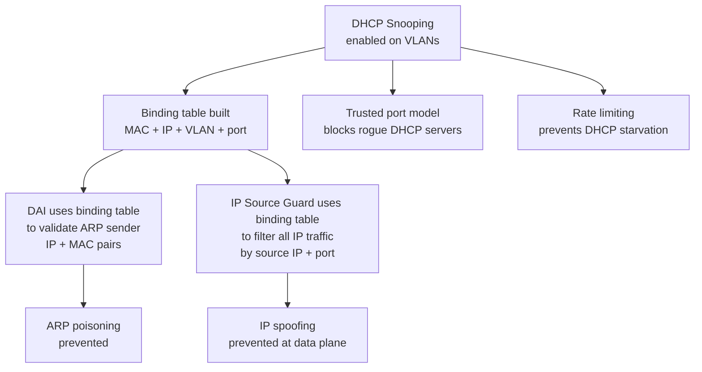

# DHCP Security — Snooping, DAI, and IP Source Guard

DHCP is a broadcast-based protocol with no built-in authentication. Any device on a
broadcast domain can respond to a DHCP Discover, claim any IP address in an ARP
reply, or inject traffic with a spoofed source IP. Three switch-layer mechanisms
address these vulnerabilities in layers: DHCP Snooping, Dynamic ARP Inspection (DAI),
and IP Source Guard. Each builds on the previous, and deploying them together provides
defence-in-depth against the most common Layer 2 attack classes.

For IOS-XE configuration of these features see
[Cisco DHCP, Snooping & DAI](../cisco/cisco_dhcp_snooping.md).

---

## At a Glance

| Mechanism | Problem Solved | Data Source | Filter Type | Scope |
| --- | --- | --- | --- | --- |
| **DHCP Snooping** | Rogue DHCP servers; DHCP starvation | DHCP messages | Trusted/untrusted ports; rate limiting | VLAN; per-port |
| **Dynamic ARP Inspection (DAI)** | ARP poisoning; gratuitous ARP spoofing | Binding table (MAC + IP) | ARP payload validation | Layer 2; per-port |
| **IP Source Guard** | IP source spoofing | Binding table (IP + port) | Per-packet source IP filter | Layer 3 ingress |
| **Combined (Layered)** | All three attacks above | All of the above | Bind table + port enforcement | Broadcast domain |

---

## The DHCP Attack Surface

### Rogue DHCP Server (DHCP Spoofing)

A DHCP exchange is a race: the client sends a Discover broadcast, and the first Offer
it receives is the one it accepts. An attacker on the same broadcast domain can listen
for Discover messages and respond with a crafted Offer faster than the legitimate DHCP
server.

The malicious Offer assigns the client:

- A valid IP address (so the client believes the assignment is legitimate).
- An attacker-controlled default gateway address.
- An attacker-controlled DNS server.

Once accepted, all of the client's traffic is routed via the attacker's machine. The
client has no indication that anything is wrong — its IP connectivity appears to work
normally. This is a man-in-the-middle attack established entirely through the DHCP
exchange.

### DHCP Starvation

DHCP address pools are finite. An attacker can flood the network with DHCP Discover
messages, each using a different spoofed source MAC address. The DHCP server allocates
a lease to each apparent MAC, exhausting the available address pool within seconds.

Subsequent legitimate clients send Discover messages but receive no Offer — the pool
is empty. This is a denial-of-service attack at the DHCP layer. The attacker does not
need to maintain the spoofed clients; the leases remain allocated until they expire or
are cleared manually.

### ARP Poisoning and Gratuitous ARP Spoofing

Once a device has a valid IP assignment, a second attack vector opens at the ARP layer.
ARP has no authentication; any device can send an unsolicited (gratuitous) ARP reply
claiming to be the owner of any IP address.

An attacker sends gratuitous ARPs claiming the gateway IP is associated with the
attacker's MAC address. Hosts and switches update their ARP caches with this false
mapping. Subsequent traffic destined for the gateway is forwarded to the attacker
instead. ARP poisoning does not require a rogue DHCP server — it can be executed
independently after the victim already has a legitimate DHCP lease.

---

## DHCP Snooping

DHCP Snooping addresses rogue DHCP servers and starvation by imposing a
trusted/untrusted
model on switch ports.

**Trusted ports** are permitted to send and receive all DHCP message types, including
server-originated messages (Offer, Ack, NAK). Uplinks to distribution switches and ports
connected to DHCP servers are configured as trusted.

**Untrusted ports** are access ports facing end devices. DHCP server messages arriving
on an untrusted port are dropped immediately. A host connected to an untrusted port
cannot successfully respond to a DHCP Discover even if it attempts to — its Offer will
be dropped at the ingress port of the switch.

**Rate limiting on untrusted ports** mitigates starvation attacks. A per-port DHCP
packet rate limit (e.g. 15 packets per second) prevents a single attacker from flooding
the network with Discover messages. When the rate is exceeded, the port is
error-disabled.

**The binding table** is built automatically from DHCP exchanges observed on untrusted
ports. When a client receives a DHCP Ack, the switch records:

- Client MAC address
- Assigned IP address
- VLAN
- Switch port
- Lease expiry time

This binding table is the foundation for DAI and IP Source Guard.

---

## Dynamic ARP Inspection (DAI)

DAI addresses ARP poisoning by validating ARP packets against the DHCP snooping binding
table. Every ARP request and reply arriving on an untrusted port is intercepted and
inspected. The sender's IP address and MAC address in the ARP payload are compared
against the binding table entry for that port.

If the ARP matches the binding table — the MAC and IP are consistent with what the
switch recorded during the DHCP exchange — the ARP is forwarded normally. If the ARP
does not match (wrong IP for the MAC, wrong MAC for the IP, or no binding entry exists),
it is dropped.

This prevents an attacker from sending a gratuitous ARP claiming the gateway IP. The
switch has a binding table entry for the gateway's IP and MAC; the attacker's ARP will
fail validation and be silently dropped.

DAI can also validate the ARP sender's IP against source IP ranges (ARP ACLs), and can
optionally log dropped ARPs for forensic purposes.

---

## IP Source Guard

IP Source Guard extends the binding table's protection to all IP traffic, not just DHCP
and ARP. Once IP Source Guard is enabled on an untrusted port, the switch installs a
per-port ingress filter using the binding table: only packets with a source IP matching
the binding table entry for that port are forwarded. All other packets are dropped.

This prevents IP spoofing at the data plane level. Even if an attacker has observed a
valid DHCP exchange and knows a legitimate IP address, they cannot inject traffic using
that IP from a different port — the binding entry maps that IP to a specific port, and
traffic arriving with that source IP on any other port is dropped.

IP Source Guard is the most restrictive of the three mechanisms. It filters every IP
packet, which can impact performance on high-traffic ports and requires that all devices
on protected ports have binding table entries.

---

## The Layered Defence Model

The three mechanisms form a dependency chain. Each layer builds on the binding table
created by DHCP Snooping:



DAI without DHCP Snooping has no binding table to validate against and provides no
protection. IP Source Guard without DHCP Snooping has no binding entries and will drop
all traffic on protected ports. Snooping must be deployed and the binding table must be
populated before the dependent features can function.

---

## Design Considerations

### Trusted Port Placement

The boundary between trusted and untrusted must be drawn carefully. The rule is:

- **Trusted:** Uplinks to aggregation or distribution switches, ports connected to DHCP
  servers, ports connected to routers or firewalls acting as DHCP relay agents.

- **Untrusted:** All access ports facing end-user devices, printers, IP phones, and
  IoT devices.

If an uplink is accidentally left as untrusted, DHCP Acks from the legitimate server
will be dropped at that link and clients will lose the ability to obtain addresses.
Conversely, if an access port is accidentally set to trusted, a rogue DHCP server
connected to that port will not be blocked.

In stacked or multi-switch environments, inter-switch uplinks must be trusted. The
binding table is not automatically synchronised across switches — each switch builds
its own table from exchanges it observes. If a client connects to a downstream switch
and the DHCP exchange passes through an untrusted uplink on the upstream switch, the
Ack will be dropped.

### Static IP Devices

Static IP devices do not go through a DHCP exchange, so they generate no binding table
entry. This creates a problem for DAI and IP Source Guard:

- **DAI:** A static IP device's ARP will fail validation because there is no binding
  entry. The ARP will be dropped. The fix is to create an ARP ACL mapping the device's
  static IP to its MAC and apply it to the VLAN as a DAI override.

- **IP Source Guard:** All traffic from the static IP device will be dropped. The fix
  is to add a static binding entry to the snooping table manually.

Every static IP device on a protected VLAN must be explicitly accounted for before
enabling DAI and IP Source Guard. Missing entries will silently break connectivity for
those devices.

### DHCP Option 82 Interaction

When a DHCP relay agent (typically the Layer 3 switch or router) forwards a Discover
upstream, DHCP Snooping can insert a relay agent information option (Option 82) into
the packet. Option 82 encodes the circuit ID (VLAN and port) and remote ID (switch
identifier).

Some DHCP servers reject packets containing Option 82 when they did not expect a relay
agent. This causes clients on snooped VLANs to receive no Offer from the server, even
though the network path is correct.

If the DHCP server does not support or process Option 82, disable Option 82 insertion
on the access switch:

```ios

no ip dhcp snooping information option
```

This disables Option 82 insertion globally. The server will receive standard relayed
Discover messages without the additional option.

### Binding Table Persistence

The DHCP snooping binding table is held in memory. On a switch reload, the table is
lost. Clients that renew their leases after the reload will re-populate the table
automatically. However, in the window between reload and lease renewal, existing clients
with valid leases will have no binding table entry — their ARPs will fail DAI validation
and their traffic will fail IP Source Guard checks.

The binding table should be persisted to flash storage or a TFTP server so it can be
restored on reload:

```ios

ip dhcp snooping database flash:/dhcp-snooping.db
```

This writes the binding table periodically and on-change. On reload, the switch reads
the database file and pre-populates the binding table before any ports come up.

### Deployment Order

The three mechanisms should be deployed in sequence, with verification between each
step. Jumping directly to IP Source Guard without a validated binding table will cause
widespread connectivity loss:

1. **Enable DHCP Snooping.** Configure trusted ports and enable on the target VLANs.

   Verify that DHCP exchanges are completing normally and that the binding table is
   populating with correct entries.

1. **Enable DAI.** Enable on the target VLANs. Monitor for dropped ARPs. Verify that

   static IP devices have ARP ACL entries and that the binding table entries match
   what devices are actually using.

1. **Enable IP Source Guard.** Apply to access ports. This is the most disruptive step.

   Any device without a binding table entry will lose IP connectivity immediately.
Verify that all devices — especially static IP devices — have entries before enabling.

> **Tip:** DAI dropped ARPs and IP Source Guard drops appear in switch logs. Enable
> logging for both features and review the log before declaring the deployment stable.
> Silent drops with no log entry indicate a misconfigured trusted port or a missing
> static binding.

---

## Notes

- DHCP Snooping, DAI, and IP Source Guard operate at the access layer switch level.
  They provide no protection for routed interfaces or Layer 3 paths — an attacker with
  Layer 3 access bypasses all three mechanisms.

- In environments using 802.1X for port authentication, the DHCP exchange occurs after
  the port is authorised. DHCP Snooping and DAI function normally in this model. IP
  Source Guard should be evaluated carefully if 802.1X assigns dynamic VLANs — the
  binding table entry must reflect the post-authentication VLAN.

- These features consume TCAM resources on the switch. IP Source Guard in particular
  installs a per-host ACL entry in hardware for each binding table entry. On switches
  with limited TCAM, this limits the number of devices that can be protected
  simultaneously. Verify platform-specific limits before large-scale deployment.

---

## See Also

- [Cisco DHCP, Snooping & DAI Configuration](../cisco/cisco_dhcp_snooping.md) — IOS-XE setup and verification
- [DHCP Fundamentals](../theory/switching_fundamentals.md) — Layer 2 broadcast domains and DHCP mechanics
- [ARP and Gratuitous ARP](../reference/arp_reference.md) — ARP protocol details and attack vectors
- [802.1X Port Authentication](../theory/switching_fundamentals.md) — Interaction with DHCP Snooping
- [Access Control Lists (ACLs)](../reference/acl_reference.md) — Port security and ARP ACL configuration
