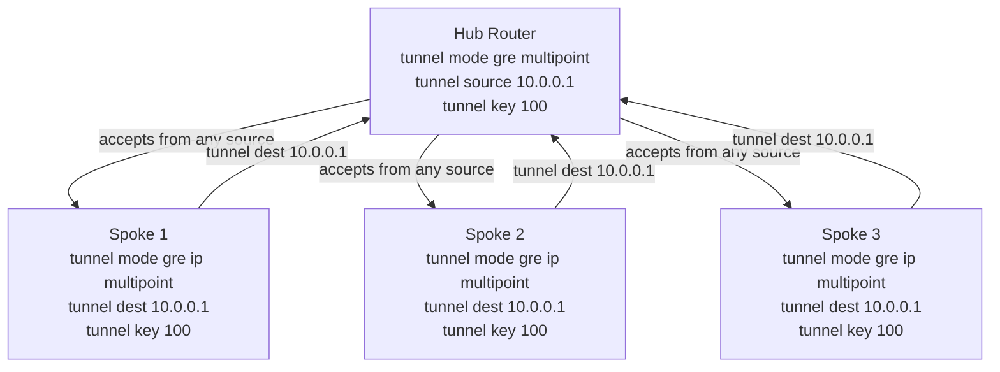
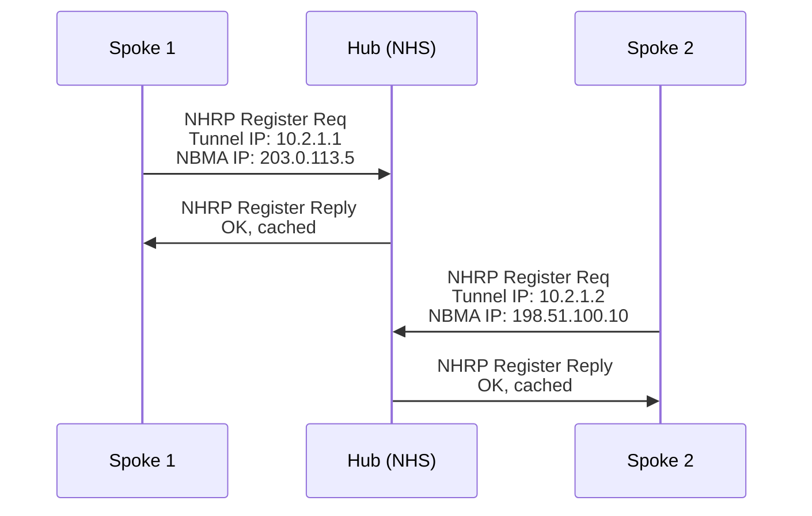
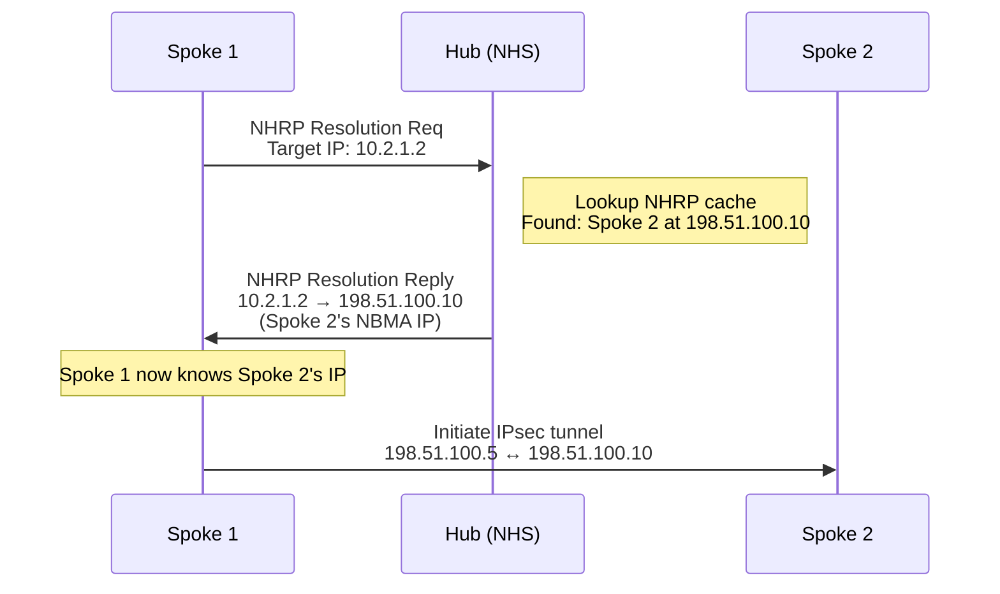
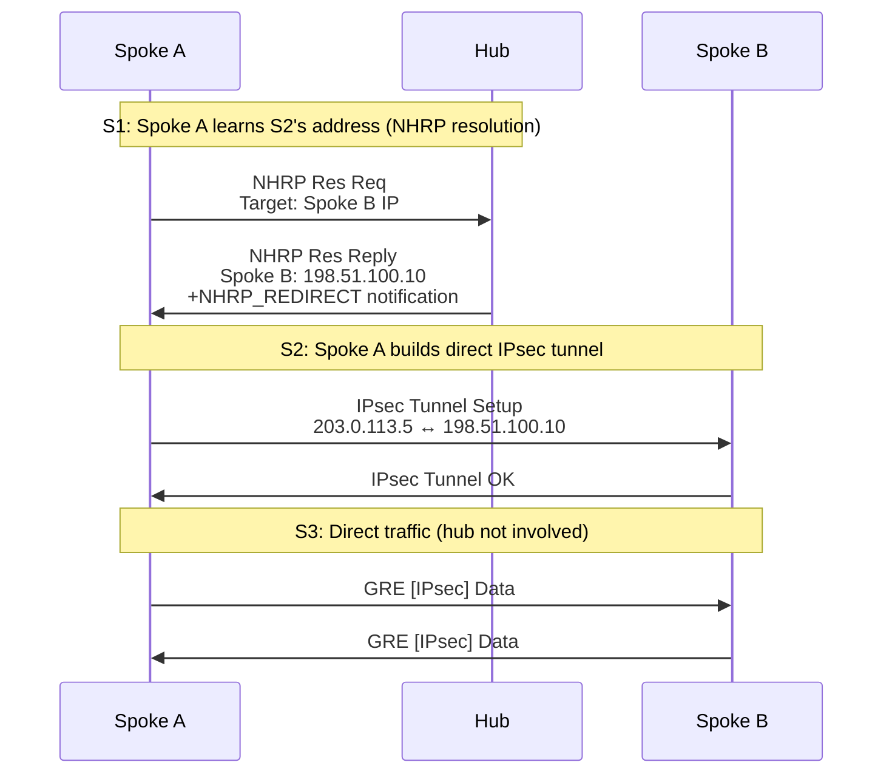

# DMVPN (Dynamic Multipoint VPN)

DMVPN is a Cisco IOS technology that combines GRE (Generic Routing Encapsulation), mGRE (multipoint
GRE), NHRP (Next Hop Resolution Protocol), and IPsec to enable scalable hub-and-spoke VPN
deployments with dynamic spoke-to-spoke tunneling. Unlike static GRE tunnels (which require one
tunnel per peer), DMVPN uses a single mGRE tunnel interface on the hub to accept connections from
unlimited spokes; NHRP dynamically resolves spoke endpoints and allows spokes to build direct
IPsec tunnels without hub involvement.

For GRE fundamentals see [GRE](../packets/gre.md). For IPsec details see [IPsec & IKE](ipsec.md).
For Cisco configuration see [Cisco DMVPN Config](../cisco/cisco_dmvpn_config.md).

---

## What Is DMVPN

DMVPN is composed of four technologies:

- **GRE (Generic Routing Encapsulation)**: Tunnel protocol; carries IP packets over IP
- **mGRE (Multipoint GRE)**: Single GRE tunnel interface on hub accepts packets from multiple
  spokes (identified by tunnel source IP + GRE Key field)
- **NHRP (Next Hop Resolution Protocol, RFC 2332)**: Spoke-to-spoke endpoint discovery via a
  central hub; dynamically resolves IP addresses of other spokes
- **IPsec**: Encrypts GRE packets; typically uses transport mode (protects GRE + payload, not
  outer IP)

### Why DMVPN Over Static GRE

| Aspect | Static GRE | DMVPN |
| --- | --- | --- |
| **Tunnels per hub** | N (one per peer) | 1 (mGRE) |
| **Spoke-to-spoke** | Always via hub (no direct path) | Direct tunnel (Phase 2/3) |
| **Scalability** | Linear: 10 spokes = 10 tunnels | Single interface: 10+ spokes |
| **New spoke addition** | Reconfigure hub (add tunnel) | Automatic (NHRP registration) |
| **Bandwidth efficiency** | Lower (redundant hop for spoke-spoke) | Higher (direct paths possible) |
| **Encryption cost** | Single layer of IPsec | Single layer of IPsec (reused) |
| **Management overhead** | High (each tunnel configured) | Low (template on hub/spoke) |

---

## mGRE (Multipoint GRE)

Standard point-to-point GRE requires a tunnel interface per peer. Multipoint GRE uses a single
hub tunnel interface with `tunnel mode gre multipoint` to accept GRE packets from any source.

### Hub mGRE Interface

```text
Hub Router:
  interface Tunnel0
    tunnel mode gre multipoint
    tunnel source 10.0.0.1
    tunnel key 100
```

Packets arriving from any source IP are accepted, provided the tunnel key matches:

```text
Spoke 1 (10.1.0.1) → [GRE hdr, Key=100, Data] → Hub accepts on Tunnel0
Spoke 2 (10.1.0.2) → [GRE hdr, Key=100, Data] → Hub accepts on Tunnel0
Spoke 3 (10.1.0.3) → [GRE hdr, Key=100, Data] → Hub accepts on Tunnel0
```

The **tunnel key** disambiguates traffic from different DMVPN networks (or DMVPN tenants). Each
DMVPN domain uses a unique key; the hub matches the key to route packets to the correct NHRP
network-id.

### Spoke P2MP Tunnel

Spokes use point-to-multipoint (p2mp) GRE:

```text
Spoke Router:
  interface Tunnel0
    tunnel mode gre ip multipoint
    tunnel source 10.1.0.1
    tunnel destination 10.0.0.1    # Hub IP
    tunnel key 100
```

Spokes configure tunnel destination pointing to the hub; the tunnel source is the spoke's own IP.
All packets sent to the hub's address use this single interface.

### mGRE Topology Graph



---

## NHRP (Next Hop Resolution Protocol)

NHRP allows spokes to dynamically discover each other's IP addresses and establish direct IPsec
tunnels without involving the hub for every packet. Two operations: **registration** and
**resolution**.

### Registration (Spoke → Hub)

When a spoke comes online, it registers its tunnel IP and physical IP with the hub (NHRP server):



The hub caches these registrations in an **NHRP cache** (NHRP database).

### Resolution (Spoke → Spoke Discovery)

When Spoke 1 needs to send traffic to Spoke 2, it queries the hub for Spoke 2's IP:



Once the tunnel is established, Spoke 1 and Spoke 2 exchange traffic directly, bypassing the hub.

### NHRP Abbreviations

| Term | Meaning |
| --- | --- |
| **NBMA** | Non-Broadcast Multi-Access — physical network (Internet in DMVPN) |
| **NHS** | Next Hop Server — hub; caches spoke registrations and resolves queries |
| **NHRP Client** | Spoke; registers with NHS and queries for other spokes |
| **Tunnel IP** | IP address on the tunnel interface (e.g., 10.2.1.1) |
| **NBMA IP** | Physical IP address (e.g., 203.0.113.5); used for IPsec SA setup |

---

## DMVPN Phases

DMVPN supports three phases, each with different capabilities for spoke-to-spoke routing and hub
load.

### Phase 1 (Hub-and-Spoke Only)

Spokes register with hub and resolve each other's IPs, but **all traffic traverses the hub**. The
hub routes all spoke-to-spoke traffic; spokes do not build direct tunnels.

**When Phase 1 is chosen:**

- Simple deployments; few spokes
- Maximum hub control (centralized policy, logging, inspection)
- Hub has sufficient capacity

**Limitations:**

- Hub is bandwidth bottleneck
- Spoke-to-spoke latency higher (extra hop)
- Scalability capped by hub throughput

### Phase 2 (Dynamic Spoke-to-Spoke)

Spokes register with hub as in Phase 1, but the **hub redirects spoke-to-spoke traffic**. When
Spoke A queries for Spoke B, the hub sends an NHRP redirect, instructing Spoke A to create a
direct tunnel.



**When Phase 2 is chosen:**

- Medium-sized deployments; 20-50 spokes
- Reduced hub bandwidth (no spoke-to-spoke data transit)
- Faster spoke-to-spoke communication

**Limitations:**

- Hub still resolves addresses (control plane load)
- Split-horizon issues with dynamic routing if not carefully configured
- Route summarization on hub can break spoke-to-spoke routing

### Phase 3 (Hub-Initiated Shortcut)

The hub proactively sends NHRP **shortcut notifications** to spokes when it sees traffic between
them. Spokes do not query; they respond to hub shortcuts.

**How Phase 3 works:**

1. Hub monitors traffic between spokes
2. When hub sees Spoke A ↔ Spoke B traffic, it sends NHRP shortcut to both
3. Spokes receive shortcut → build direct tunnel
4. Hub withdraws routes learned from spokes in IGP updates (split-horizon fully disabled)
5. Spokes use routing protocol to learn remote subnets from other spokes directly

**When Phase 3 is chosen:**

- Large deployments; 100+ spokes
- Hub CPU reduced (no resolution queries)
- Full dynamic routing (OSPF, EIGRP, BGP) over direct spokes
- Route summarization supported

**Comparison Table:**

| Feature | Phase 1 | Phase 2 | Phase 3 |
| --- | --- | --- | --- |
| **Spoke-to-Spoke Tunnels** | No (always via hub) | Yes (after NHRP resolve) | Yes (hub-initiated) |
| **Hub CPU Load** | Moderate (routes all traffic) | High (resolves + redirects) | Low (monitors only) |
| **Scalability** | ~20 spokes | ~50 spokes | 100+ spokes |
| **Route Summarization** | Supported | Problematic | Fully supported |
| **Split-Horizon in EIGRP** | Enabled (hub blocks) | Enabled (causes issues) | Disabled (no blocking) |
| **OSPF Mode** | Broadcast/P2MP | Broadcast/P2MP | Point-to-Multipoint |
| **Convergence** | Slow (all via hub) | Medium (new shortcut setup) | Fast (direct routes) |

---

## IPsec Integration

DMVPN uses IPsec to encrypt GRE packets. The IPsec SA protects the GRE payload, allowing spoke-to-
spoke tunnels to be encrypted end-to-end.

### Transport Mode (Not Tunnel Mode)

DMVPN uses **IPsec transport mode**, not tunnel mode:

- **Transport mode**: IPsec header + original IP payload encrypted; original IP header in clear
- **Tunnel mode**: Entire original IP packet encrypted; new outer IP header added

GRE already encapsulates the original IP packet (`GRE [Original IP]`). IPsec transport mode
encrypts the data part (`[Original IP]`), keeping the GRE and outer IP headers unencrypted.

```text
Without IPsec:
  Outer IP | GRE | Original IP | Payload

With IPsec Transport:
  Outer IP | [IPsec | GRE | Original IP | Payload | ICV]
```

This is more efficient than IPsec tunnel mode, which would double-encapsulate.

### Tunnel Protection Profile

Modern Cisco IOS uses **IPsec tunnel protection profiles** rather than crypto maps. The profile is
applied to the tunnel interface:

```ios
crypto ikev2 proposal DMVPN-PROPOSAL
  encryption aes-cbc-256
  integrity sha256
  dh-group 14

crypto ikev2 policy DMVPN-POLICY
  proposal DMVPN-PROPOSAL

crypto ipsec transform-set DMVPN-TS esp-aes 256 esp-sha256-hmac
  mode transport

crypto ipsec profile DMVPN-PROFILE
  set transform-set DMVPN-TS
  set pfs group14
  set security-association lifetime seconds 3600

interface Tunnel0
  tunnel protection ipsec profile DMVPN-PROFILE
```

The profile is assigned to the tunnel interface on both hub and spokes, avoiding per-peer crypto
map maintenance.

---

## Routing Over DMVPN

Different routing protocols have different behaviors over DMVPN depending on the phase and split-
horizon configuration.

### EIGRP Over DMVPN

EIGRP is the most commonly used dynamic routing protocol in DMVPN because it natively supports
hierarchy (hub as route reflector).

| Aspect | Phase 1/2 | Phase 3 |
| --- | --- | --- |
| **Split-horizon** | Enabled on hub (hub blocks EIGRP updates to spokes) | Disabled on hub |
| **Summarization** | Supported (hub summarizes) | Supported (spokes can summarize) |
| **Hub Role** | Active router, originates routes | Route reflector (transparent) |
| **Spoke-to-Spoke Learning** | Via hub route advertisements | Direct via EIGRP protocol |
| **Configuration** | Standard EIGRP; no special tuning | `no split-horizon eigrp 100` on hub |

**Phase 1/2 Challenge:**
In Phase 1, spokes cannot learn directly from other spokes because the hub blocks EIGRP updates
(split-horizon). Spokes only see routes via the hub.

**Phase 3 Advantage:**
In Phase 3, the hub disables split-horizon, allowing EIGRP advertisements to flow directly
between spokes over their shortcut tunnels.

### OSPF Over DMVPN

OSPF requires **point-to-multipoint (P2MP)** mode on DMVPN interfaces to avoid issues with
dynamic neighbors.

```ios
interface Tunnel0
  ip ospf network point-to-multipoint
```

In P2MP mode, OSPF treats each spoke as a separate neighbor (no DR/BDR election); each spoke sends
individual Hello packets.

### BGP Over DMVPN

BGP's next-hop handling requires careful configuration. By default, the hub does not change the
next-hop when advertising routes to spokes, which can cause packets to be sent to a next-hop that
is not directly reachable.

```ios
router bgp 65000
  address-family ipv4
    neighbor 10.2.1.0 peer-session DMVPN-PEER
      ! Ensure next-hop-self is used
      neighbor 10.2.1.0 next-hop-self
```

---

## Dual-Hub Redundancy

Critical deployments use two DMVPN hubs for failover. Each hub operates independently with its own
NHRP network-id; spokes register with both hubs and establish IPsec tunnels to both.

### Multi-Hub NHRP Config

```text
Hub 1:
  ip nhrp network-id 100
  ip nhrp authentication KEY

Hub 2:
  ip nhrp network-id 100
  ip nhrp authentication KEY

Spoke (connects to both):
  tunnel mode gre ip multipoint
  ip nhrp network-id 100
  ip nhrp nhs 10.0.0.1 nbma 10.0.0.1  ! Hub 1
  ip nhrp nhs 10.0.0.2 nbma 10.0.0.2  ! Hub 2
```

The spoke registers with **both** NHS servers and queries both for address resolution. If Hub 1
fails, the spoke and other spokes use Hub 2 for NHRP resolution.

### Routing Preference

Primary/secondary hub is determined via **routing metrics**, not NHRP priority:

```mermaid
graph TB
    HUB1["Hub 1<br/>Primary"]
    HUB2["Hub 2<br/>Secondary"]
    S1["Spoke 1"]
    S2["Spoke 2"]

    S1 -->|Cost 10 (BGP/EIGRP)| HUB1
    S1 -->|Cost 100 (BGP/EIGRP)| HUB2
    S2 -->|Cost 10| HUB1
    S2 -->|Cost 100| HUB2
    HUB1 -.->|BGP/EIGRP iBGP| HUB2
```

Spokes use the lowest-cost hub for routes learned via the routing protocol; if Hub 1 fails, all
routing updates are received from Hub 2.

---

## Related Pages

- [GRE](../packets/gre.md)
- [IPsec & IKE](ipsec.md)
- [Cisco DMVPN Config](../cisco/cisco_dmvpn_config.md)
