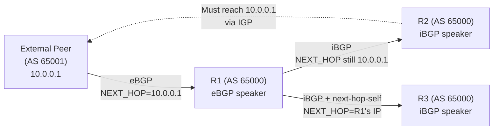
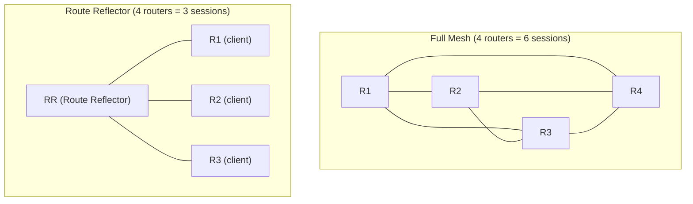

# eBGP vs iBGP

External BGP (eBGP) and Internal BGP (iBGP) are the same protocol (RFC 4271) running in
two distinct contexts. eBGP peers connect routers in different Autonomous Systems — it
is
the protocol of inter-domain routing. iBGP peers connect routers within the same AS,
carrying
externally learned routes across the AS interior. The rules each must follow are
different,
and the design constraints of iBGP in particular have significant architectural
implications.

---

## At a Glance

| Property | eBGP | iBGP |
| --- | --- | --- |
| **Peer relationship** | Different AS numbers | Same AS number |
| **Default TTL** | 1 (directly connected only) | 255 (can traverse multiple hops) |
| **AS_PATH behaviour** | Prepends own AS on send | Does not modify AS_PATH |
| **NEXT_HOP behaviour** | Sets NEXT_HOP to self | Does not change NEXT_HOP (by default) |
| **LOCAL_PREF** | Not sent (stripped) | Propagated to all iBGP peers |
| **MED** | Sent to eBGP peers | Not sent to iBGP peers |
| **Loop prevention** | AS_PATH (reject if own AS in path) | Split horizon: do not re-advertise iBGP-learned routes to iBGP peers |
| **Administrative Distance (Cisco)** | 20 | 200 |
| **Route propagation** | Advertise to all eBGP and iBGP peers | Advertise only to eBGP peers and RR clients; not to other iBGP peers |

---

## NEXT_HOP Behaviour

eBGP sets NEXT_HOP to the advertising router's interface IP. iBGP does **not** change
NEXT_HOP — the NEXT_HOP remains the eBGP peer's address. This means iBGP speakers must
be able to resolve the eBGP NEXT_HOP via the IGP.

Workaround: `neighbor <x> next-hop-self` forces the iBGP speaker to replace NEXT_HOP
with
its own address.

### When to use next-hop-self

- Always use on iBGP peers that are not also running the IGP and learning eBGP next-hops
- Required when iBGP peers cannot reach the eBGP peer's IP via the IGP
- Common in hub-and-spoke iBGP designs

---

## iBGP Full Mesh

iBGP split horizon (do not re-advertise iBGP-learned routes to other iBGP peers) requires
a full mesh of iBGP sessions among all routers in the AS. For n routers: **n(n-1)/2
sessions**. This scales poorly.

### Solutions to iBGP full mesh

1. **Route Reflectors (RFC 4456):** One or more RR servers re-advertise iBGP-learned routes

   to their clients. Clients need only peer with RRs, not with each other. Clusters prevent
   loops via `ORIGINATOR_ID` and `CLUSTER_LIST` attributes.

2. **Confederations (RFC 5065):** The AS is split into sub-ASes (confederation sub-ASes).

   eBGP runs between sub-ASes using private ASNs; the confederation appears as a single
   AS to the outside world. Rarely used in new designs; Route Reflectors are preferred.

---

## eBGP Multihop

By default eBGP peers must be directly connected (TTL=1). `neighbor <x> ebgp-multihop <ttl>`
allows eBGP sessions over multiple hops — used for loopback-to-loopback peering, which
improves resilience (session survives failure of one path if multiple exist).

---

## Attribute Propagation Rules

| Attribute | eBGP sends? | iBGP sends? | iBGP re-advertises to eBGP? |
| --- | --- | --- | --- |
| **WEIGHT** | No (Cisco-local) | No | No |
| **LOCAL_PREF** | No | Yes | No |
| **AS_PATH** | Yes (prepend own) | Yes (unchanged) | Yes |
| **NEXT_HOP** | Yes (own IP) | Yes (unchanged) | Yes |
| **MED** | Yes | No | No |
| **COMMUNITY** | Yes (if not stripped) | Yes | Yes (if not stripped) |

---

## When to Use Each

### eBGP

- Connecting to external ASes (upstream ISPs, customers, IXPs)
- Multi-homed internet edge with two or more providers
- Any peering that crosses AS boundaries — eBGP is the only option

### iBGP

- Carrying external (eBGP-learned) routes across the interior of a large AS
- Service provider backbone where IGP carries reachability and BGP carries policy
- When the AS has multiple eBGP exit points and needs consistent policy via LOCAL_PREF

---

## Notes

- The iBGP AD of 200 is intentionally high — iBGP routes should be last resort within
the

the

  AS; IGP routes are preferred for intra-AS reachability.

- Route Reflectors do not change the path attributes of reflected routes except adding

  `ORIGINATOR_ID` and `CLUSTER_LIST`.

- Confederation eBGP sessions use the real peer AS number for loop detection but strip

  confederation sub-ASes from AS_PATH before advertising externally.

- `show ip bgp summary` distinguishes iBGP and eBGP by whether the remote-as matches the

  local AS.
