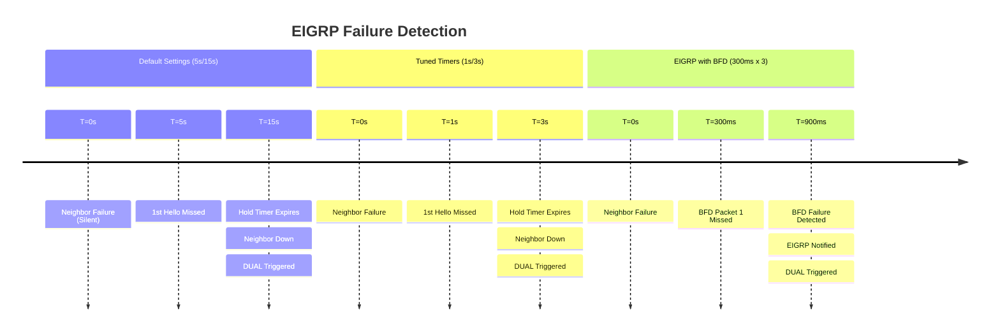
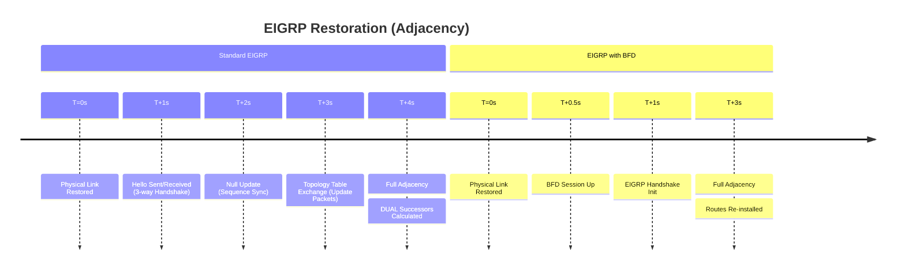

# EIGRP Convergence: Default Settings vs. BFD Integration

## At a Glance

| Aspect | Default Settings | Tuned Timers | EIGRP with BFD |
| --- | --- | --- | --- |
| **Hello / Hold Timer** | 5s / 15s | 1s / 3s | 5s / 15s (backup) |
| **Detection Time** | ~15 seconds | ~3 seconds | **< 1 second** |
| **CPU Impact** | Low | High | Low (offloaded) |
| **Stability** | High | Moderate (SIA risk) | High |
| **Local vs Remote Failure** | Same delay | Same delay | Instant for remote |
| **Feasible Successor Promotion** | Delayed by timer | Delayed by timer | Immediate via DUAL |

---

## 1. Overview & Principles

Enhanced Interior Gateway Routing Protocol (EIGRP) is renowned for its rapid convergence
due to the **Diffusing Update Algorithm (DUAL)**. However, DUAL can only begin its
calculations once a neighbor failure is detected.

### The Role of DUAL in Convergence

EIGRP maintains a topology table containing **Successors** (primary paths) and
**Feasible
Successors**(backup paths).

- **Local Repair:** If a local interface goes down, EIGRP promotes a Feasible Successor

    to the routing table in milliseconds.

- **Remote/Silent Failure:** If the neighbor fails but the interface stays "Up"

    (e.g., through a switch), EIGRP must wait for the **Hold Timer** to expire before
    DUAL can trigger.

### Key Principles

- **The 1s/3s "Aggressive" Limit:** While OSPF can be tuned to sub-second "minimal"

    hellos, EIGRP typically bottoms out at 1-second Hellos. Going faster without
    BFD significantly risks "Stuck-In-Active" (SIA) issues if the CPU is momentarily
    busy.

- **BFD Offloading:** BFD allows the protocol to maintain high-stability timers

    (5/15) to prevent churn, while still reacting to physical failures at sub-second
    speeds.

- **DUAL Catalyst:** BFD provides the sub-second trigger required for "silent" failures.

    Instead of waiting 15 seconds, BFD notifies EIGRP in <1 second, allowing DUAL
    to immediately promote a backup path or enter the **Active** state to query
    neighbors.

## 2. Failure Detection & Restoration Timelines

### Failure Detection (Neighbor Down)



### Restoration Timeline (Adjacency)



## 3. Configuration Snippets

### Cisco IOS-XE EIGRP (Named Mode)

Named mode is the modern standard and allows for unified BFD configuration within
the address-family.

```ios

router eigrp CORE
 address-family ipv4 unicast autonomous-system 100
  ! Enable BFD globally for all AF interfaces
  af-interface default
   bfd
  exit-af-interface
  !
  ! Maintain hold-timer at 15s for stability
  af-interface GigabitEthernet1
   hello-interval 5
   hold-time 15
  exit-af-interface
!
```

## 4. Comparison Summary

| Metric | Default Settings | Tuned EIGRP | EIGRP with BFD |
| :--- | :--- | :--- | :--- |
| **Hello / Hold** | 5s / 15s | 1s / 3s | 5s / 15s (Backup) |
| **Detection Time** | ~15 Seconds | ~3 Seconds | **< 1 Second** |
| **CPU Impact** | Low | High | **Low (Offloaded)** |
| **Stability** | High | Moderate | **High** |
| **Recovery Logic** | DUAL Query | DUAL Query | **Immediate DUAL Trigger** |

## 5. Verification & Troubleshooting

| Command | Purpose |
| :--- | :--- |
| `show ip eigrp interfaces detail` | Confirm BFD is registered on the interface. |
| `show bfd neighbors` | Verify heartbeat negotiation and intervals. |
| `show ip eigrp topology` | Check for Feasible Successors (Promotion targets). |
| `debug eigrp packets hello` | Monitor EIGRP hello exchange (separate from BFD). |

---

### Engineering Guidance

- **Use BFD** as the primary detection mechanism for all Core and Distribution links.

    It is the only way to achieve sub-second convergence safely.

- **Tuned Timers (1s/3s)** are acceptable for branch offices or lower-speed links

    where sub-second convergence isn't a requirement and BFD is unsupported.

- **Feasible Successors:** Ensure your network design provides EIGRP with feasible

    successors. BFD detects the failure faster, but DUAL needs a valid backup path
    in the topology table to achieve "instant" (sub-50ms) convergence.

---

## Notes / Gotchas

- **Stuck-In-Active (SIA) is Not Unique to Fast Timers:** BFD detects link failure but does not
  prevent SIA caused by CPU overload or query storms. If a neighbor cannot respond to an Active
  query within the hold timer, EIGRP tears down the adjacency regardless of BFD.

- **Local Repair vs Remote Failure:** When a local interface goes down, EIGRP can promote a
  Feasible Successor in milliseconds — even without BFD. BFD solves *remote* failure (neighbor
  down, interface still up). Topology diversity is still required; BFD cannot fix a design
  with no Feasible Successors.

- **BFD Interval Mismatch Causes Session Flap:** Mismatched BFD intervals (e.g. 300 ms vs 1 s)
  prevent session establishment or cause flaps. Always configure identical intervals on both
  ends of a link.

- **Tuned Timers (1s/3s) Have Bandwidth Cost:** Sub-second hellos on WAN links with hundreds of
  neighbors consume significant bandwidth and CPU. BFD offloads detection to the forwarding
  plane; tuned timers do not.

- **DUAL Query Scope Matters:** BFD provides instant detection, but DUAL must still query all
  neighbors for alternate paths. On a meshed core with 50+ neighbors, query scope drives
  overall convergence. Use `eigrp log-neighbor-changes` to monitor.

---

## See Also

- [BFD (Bidirectional Forwarding Detection)](../theory/bfd_fundamentals.md)
- [EIGRP Fundamentals](../theory/eigrp_fundamentals.md)
- [OSPF vs EIGRP](../theory/ospf_vs_eigrp.md)
- [BGP vs EIGRP](../theory/bgp_vs_eigrp.md)
- [Cisco EIGRP Configuration](../cisco/eigrp_configuration.md)
