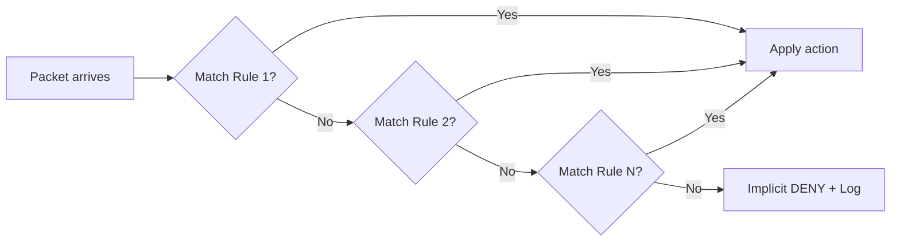
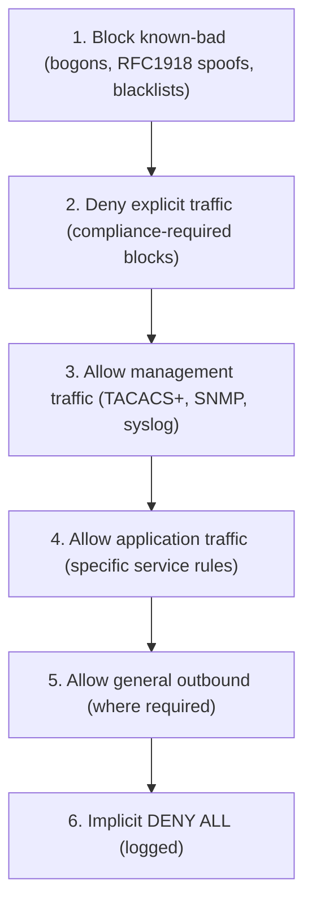
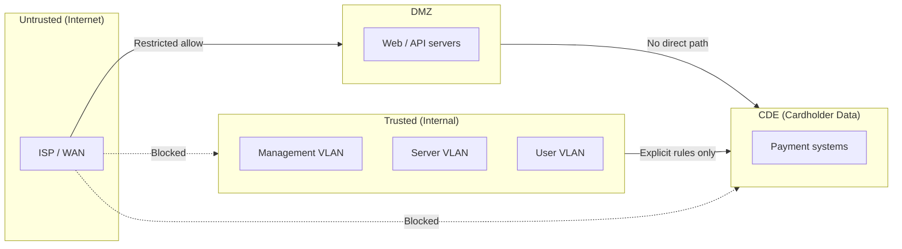
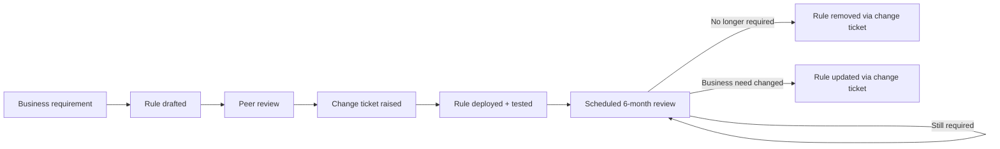

# Firewall Rule Design Principles

Good firewall rules are specific, ordered, documented, and reviewed regularly — vague or permissive
rules are the most common source of unintended access and compliance failures.

---

## At a Glance

| Principle | Rule |
| --- | --- |
| **Least Privilege** | Allow only what is explicitly required; deny everything else |
| **Specificity** | Most specific rules first; most general last |
| **Default Deny** | Explicit logged deny-all at the bottom — never rely on silent implicit deny |
| **No ANY** | Never use ANY for source, destination, or service in production rules |
| **Named Objects** | Use address/service objects, not raw IPs and ports |
| **Business Justification** | Every allow rule must have a documented reason |
| **Log Everything** | Explicit deny-all logged; log allows on sensitive paths |
| **Egress Filtering** | Outbound from servers and CDE is as restricted as inbound |
| **Stealth Rule** | Firewall management access explicitly restricted early in the policy |
| **Intra-Zone** | Do not trust traffic between hosts in the same zone — apply explicit policies |
| **ICMP** | Allow only specific required types; block the rest explicitly |
| **Temporary Rules** | Time-limited rules must have a removal step in the change ticket |
| **Review Regularly** | PCI DSS requires rule set review every 6 months |

---

## Core Design Principles

### Least Privilege

Every rule should grant the minimum access required for the stated business purpose. Start with
the question: *what is the smallest set of sources, destinations, and services that satisfies this
requirement?*

```text
BAD:  Allow ANY → ANY : ANY
      (permits all traffic in all directions)

BAD:  Allow 10.0.0.0/8 → ANY : TCP 443
      (correct service, but source and destination too broad)

GOOD: Allow 10.13.1.0/24 (management subnet) → 10.0.5.10 (specific server) : TCP 443
      (specific source, specific destination, specific service)
```

Least privilege applied consistently means a compromised host can only reach what it was already
permitted to reach — lateral movement is bounded by the ruleset.

### Default Deny

All traffic not explicitly permitted must be denied. Never rely on the absence of a matching rule
— always terminate the ruleset with an explicit or implicit deny. This is the foundation of
defence-in-depth.



### Specificity — Most Specific First

Rules are evaluated top-to-bottom; first match wins. Place the most specific rules at the top.
If a broad allow rule appears before a narrow deny rule, the deny is never reached.

```text
WRONG order:
  Rule 1: Allow 10.0.0.0/8 → ANY : ANY     ← catches everything first
  Rule 2: Deny 10.0.1.5 → ANY : ANY        ← never evaluated

CORRECT order:
  Rule 1: Deny 10.0.1.5 → ANY : ANY        ← specific deny evaluated first
  Rule 2: Allow 10.0.0.0/8 → ANY : ANY     ← broad permit after
```

### No ANY

Using `ANY` for source, destination, or service bypasses the intent of the ruleset and typically
violates PCI DSS Requirement 1.2.5. Every field should be as narrow as possible:

| Field | Instead of ANY, use... |
| --- | --- |
| Source | Named address object or subnet |
| Destination | Named address object or FQDN |
| Service | Named service object (TCP 443, not TCP ANY) |
| Interface | Specific zone or interface |

The only legitimate use of ANY is in a deny-all catch rule at the bottom of the policy.

---

## Rule Ordering Strategy

FortiGate and most stateful firewalls evaluate rules top-to-bottom. A well-ordered ruleset
balances security and performance:



**Security ordering** (recommended): Denies before allows. High-confidence block rules at the top
mean malicious traffic is dropped immediately without evaluating the allow list.

**Performance note:** Rules matched most frequently should appear higher in the allow section —
HTTPS before SNMP, for example. FortiGate's policy hit count statistics help identify ordering
optimisation opportunities.

---

## Zone-Based Design

Think in zones, not interfaces. A zone is a logical grouping of interfaces that share the same
trust level and security policy requirements.



Rules flow between zones. Traffic should never flow directly from Untrusted to Trusted or CDE
without passing through an intermediate zone with inspection.

**Zone trust hierarchy:**

| Zone | Trust Level | Default Posture |
| --- | --- | --- |
| Internet / WAN | None | Deny all inbound; allow established only |
| DMZ | Low | Allow specific inbound from internet; restricted outbound |
| User / Office | Medium | Allow specific outbound; deny inbound from internet |
| Server / Infrastructure | Medium-High | Deny inbound from user; allow specific management |
| CDE | High | Strict allow list both directions; logged comprehensively |
| Management | High | Allow from management subnet only; deny all other inbound |

---

## Egress Filtering

Outbound traffic from servers and the CDE is just as important to control as inbound. A default-
permit outbound posture means a compromised host can freely call home, exfiltrate data, or scan
the internet. PCI DSS Requirement 1.3.2 explicitly mandates that outbound traffic from the CDE
is restricted to only what is necessary.

**What CDE systems should typically be permitted outbound:**

| Destination | Service | Reason |
| --- | --- | --- |
| Payment processor endpoints | TCP 443 | Transaction processing |
| Internal DNS servers | UDP/TCP 53 | Name resolution |
| Internal NTP servers | UDP 123 | Time synchronisation |
| Syslog servers | TCP 601 | Centralised logging |
| Management systems | TCP 22, TCP 443 | Monitoring and management |

Everything else should be denied. CDE systems have no legitimate reason to initiate connections
to arbitrary internet destinations.

**For non-CDE servers** apply the same principle — enumerate what a server needs to reach and
deny the rest. A database server should not be able to reach the internet at all.

```fortios
config firewall policy
    edit 50
        set name "ALLOW-CDE-to-PaymentProcessor"
        set srcintf "cde"
        set dstintf "wan1"
        set srcaddr "CDE-SERVERS"
        set dstaddr "PAYMENT-PROCESSOR-ENDPOINTS"
        set service "HTTPS"
        set action accept
        set logtraffic all
        set comments "CDE outbound to payment processor. PCI 1.3.2. CR-2026-5200."
    next
    edit 51
        set name "DENY-CDE-Outbound-All"
        set srcintf "cde"
        set dstintf "wan1"
        set srcaddr "all"
        set dstaddr "all"
        set service "ALL"
        set action deny
        set logtraffic all
        set comments "Default deny CDE outbound. PCI 1.3.2."
    next
end
```

---

## Intra-Zone Traffic

FortiGate permits traffic between interfaces in the same zone by default on some firmware versions.
This means two hosts in the same zone (e.g., two servers in the server VLAN) can communicate
freely without matching any policy. If the CDE and a general server are in the same zone, or if
a compromised host can reach neighbouring hosts without hitting the firewall, the ruleset provides
no lateral movement protection.

**Best practice:** Disable intra-zone traffic at the zone level and apply explicit policies for
any traffic that needs to flow between hosts in the same zone.

```fortios
config system zone
    edit "servers"
        set intrazone deny
    next
    edit "cde"
        set intrazone deny
    next
end
```

With intra-zone traffic denied, all host-to-host communication — even within the same VLAN —
must match an explicit policy. This significantly limits blast radius if a host is compromised.

---

## Writing Precise Rules

### Use Named Objects

Raw IP addresses and port numbers in rules are opaque and error-prone. Named objects make rules
self-documenting and allow a single change to update multiple rules consistently.

```fortios
! Define objects once
config firewall address
    edit "MGMT-SUBNET"
        set subnet 10.13.0.0 255.255.255.0
    next
    edit "SYSLOG-SERVER-1"
        set subnet 10.13.1.147 255.255.255.255
    next
end

config firewall service custom
    edit "SYSLOG-TCP"
        set protocol TCP
        set tcp-portrange 601
    next
end

! Reference in policy — intent is immediately clear
config firewall policy
    edit 10
        set name "ALLOW-Network-to-Syslog"
        set srcaddr "MGMT-SUBNET"
        set dstaddr "SYSLOG-SERVER-1"
        set service "SYSLOG-TCP"
        set action accept
        set logtraffic all
    next
end
```

### Document the Business Justification

Every allow rule must have a documented reason. This is a PCI DSS Requirement 1.2.5 obligation
and operationally essential for rule reviews. Use the rule comment/description field:

```fortios
set comments "Required: Network devices forward syslog to utility servers. CR-2026-5120."
```

Good comments answer: *why does this traffic need to flow?* Not *what does this rule do* (the
rule itself shows that).

### Anti-Spoofing

Anti-spoofing is primarily enforced by **Reverse Path Forwarding (RPF)** — the device checks that
the source IP on an inbound packet would be reachable back via the same interface it arrived on.
A packet arriving on the WAN claiming to originate from an internal address fails this check
because the routing table points to an internal interface for that source, not the WAN. This is
more comprehensive than blocking specific prefixes because it catches spoofed public IPs as well
as RFC1918 addresses (BCP38, RFC 3704).

**Cisco IOS-XE — strict RPF (recommended for single-homed interfaces):**

```ios
interface GigabitEthernet0/0/0
 description WAN-UPLINK
 ip verify unicast source reachable-via rx
!
```

Strict mode (`reachable-via rx`) requires the return path to exit the same interface the packet
arrived on. VPN Phase 2 tunnel interfaces must use loose mode — traffic arriving on a tunnel
carries source IPs from the remote private network whose return path routes via the WAN, not back
through the same tunnel interface:

```ios
interface GigabitEthernet0/0/0
 description WAN-UPLINK
 ip verify unicast source reachable-via rx
!
interface Tunnel10
 description VPN-PHASE2
 ip verify unicast source reachable-via any
!
```

**FortiGate — RPF is enabled per-interface:**

```fortios
config system interface
    edit "wan1"
        set src-check enable
    next
end
```

RFC1918 blocking in firewall policy is a complementary control for platforms that do not support
RPF, or as defence-in-depth, but should not be the primary anti-spoofing mechanism (PCI DSS
Requirement 1.4.3).

---

## Stealth Rule

The firewall's own management IP must be protected by an explicit rule early in the policy —
before any broad permit rules that could inadvertently allow access to the management plane.
Without this, management access is only protected by policy order, which is fragile and easily
broken when rules are reordered.

The stealth rule pattern: explicitly allow management access from the management subnet, then
explicitly deny everything else to the firewall's management address.

```fortios
config firewall policy
    edit 2
        set name "ALLOW-Mgmt-to-Firewall"
        set srcintf "mgmt"
        set dstintf "local"
        set srcaddr "MGMT-SUBNET"
        set dstaddr "FIREWALL-MGMT-IP"
        set service "HTTPS" "SSH"
        set action accept
        set logtraffic all
        set comments "Management access to firewall. Management subnet only."
    next
    edit 3
        set name "DENY-All-to-Firewall"
        set srcintf "any"
        set dstintf "local"
        set srcaddr "all"
        set dstaddr "FIREWALL-MGMT-IP"
        set service "ALL"
        set action deny
        set logtraffic all
        set comments "Stealth rule: block all other access to firewall management IP."
    next
end
```

Place these rules at the top of the policy, immediately after any anti-spoofing blocks.

---

## Explicit Deny-All with Logging

The implicit deny at the bottom of most firewall platforms is silent — traffic that matches it
is dropped without generating a log entry. This means you are blind to:

- Traffic that should be permitted but is missing a rule (misconfiguration)
- Port scans and reconnaissance against your network
- Lateral movement attempts that don't match any policy

Add an explicit deny-all as the final rule with full logging enabled:

```fortios
config firewall policy
    edit 9999
        set name "DENY-ALL-Logged"
        set srcintf "any"
        set dstintf "any"
        set srcaddr "all"
        set dstaddr "all"
        set service "ALL"
        set action deny
        set logtraffic all
        set comments "Explicit logged catch-all. Any hit here warrants investigation."
    next
end
```

High hit counts on this rule indicate either a missing permit rule or active probing — both
worth investigating. Review it regularly in Datadog alongside normal traffic analysis.

---

## ICMP Handling

ICMP is commonly handled poorly — either blocked entirely (breaking path MTU discovery and
traceroute) or fully permitted (leaking network topology). Allow only the specific types
required for normal operation; block everything else.

| ICMP Type | Name | Allow? | Reason |
| --- | --- | --- | --- |
| 0 | Echo Reply | Yes | Response to ping |
| 3 | Destination Unreachable | Yes | Path MTU discovery; TCP RST equivalent |
| 8 | Echo Request | Internal only | Ping; block inbound from internet |
| 11 | Time Exceeded | Yes (inbound) | Traceroute responses |
| 5 | Redirect | **No** | Leaks routing information; used in attacks |
| 13/14 | Timestamp Request/Reply | **No** | Device fingerprinting |
| 17/18 | Address Mask Request/Reply | **No** | Network topology disclosure |

```fortios
config firewall service custom
    edit "ICMP-PERMITTED"
        set protocol ICMP
        set icmptype 0
        set icmpcode 255
    next
    edit "ICMP-UNREACH"
        set protocol ICMP
        set icmptype 3
        set icmpcode 255
    next
    edit "ICMP-TTL-EXCEEDED"
        set protocol ICMP
        set icmptype 11
        set icmpcode 255
    next
end
```

On external (WAN-facing) interfaces, block inbound echo requests (type 8) — internal hosts can
still ping outbound and receive replies, but the firewall itself does not respond to internet
pings.

---

## PCI DSS Requirements

PCI DSS 4.0 Requirement 1 governs Network Security Controls (NSCs). The table below maps specific
sub-requirements to rule design practices.

| Requirement | What it mandates | Rule design implication |
| --- | --- | --- |
| **1.2.1** | Configuration standards for NSC rulesets must exist | Document your rule design standard (this doc + firewall-standards.md) |
| **1.2.5** | All allowed services, protocols, and ports must have an identified and approved business need | Every allow rule needs a documented business justification in the comment field |
| **1.2.6** | Security features defined for any insecure services that are allowed | If a legacy plaintext protocol must be allowed, document compensating controls in the rule comment |
| **1.2.7** | NSC rule sets reviewed at least every 6 months | Rules without a recent review date or business justification are candidates for removal |
| **1.3.1** | Inbound traffic to the CDE restricted to only what is necessary | CDE-bound rules must be explicit allow lists; no broad permits into CDE |
| **1.3.2** | Outbound traffic from the CDE restricted to only what is necessary | CDE outbound rules must be as narrow as inbound; CDE systems should not freely reach the internet |
| **1.4.2** | Inbound traffic from untrusted networks to trusted networks restricted to established connections | Stateful firewall enforces this automatically; do not add explicit inbound rules that bypass state tracking |
| **1.4.3** | Anti-spoofing measures to detect and block forged IP addresses | Enable RPF (`ip verify unicast source reachable-via rx` on IOS-XE; `set src-check enable` on FortiGate) on all external-facing interfaces |
| **1.4.4** | System components in the CDE not directly accessible from untrusted networks | No rule should permit direct internet → CDE access; route through DMZ with inspection |
| **1.4.5** | Internal IP addresses not disclosed to untrusted networks | Block ICMP unreachables and redirects on WAN; verify NAT conceals internal addressing |

### CDE Rule Writing Checklist (PCI)

Before adding any rule that touches the CDE:

- [ ] Source is a named object — no raw IPs, no ANY
- [ ] Destination is a named object — no raw IPs, no ANY
- [ ] Service is explicit — no ANY, no broad port ranges
- [ ] Comment states the business justification and Jira ticket reference
- [ ] Logging set to `all` (session start and end)
- [ ] Reviewed by a second engineer before committing
- [ ] Change documented in Jira

---

## Rule Lifecycle Management

Rules accumulate over time. Without active lifecycle management, rulesets become bloated with
stale, overlapping, and undocumented rules — each one a potential security gap.



**At creation:**

- Document business justification in the comment field
- Include the Jira change ticket reference
- Set an explicit log action

**At 6-month review (PCI 1.2.7):**

- Verify the business need still exists
- Check hit counts — zero hits may indicate the rule is stale or the traffic path changed
- Confirm source/destination objects are still accurate (IPs may have changed)
- Remove rules for decommissioned systems

**At decommission:**

- Remove rules referencing retired systems — do not leave them disabled
- Disabled rules still clutter the ruleset and confuse auditors

### Temporary Rules

Rules added for troubleshooting, maintenance windows, or short-term vendor access must be treated
as temporary from the moment they are created. Without a formal removal step they become
permanent.

**Required for any temporary rule:**

- Comment must include: `TEMPORARY — remove by [date] — [reason] — [Jira ticket]`
- Jira ticket must have a sub-task or checklist item for rule removal
- Rule removal confirmed in the same ticket before it is closed

```fortios
set comments "TEMPORARY - remove by 2026-06-15 - Vendor access for upgrade - CR-2026-5300"
```

FortiGate supports schedule objects to automatically disable a policy after a set time — use
this for maintenance window rules where the exact end time is known:

```fortios
config firewall schedule onetime
    edit "MAINT-2026-06-10"
        set start 00:00 2026/06/10
        set end 06:00 2026/06/10
    next
end

config firewall policy
    edit 200
        set name "TEMP-Vendor-Access"
        set schedule "MAINT-2026-06-10"
        set comments "TEMPORARY - Vendor upgrade window - CR-2026-5300"
    next
end
```

The rule becomes inactive automatically at 06:00 on 10 June 2026. Still remove it via the
change ticket — an inactive rule should not remain in the policy.

---

## Common Mistakes

| Mistake | What goes wrong | How to avoid |
| --- | --- | --- |
| **ANY source or destination** | Unintended hosts gain access; fails PCI 1.2.5 | Always name the source and destination |
| **Shadowed rules** | A broad rule above catches traffic before a narrow rule below it; narrow rule is never evaluated | Review ordering; use hit counts to detect zero-hit rules |
| **Missing business justification** | Auditors cannot determine if a rule is still needed; fails PCI 1.2.5 | Enforce comment field as mandatory in change process |
| **No logging on allow rules** | Breaches are invisible; incident response cannot reconstruct what happened | Log all rules; at minimum log session start on allows, all on denies |
| **Stale rules for decommissioned systems** | Attack surface remains after the system is gone | Tie rule removal to system decommission checklist |
| **Overlapping objects** | Same host in multiple groups; editing one doesn't update the other | Maintain a single object per host; group objects into address groups |
| **Using port ranges instead of named services** | TCP 1-65535 is equivalent to ANY service | Define specific service objects; never use broad port ranges |
| **Implicit trust between zones** | Internal zones assumed safe; lateral movement goes unchecked | Apply explicit rules between all zone pairs, including internal-to-internal |
| **Rules added for troubleshooting, never removed** | Temporary broad permits become permanent | Every troubleshooting rule must have a removal step in the change ticket |

---

## Notes / Gotchas

- **FortiGate policy IDs are permanent** — once a policy ID is used, avoid reusing it after
    deletion; the ID appears in logs and reuse creates audit confusion.
- **Object groups are evaluated at match time** — adding a host to an address group immediately
    affects all rules using that group. Verify intended scope before editing groups.
- **Session table vs rule changes** — changing or removing a rule does not terminate existing
    sessions already established under the old rule. Reboot or clear sessions explicitly if
    immediate enforcement is required.
- **Logging "all" has a performance cost** — on high-throughput interfaces, log all sessions to
    the remote syslog server (TCP/601), not to local disk, to avoid I/O bottleneck.
- **Bi-directional policies (FortiGate)** — a single FortiGate policy handles both directions of
    a stateful session; do not create matching inbound and outbound rules for the same flow.
- **PCI scope creep** — connecting a non-CDE system to a CDE segment (even read-only) pulls that
    system into PCI scope. Rule design should enforce strict CDE boundaries to keep scope minimal.

---

## See Also

- [Firewall Rule Processing](firewall_rule_processing.md) — how rules are evaluated technically
- [Firewall Policy Standards](../checkout-standards/firewall-standards.md) — Checkout naming
    conventions, ordering, and FortiGate-specific config
- [Security Hardening Standards](../checkout-standards/security-hardening.md) — CIS/STIG/PCI
    compliance posture
- [FortiGate Firewall Policies](../fortigate/fortigate_firewall_policies.md) — platform config
    reference
