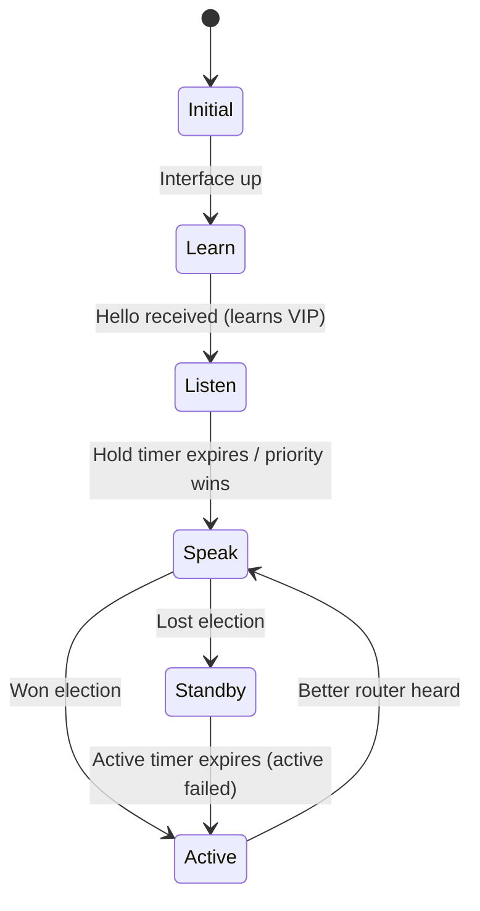
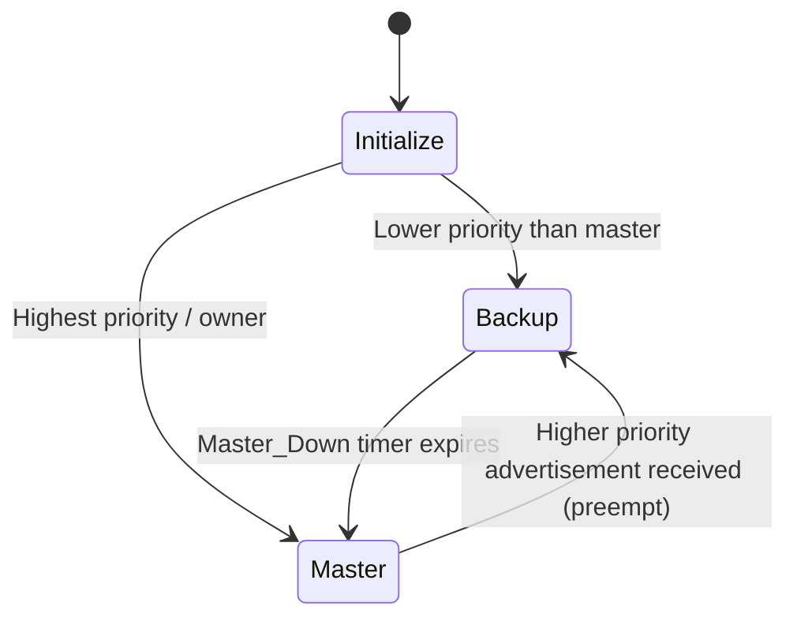
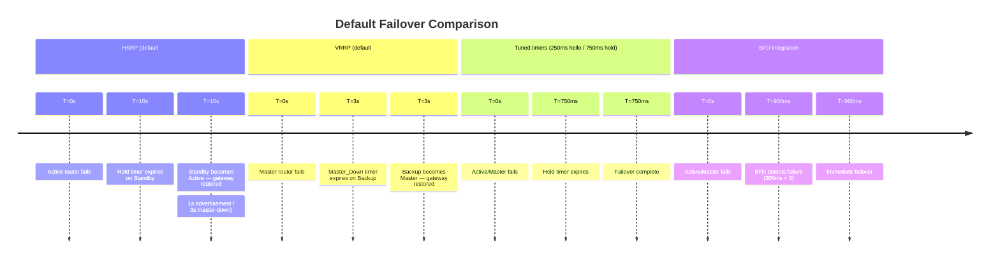
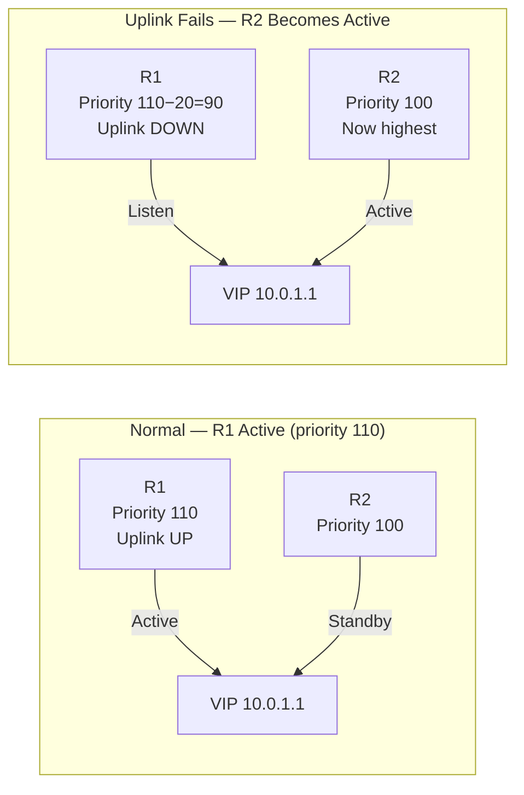

# HSRP vs VRRP

HSRP (Hot Standby Router Protocol, Cisco proprietary) and VRRP (Virtual Router
Redundancy Protocol, RFC 5798) both solve the same problem: hosts have a single
default gateway configured, but that router can fail. Both protocols present a
**virtual IP (VIP)** and **virtual MAC** shared between two or more routers. One
router is active and forwards traffic; the others monitor it and take over on failure.

For IOS-XE configuration see [HSRP and VRRP Configuration](../cisco/cisco_hsrp_vrrp.md).

---

## At a Glance

| Property | HSRP v2 | VRRP v3 |
| --- | --- | --- |
| **Standard** | Cisco proprietary | RFC 5798 (VRRPv3), RFC 3768 (VRRPv2) |
| **Transport** | UDP `1985`, multicast `224.0.0.102` (v2) / `FF02::66` (IPv6) | IP protocol `112`, multicast `224.0.0.18` / `FF02::12` |
| **Hello interval** | 3 seconds | 1 second |
| **Hold time** | 10 seconds (3× hello + 1) | 3 seconds (3× hello) |
| **Default failover time** | ~10 seconds | ~3 seconds |
| **Priority** | 0–255, default `100` | 1–254, default `100` |
| **Priority tiebreaker** | Highest IP address | Highest IP address |
| **Preemption default** | Disabled | Enabled |
| **Virtual MAC format** | `0000.0C9F.F` + group (12-bit) | `0000.5E00.01` + group (8-bit, VRRPv2) |
| **Max groups per interface** | 255 (HSRPv2) | 255 |
| **IPv6 support** | HSRPv2 only | VRRPv3 (native) |
| **Master IP = VIP** | Not possible | Allowed (owner concept) |
| **Authentication** | MD5 (HSRPv2), plaintext (HSRPv1) | Plaintext only in VRRPv2; none in VRRPv3 |

---

## How Each Protocol Works

### HSRP State Machine

HSRP routers negotiate through six states:



- **Active router:** Responds to ARP requests for the VIP, forwards traffic.
- **Standby router:** Monitors the Active. If the Active's hello messages stop arriving
  within the hold time, the Standby immediately becomes Active.

- **Listen state:** Other routers in the group that are neither Active nor Standby.
  They monitor but do not participate in the election unless both Active and Standby fail.

Only two routers play Active/Standby at any time — the rest sit in Listen. HSRP
groups can have many members, but only one active and one standby exist per group.

### VRRP State Machine

VRRP has three states and a simpler model:



- **Master:** Forwards traffic and sends VRRP Advertisements.
- **Backup:** Listens for Advertisements from the Master. On expiry of
  `Master_Down_Interval` (3 × Advertisement_Interval + Skew_Time), a Backup
  transitions to Master.

- **Owner:** A router whose real IP address *is* the VIP. The owner always has
  priority 255 and is always preferred as Master. HSRP has no equivalent — the VIP
  must be distinct from any real interface address.

---

## Election: Priority and Preemption

Both protocols elect the Active/Master based on **priority** (higher wins), with the
highest IP address as a tiebreaker.

**Preemption** controls whether a higher-priority router will take over from a
lower-priority Active/Master when it comes back online:

| | HSRP | VRRP |
| --- | --- | --- |
| Preemption default | **Disabled** | **Enabled** |
| Enable/disable | `standby <g> preempt` | `no vrrp <g> preempt` (to disable) |
| Preemption delay | `standby <g> preempt delay minimum <s>` | `vrrp <g> timers advertise <ms>` (indirect) |

**HSRP preemption is off by default.** This means if a higher-priority router reboots,
it does not reclaim the Active role — the lower-priority router that took over keeps it.
Always enable preemption with a delay:

```ios

standby 1 preempt delay minimum 30
```

The 30-second delay prevents a router from becoming Active before its routing table
has fully converged (OSPF/BGP adjacencies re-established), which would cause a traffic
black-hole even though HSRP has converged.

**VRRP preemption is on by default.** The highest-priority router always claims Master.
No delay is configured by default — add one in production:

```ios

vrrp 1 address-family ipv4
 preempt delay minimum 30
```

---

## Timers and Failover Time

Default failover time is determined by the hold/dead interval:



VRRP's faster defaults (1s/3s vs 3s/10s) mean out-of-box failover is roughly 3× faster
than HSRP. Both can be tuned to millisecond intervals; BFD provides the fastest
detection (~900ms default, tunable lower) independent of HSRP/VRRP hello timers.

---

## Virtual MAC Behaviour

Both protocols use a deterministic virtual MAC derived from the group number. Hosts
ARP for the VIP and cache this virtual MAC. When a failover occurs, the new Active/Master
sends a **gratuitous ARP** (HSRP) or an unsolicited VRRP Advertisement (VRRP) to update
switch MAC tables and host ARP caches, redirecting traffic immediately.

**HSRP virtual MAC:**
`0000.0C9F.F` + 12-bit group number
Group 1 → `0000.0C9F.F001`, Group 10 → `0000.0C9F.F00A`

**VRRP virtual MAC (VRRPv2/v3 IPv4):**
`0000.5E00.01` + 8-bit group number (0–255)
Group 1 → `0000.5E00.0101`, Group 10 → `0000.5E00.010A`

> VRRP's group number is only 8 bits (0–255 per VRRPv2 MAC format), so groups above
> 255 on VRRPv3 use a different approach. HSRP's 12-bit group allows 4096 groups but
> this is rarely a practical constraint.

---

## Tracking and Failover Triggers

Both protocols support object tracking to trigger a priority decrement when something
upstream fails — forcing a failover to the standby router even if the gateway interface
is still up.



Without tracking, a failure of R1's uplink (its path to the rest of the network) does
not affect HSRP/VRRP — R1 remains Active and forwards traffic into a black hole.
Object tracking solves this by reducing R1's priority below R2's when the uplink fails.

---

## IPv6 Support

**HSRP:** HSRPv2 supports IPv6 with a separate group configuration. The virtual IPv6
address must be a link-local address; uses multicast `FF02::66`.

**VRRP:** VRRPv3 (RFC 5798) natively supports both IPv4 and IPv6 within the same
framework, using `FF02::12` for advertisements. VRRPv2 (RFC 3768) supports IPv4 only.

For dual-stack environments, VRRPv3 is the cleaner choice — one protocol covers both
address families with consistent behaviour.

---

## When to Use Each

### Use HSRP when

- The environment is Cisco-only and the additional Cisco-specific features matter
  (e.g., per-VLAN HSRP load balancing with PVST+ alignment is well-understood
  operationally in Cisco shops)

- Existing network is already using HSRP and migration cost outweighs benefits

### Use VRRP when

- The network includes non-Cisco devices (firewalls, load balancers, non-Cisco
  switches acting as gateways)

- IPv6 redundancy is required — VRRPv3 handles both address families cleanly
- Faster default failover time matters and tuning hsrp timers feels like unnecessary
  configuration overhead

- Greenfield deployment — VRRP is the vendor-neutral standard

### Practical Differences That Matter Most

1. **Preemption defaults are opposite.** HSRP requires explicit `preempt` to reclaim

   Active after a recovery; VRRP preempts by default. This catches engineers who
   configure HSRP without preempt and then wonder why the preferred router never
   reclaims Active after a reboot.

2. **VRRP allows the VIP to be a real interface address.** The VRRP owner (the router

   whose real IP is the VIP) has an implicit priority of 255. HSRP always requires the
   VIP to be separate from any real interface address.

3. **HSRP has more Cisco-specific integration.** IP SLA tracking, NHRP, and some

   Cisco SD-WAN integrations tie into HSRP more naturally in Cisco-only environments.

---

## Notes

- Both HSRP and VRRP are **gateway redundancy only** — they do not load-balance traffic
  across routers in their basic form. ECMP or per-VLAN load balancing (multiple groups
  with different active routers) are the standard approaches.

- VRRP advertisements are sent to `224.0.0.18` (IP protocol 112). Some firewalls drop
  IP protocol 112 — ensure VRRP multicast is permitted between gateway interfaces.

- In a spine-leaf datacentre fabric, HSRP/VRRP is largely replaced by **anycast
  gateway** on leaf switches — every leaf presents the same gateway MAC/IP, eliminating
  the need for a separate redundancy protocol. See
  [Data Centre Topologies](dc_topologies.md).

- `show standby brief` / `show vrrp brief` — quick state overview for all groups.
  The Active/Master router is shown with its real IP; confirm it is the intended
  primary before making changes.
