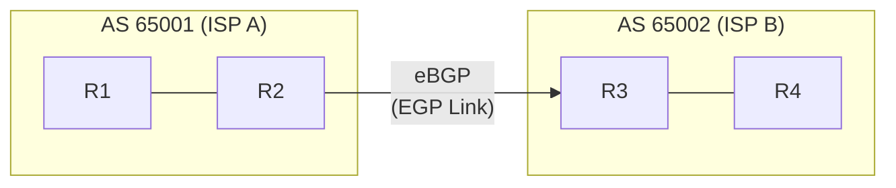
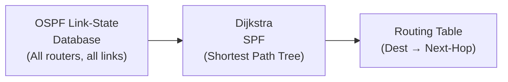
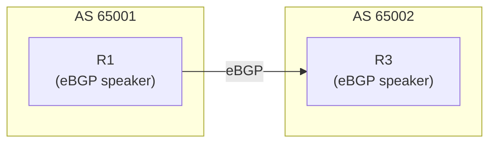
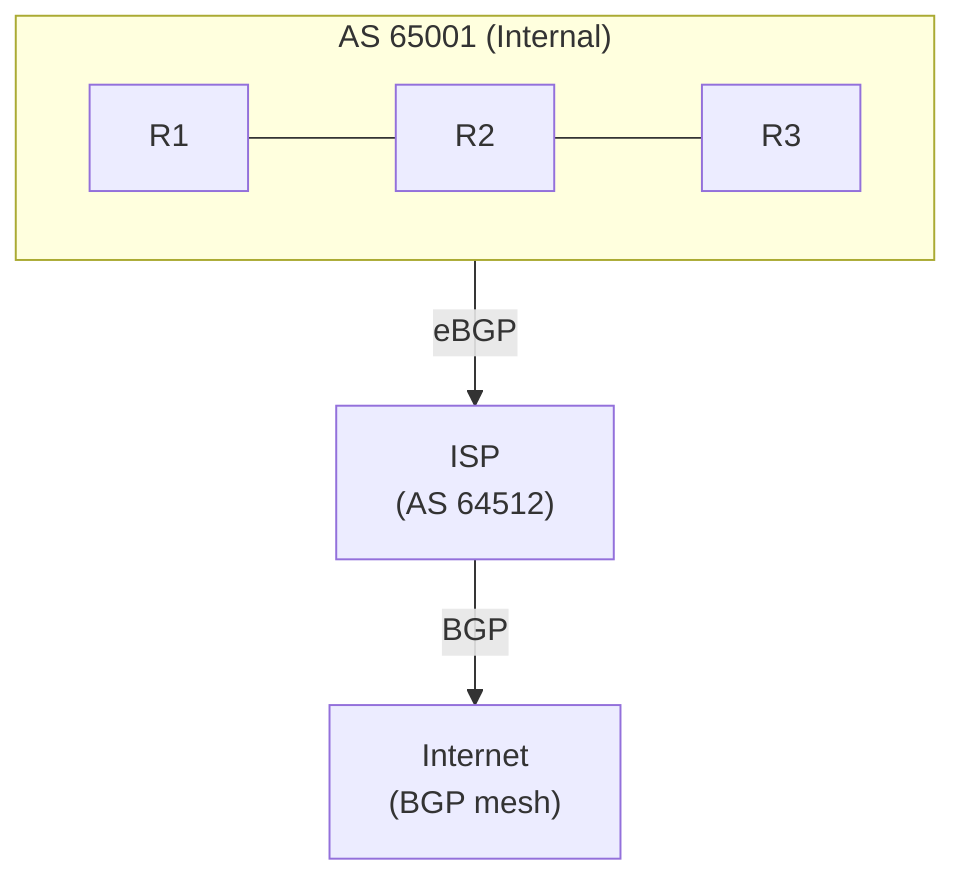
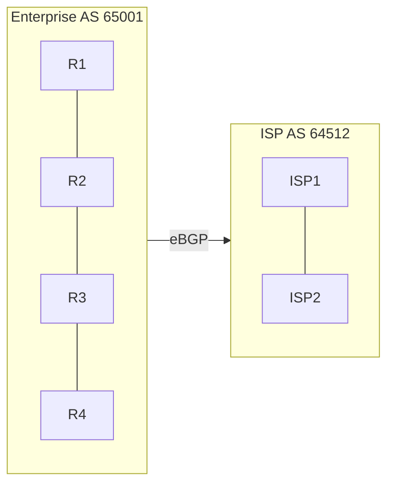
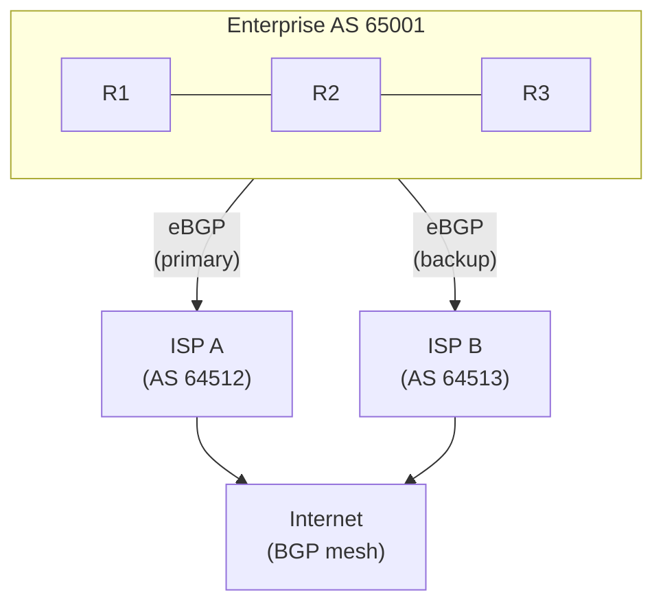
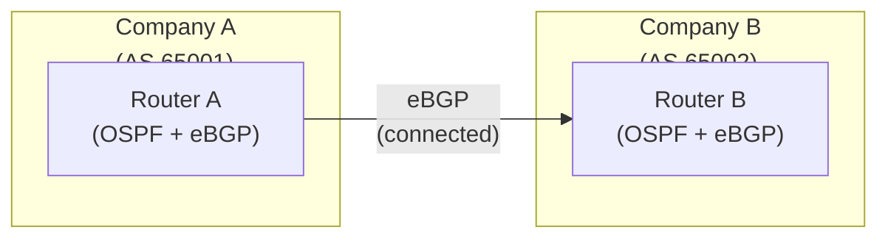

# IGPs vs EGPs (Interior vs Exterior Gateway Protocols)

Interior Gateway Protocols (IGPs) and Exterior Gateway Protocols (EGPs) solve different routing
problems within different scopes. IGPs optimize routing within a single autonomous system (AS),
while EGPs connect separate autonomous systems and enforce policy at the AS boundary. Understanding
their distinction is fundamental to network architecture.

---

## At a Glance

| Aspect | IGP (Interior) | EGP (Exterior) |
| --- | --- | --- |
| **Scope** | Single AS (internal) | Between autonomous systems |
| **Primary Goal** | Optimize path; fast convergence | Policy control; AS-level reachability |
| **Scale** | 10s–1000s of routers | 1000s of networks globally |
| **Metrics** | Technical (cost, bandwidth, delay) | Path attributes (AS-path, local-pref, MED) |
| **Common Protocols** | OSPF, EIGRP, IS-IS, RIP | BGP (de facto standard) |
| **Convergence** | Sub-second to seconds | Minutes (by design for stability) |
| **Update Style** | Periodic or event-driven | Event-driven (no periodic flooding) |
| **Auth Methods** | MD5, SHA-256 | MD5, TCP MD5 option |
| **Architecture Role** | Intra-AS routing; optimality | Inter-AS routing; reachability + policy |

---

## Quick Reference

| Aspect | IGP (Interior) | EGP (Exterior) |
| --- | --- | --- |
| **Scope** | Within a single AS | Between autonomous systems |
| **Primary goal** | Fast, optimal path; converge quickly | Policy control; reachability assurance |
| **Metrics** | Technical: cost, delay, bandwidth, hop count | Path attributes: AS-path, local pref, MED |
| **Common protocols** | OSPF, EIGRP, IS-IS, RIP | BGP (de facto standard) |
| **Scalability** | 10s–1000s of routers | Tens of thousands of networks globally |
| **Convergence time** | Sub-second to seconds | Minutes (by design) |
| **Authentication** | Yes (MD5, SHA) | Yes (MD5, TCP MD5 option) |
| **Update frequency** | Periodic or event-driven | Event-driven (no periodic flooding) |
| **Routing decision basis** | Shortest/best path to destination | AS path, peer relationships, policies |

---

## What are Autonomous Systems?

An **Autonomous System (AS)** is a network under a single administrative control that presents a
unified routing policy to the Internet. Each AS is assigned a unique 16-bit (now 32-bit) AS number
(ASN).



Within AS 65001: OSPF distributes routes
Within AS 65002: OSPF distributes routes
Between ASes: BGP exchanges reachability

---

## Interior Gateway Protocols (IGPs)

### Purpose

IGPs optimize routing **within** an AS. Every router in the AS runs the same IGP and builds a
complete or near-complete view of the network topology. The IGP's job is to find the fastest,
lowest-cost path to reach destinations.

### Common IGPs

| Protocol | Type | Metric | Scalability | Use Case |
| --- | --- | --- | --- | --- |
| **OSPF** | Link-state | Cost (10^8/bandwidth) | Large enterprise, ISP | Open standard; most common |
| **EIGRP** | Distance-vector | Composite (bandwidth, delay, load, reliability) | Medium to large | Cisco-dominant networks |
| **IS-IS** | Link-state | Configurable metric | Very large ISP networks | Service provider backbone |
| **RIP** | Distance-vector | Hop count | Small networks only (deprecated) | Legacy; rarely deployed |

### Key Characteristics

- **Convergence:** Fast (sub-second to seconds) — network changes trigger immediate recalculation
- **Scope:** Limited to a single AS — stops at AS boundary
- **Metric-based:** Optimizes on technical parameters (bandwidth, delay, hop count)
- **Full topology awareness:** Each router knows all reachable prefixes and the topology

### Example: OSPF Within an AS



R1's routing perspective:

```text
10.1.1.0/24 via 10.0.0.2 (cost 20)     [via R2]
10.2.0.0/24 via 10.0.0.3 (cost 50)     [via R3]
10.3.0.0/24 via 10.0.0.2 (cost 70)     [via R2→R4]

IGP chooses: Always use the lowest-cost path
```

---

## Exterior Gateway Protocols (EGPs)

### Purpose

EGPs exchange routing information **between** autonomous systems. BGP (the only modern EGP in
production) is policy-driven: it allows each AS to control which routes it accepts, advertises,
and prefers based on business relationships and policies, not just technical metrics.

### BGP (Border Gateway Protocol)

BGP is the Internet's routing protocol. Every Internet-connected AS must run BGP to exchange
routes with its neighbors (peers).

**Key features:**

- **AS-path attribute:** Shows which ASes a route has traversed (loop prevention)
- **Local preference:** Allows an AS to prefer some external routes over others
- **Multi-Exit Discriminator (MED):** Suggests preferred entry point to peer AS
- **Communities:** Tags routes for policy grouping
- **Policy control:** Prefix filters, attribute manipulation, route redistribution

### Key Characteristics

- **Convergence:** Slow (minutes by design) — stability over speed at Internet scale
- **Scope:** Unlimited — routes can traverse the entire Internet
- **Policy-based:** Optimizes on business relationships, not just metrics
- **Partial topology:** Each router sees only routes its peers advertise (limited view)

### Example: BGP Between ASes



R1 advertises to R3: "AS 65001 can reach 10.1.0.0/16"

```text
BGP Path Attributes:
  AS_PATH: [65001]
  NEXT_HOP: 10.0.1.1 (R1's address)
  LOCAL_PREF: 100 (R1's preference)
  MED: 50 (preferred entry point)

R3's decision:
  "I learned about 10.1.0.0/16 from AS 65001 (AS_PATH: 65001)
   I also learned it from AS 65003 (AS_PATH: 65003, 65001)
   AS 65001 is shorter → prefer R1's route"
```

---

## IGP vs EGP: Design Principles

### When to Use IGP Alone

- **Small networks:** Single site, no Internet connectivity
- **Private networks:** Data center, campus — no need for external routing
- **Full mesh:** All routers can reach each other directly

### When to Use Both IGP + EGP

- **Internet connectivity:** Must run BGP to exchange routes with ISPs
- **Multiple ASes:** Separate administrative domains (e.g., company + partner networks)
- **Policy control:** Different routing policies needed at AS boundary
- **Enterprise + Cloud:** Internal IGP (OSPF) + external BGP to cloud providers

### Typical Enterprise Architecture



Inside AS 65001:

- OSPF distributes all 10.0.0.0/8 prefixes
- All routers know full topology

At boundary (R3 or eBGP speaker):

- BGP advertises 10.0.0.0/8 to ISP
- BGP learns default route or full table from ISP
- BGP policies filter/prioritize routes

---

## Interaction: IGP → EGP → IGP

Routes flow across ASes through this chain:

1. **Within AS 65001 (IGP):** OSPF distributes 10.1.0.0/16 to all routers
2. **At boundary:** R1 (eBGP speaker) advertises 10.1.0.0/16 via BGP to ISP
3. **At ISP (IGP):** ISP's OSPF carries 10.1.0.0/16 across its network
4. **At ISP boundary:** ISP's eBGP speaker advertises 10.1.0.0/16 to other ISPs
5. **Return path:** Reverse flow brings external routes back (via BGP → IGP)

### Why Two Layers?

- **IGP:** Optimizes on technical metrics (speed, efficiency) within a domain
- **EGP:** Enforces business policies (partnerships, SLAs, cost) between domains
- **Scale:** IGP handles hundreds of routers; BGP handles millions of networks

---

## Common Scenarios

### Scenario 1: Enterprise with Single ISP



Enterprise routing:

- OSPF: All internal routes (cost-based)
- BGP: One eBGP session to ISP (receive default route + learned routes)
- Policy: Accept all ISP routes; advertise corporate summarized prefix

### Scenario 2: Enterprise with Dual ISP (Redundancy)



Enterprise routing:

- OSPF: Internal (10.0.0.0/8)
- BGP session 1: ISP A (AS 64512)
- BGP session 2: ISP B (AS 64513)
- Policy: Prefer ISP A (local-pref 200 vs ISP B 100)
- Failover: If ISP A down, automatic failover to ISP B via BGP

### Scenario 3: Multi-AS Enterprise (Merger/Acquisition)



Each company:

- Runs OSPF internally
- Runs BGP to peer with other company
- Can now share routes while maintaining internal routing autonomy
- Policies define what's advertised/learned between companies

---

## Common Misconceptions

| Misconception | Reality |
| --- | --- |
| **"BGP is for routing to the Internet"** | BGP can be used for any inter-AS routing; many enterprise networks use BGP internally between data centers |
| **"IGP can handle Internet routing"** | IGP floods all routes to all routers; doesn't scale beyond ~1000s of routes and no policy control |
| **"EGP replaces IGP"** | They solve different problems; modern networks use both layers |
| **"More routers = more BGP"** | Interior scale is handled by IGP (OSPF, EIGRP); BGP handles AS-to-AS scope |

---

## Notes / Gotchas

- **BGP is Not Just for the Internet:** Many enterprises use BGP between data centers or for
  inter-company routing wherever multiple autonomous systems need policy-controlled routing.

- **IGPs Cannot Scale to Global Internet Size:** OSPF floods all topology changes to every
  router. With 1M+ prefixes, this would overwhelm routers. BGP's event-driven updates and
  aggregation make global scale possible.

- **Mixing IGPs Requires Redistribution:** Running OSPF in one site and EIGRP in another
  requires redistribution at the border router. This is complex — avoid mixing IGPs unless
  absolutely necessary.

- **BGP Does Not Guarantee Optimality:** BGP applies policy (local-preference, AS-path,
  MED) before technical metrics. A policy-preferred path may be physically longer than
  the optimal route.

- **AS Numbers Are Public Identity:** An AS number is a network's public routing identity.
  Changing it requires BGP session resets across all peers — a major operational event.

---

## See Also

- [eBGP vs iBGP](../theory/ebgp_vs_ibgp.md)
- [BGP Fundamentals](../theory/bgp_fundamentals.md)
- [OSPF vs EIGRP](../theory/ospf_vs_eigrp.md)
- [Route Redistribution](../theory/route_redistribution.md)
- [Static vs Dynamic Routing](../theory/static_vs_dynamic_routing.md)
