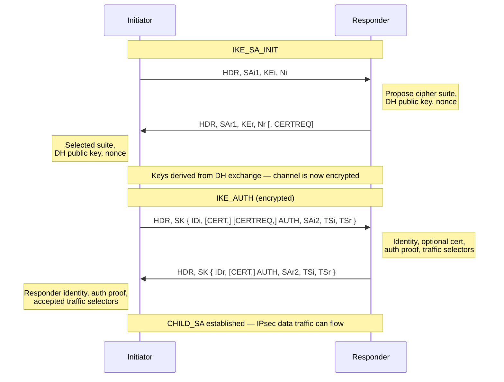

# IPsec and IKE

IPsec is a suite of protocols that operates at Layer 3 to provide
**authentication** (proof of data origin), **integrity** (detection of
in-transit modification via HMAC), **confidentiality** (encryption), and
**anti-replay protection** (sequence numbers that reject duplicate or
out-of-order packets). Because IPsec is implemented in the IP stack rather than
in applications, it is transparent to the applications using the tunnel — no
application changes are required.

For GRE over IPsec see [GRE](../packets/gre.md). For FortiGate VPN configuration
see [FortiGate SD-WAN](../fortigate/fortigate_sdwan.md). For AWS VPN usage see
[AWS BGP Stack](../aws/bgp_stack_vpn_over_dx.md).

---

## AH vs ESP

Two protocols carry IPsec-protected traffic. In modern deployments, ESP is used
exclusively.

| | AH | ESP |
| --- | --- | --- |
| **IP Protocol number** | 51 | 50 |
| **Provides encryption** | No | Yes |
| **Provides integrity &#124; authentication** | Yes | Yes |
| **What is authenticated** | Entire IP packet including IP header | ESP header, payload, and trailer (not outer IP header) |
| **NAT compatible** | No — NAT modifies the IP header, invalidating AH's signature | Yes — with NAT-T (UDP 4500 encapsulation) |
| **Used in practice** | Rarely — encryption is almost always required | Standard choice for all VPN deployments |

AH's inclusion of the outer IP header in its authentication scope means any
device that rewrites a source or destination address (including NAT) will cause
the receiving peer to reject the packet as tampered. There is no workaround —
AH and NAT are fundamentally incompatible.

---

## Tunnel Mode vs Transport Mode

| | Tunnel Mode | Transport Mode |
| --- | --- | --- |
| **What is encrypted** | Entire original IP packet (header + payload) | IP payload only; original IP header is preserved |
| **New outer IP header** | Yes — added by the encapsulating device | No — original IP header remains |
| **Typical use** | Gateway-to-gateway VPNs; client-to-gateway VPNs | Host-to-host (e.g., between servers); GRE+IPsec |
| **Overhead** | Higher (additional 20-byte IP header + ESP header) | Lower |

In tunnel mode, the original packet is opaque to any device between the two
IPsec endpoints — source, destination, and payload are all hidden inside the
encrypted outer packet. In transport mode, the original IP addresses remain
visible; only the payload is protected.

GRE over IPsec typically uses transport mode: GRE provides the tunnel
encapsulation; IPsec transport mode encrypts the GRE payload. The result is a
routable, encrypted tunnel that also supports multicast (which native IPsec
tunnel mode does not).

---

## IKE: Internet Key Exchange

IKE negotiates the cryptographic parameters and authenticates the peers before
any protected data flows. It runs over UDP port 500 (and UDP 4500 when NAT-T is
active). IKE establishes **Security Associations (SAs)** — unidirectional
agreements between two peers on which algorithms and keys to use.

### IKEv1

IKEv1 operates in two phases:

**Phase 1** establishes the ISAKMP SA (the secure channel used to protect Phase 2
negotiation). Two modes:

- **Main mode:** 6 messages. Identity of each peer is protected by encryption
  negotiated in the earlier messages. More secure; required when peer identity
  should not be exposed.
- **Aggressive mode:** 3 messages. Peer identity is sent in the clear before
  encryption is established. Faster but pre-shared key identity is exposed to
  passive eavesdroppers. Avoid in new deployments.

**Phase 2 (Quick mode):** 3 messages. Negotiates the IPsec SAs (one per
direction) that carry the actual data traffic. Runs inside the protection of the
Phase 1 SA.

### IKEv2

IKEv2 (RFC 7296) replaces both phases with a single 4-message exchange, while
adding capabilities IKEv1 lacked:

- **IKE_SA_INIT** (2 messages): peers propose cipher suites, perform Diffie-Hellman
  key exchange, and exchange nonces
- **IKE_AUTH** (2 messages): peers authenticate (PSK, certificates, or EAP) and
  create the first CHILD_SA (equivalent to the IPsec SA)

Additional CHILD_SAs (for additional traffic selectors) are created with
`CREATE_CHILD_SA` exchanges — each costs 2 messages, not a full new negotiation.

IKEv2 is preferred for all new deployments.

---

## IKEv2 Exchange

---

## Security Associations

An SA is a unidirectional relationship between two IPsec peers defining the
algorithm, key, and lifetime for a single direction of traffic. A bidirectional
IPsec tunnel requires:

- 1 IKE SA (bidirectional, used for control traffic)
- 2 IPsec SAs — one for each direction of data traffic

Each SA is identified by a **SPI (Security Parameter Index)**, a 32-bit value
chosen by the receiving peer and included in the ESP header of every packet.
The receiving peer uses the SPI to look up the correct SA and decryption key.

SAs have a lifetime (time-based and/or byte-based). Before expiry, IKEv2
automatically renegotiates via a `CREATE_CHILD_SA` exchange. IKEv1 uses a
Quick mode re-key.

---

## Recommended Cryptographic Parameters

| Parameter | Recommended | Acceptable | Avoid |
| --- | --- | --- | --- |
| **Encryption** | AES-256-GCM | AES-256-CBC, AES-128-GCM | 3DES, DES, AES-128-CBC |
| **Integrity (HMAC)** | SHA-256, SHA-384 | SHA-1 (legacy only) | MD5 |
| **Note on GCM** | GCM is AEAD — provides combined auth + encryption; no separate HMAC needed | — | — |
| **DH group (IKE)** | Group 19 (ECDH P-256), Group 20 (ECDH P-384) | Group 14 (2048-bit MODP) minimum | Groups 1, 2, 5 |
| **PFS (CHILD_SA)** | Enabled — new DH for each rekey | — | Disabled (long-term key compromise exposes all past sessions) |

**Perfect Forward Secrecy (PFS):** When PFS is enabled, a new Diffie-Hellman
exchange is performed for every CHILD_SA rekeying event. Session keys are derived
independently of the long-term authentication keys. If a long-term key (PSK or
private key) is later compromised, past sessions cannot be decrypted because the
ephemeral DH keys used to derive them are gone.

---

## NAT Traversal (NAT-T)

When either IPsec peer is behind a NAT device, ESP cannot be sent directly over
IP protocol 50 — NAT devices cannot rewrite ESP headers in the same way they
handle TCP/UDP port numbers. NAT-T solves this by wrapping ESP inside UDP port
4500.

Detection and activation:

1. During `IKE_SA_INIT`, both peers include a NAT detection notification payload
2. Each peer hashes its own IP and port; if the received hash does not match the
   observed source address, NAT is present
3. If either peer detects NAT, both peers switch to UDP 4500 for all subsequent
   IKE and ESP traffic
4. ESP packets are encapsulated as: `UDP 4500 | Non-ESP Marker | ESP`

NAT-T is built into IKEv2 and requires no explicit configuration on most
platforms. IKEv1 requires NAT-T to be explicitly enabled on older implementations.
A NAT keepalive (small UDP packet sent every 20 seconds by default) prevents the
NAT translation table entry from timing out during idle periods.

---

## IKE Version Comparison

| | IKEv1 Main Mode | IKEv1 Aggressive Mode | IKEv2 |
| --- | --- | --- | --- |
| **Messages to establish** | 9 (6 Phase 1 + 3 Phase 2) | 6 (3 Phase 1 + 3 Phase 2) | 4 |
| **Identity protected** | Yes — encrypted in Phase 1 | No — sent before encryption | Yes — encrypted in IKE_AUTH |
| **NAT-T built-in** | No — vendor extension | No — vendor extension | Yes |
| **EAP authentication** | No | No | Yes |
| **MOBIKE (mobility)** | No | No | Yes |
| **PFS** | Optional (Quick mode) | Optional (Quick mode) | Optional (CREATE_CHILD_SA) |
| **Recommendation** | Legacy only | Avoid | Preferred for all new deployments |

---

## Related Pages

- [GRE](../packets/gre.md)
- [AWS BGP Stack](../aws/bgp_stack_vpn_over_dx.md)
- [FortiGate SD-WAN](../fortigate/fortigate_sdwan.md)
