# IPsec and IKE

IPsec is a suite of protocols that operates at Layer 3 to provide
**authentication** (proof of data origin), **integrity** (detection of
in-transit modification via HMAC), **confidentiality** (encryption), and
**anti-replay protection** (sequence numbers that reject duplicate or
out-of-order packets). Because IPsec is implemented in the IP stack rather than
in applications, it is transparent to the applications using the tunnel — no
application changes are required.

For GRE over IPsec see [GRE](../packets/gre.md). For FortiGate VPN configuration
see [FortiGate SD-WAN](../fortigate/fortigate_sdwan.md). For AWS VPN usage see
[AWS BGP Stack](../aws/bgp_stack_vpn_over_dx.md).

---

## AH vs ESP

Two protocols carry IPsec-protected traffic. In modern deployments, ESP is used
exclusively.

| | AH | ESP |
| --- | --- | --- |
| **IP Protocol number** | 51 | 50 |
| **Provides encryption** | No | Yes |
| **Provides integrity &#124; authentication** | Yes | Yes |
| **What is authenticated** | Entire IP packet including IP header | ESP header, payload, and trailer (not outer IP header) |
| **NAT compatible** | No — NAT modifies the IP header, invalidating AH's signature | Yes — with NAT-T (UDP 4500 encapsulation) |
| **Used in practice** | Rarely — encryption is almost always required | Standard choice for all VPN deployments |

AH's inclusion of the outer IP header in its authentication scope means any
device that rewrites a source or destination address (including NAT) will cause
the receiving peer to reject the packet as tampered. There is no workaround —
AH and NAT are fundamentally incompatible.

---

## Tunnel Mode vs Transport Mode

| | Tunnel Mode | Transport Mode |
| --- | --- | --- |
| **What is encrypted** | Entire original IP packet (header + payload) | IP payload only; original IP header is preserved |
| **New outer IP header** | Yes — added by the encapsulating device | No — original IP header remains |
| **Typical use** | Gateway-to-gateway VPNs; client-to-gateway VPNs | Host-to-host (e.g., between servers); GRE+IPsec |
| **Overhead** | Higher (additional 20-byte IP header + ESP header) | Lower |

In tunnel mode, the original packet is opaque to any device between the two
IPsec endpoints — source, destination, and payload are all hidden inside the
encrypted outer packet. In transport mode, the original IP addresses remain
visible; only the payload is protected.

GRE over IPsec typically uses transport mode: GRE provides the tunnel
encapsulation; IPsec transport mode encrypts the GRE payload. The result is a
routable, encrypted tunnel that also supports multicast (which native IPsec
tunnel mode does not).

---

## IKE: Internet Key Exchange

IKE negotiates the cryptographic parameters and authenticates the peers before
any protected data flows. It runs over UDP port 500 (and UDP 4500 when NAT-T is
active). IKE establishes **Security Associations (SAs)** — unidirectional
agreements between two peers on which algorithms and keys to use.

### IKEv1

IKEv1 operates in two phases:

**Phase 1** establishes the ISAKMP SA (the secure channel used to protect Phase 2
negotiation). Two modes:

- **Main mode:** 6 messages. Identity of each peer is protected by encryption
  negotiated in the earlier messages. More secure; required when peer identity
  should not be exposed.

- **Aggressive mode:** 3 messages. Peer identity is sent in the clear before
  encryption is established. Faster but pre-shared key identity is exposed to
  passive eavesdroppers. Avoid in new deployments.

**Phase 2 (Quick mode):** 3 messages. Negotiates the IPsec SAs (one per
direction) that carry the actual data traffic. Runs inside the protection of the
Phase 1 SA.

### IKEv2

IKEv2 (RFC 7296) replaces both phases with a single 4-message exchange, while
adding capabilities IKEv1 lacked:

- **IKE_SA_INIT** (2 messages): peers propose cipher suites, perform Diffie-Hellman
  key exchange, and exchange nonces

- **IKE_AUTH** (2 messages): peers authenticate (PSK, certificates, or EAP) and
  create the first CHILD_SA (equivalent to the IPsec SA)

Additional CHILD_SAs (for additional traffic selectors) are created with
`CREATE_CHILD_SA` exchanges — each costs 2 messages, not a full new negotiation.

IKEv2 is preferred for all new deployments.

---

## IKEv2 Exchange

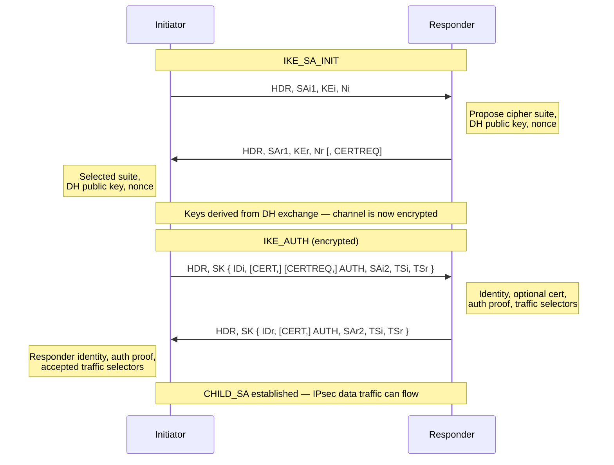

---

## Security Associations

An SA is a unidirectional relationship between two IPsec peers defining the
algorithm, key, and lifetime for a single direction of traffic. A bidirectional
IPsec tunnel requires:

- 1 IKE SA (bidirectional, used for control traffic)
- 2 IPsec SAs — one for each direction of data traffic

Each SA is identified by a **SPI (Security Parameter Index)**, a 32-bit value
chosen by the receiving peer and included in the ESP header of every packet.
The receiving peer uses the SPI to look up the correct SA and decryption key.

SAs have a lifetime (time-based and/or byte-based). Before expiry, IKEv2
automatically renegotiates via a `CREATE_CHILD_SA` exchange. IKEv1 uses a
Quick mode re-key.

---

## Recommended Cryptographic Parameters

| Parameter | Recommended | Acceptable | Avoid |
| --- | --- | --- | --- |
| **Encryption** | AES-256-GCM | AES-256-CBC, AES-128-GCM | 3DES, DES, AES-128-CBC |
| **Integrity (HMAC)** | SHA-256, SHA-384 | SHA-1 (legacy only) | MD5 |
| **Note on GCM** | GCM is AEAD — provides combined auth + encryption; no separate HMAC needed | — | — |
| **DH group (IKE)** | Group 19 (ECDH P-256), Group 20 (ECDH P-384) | Group 14 (2048-bit MODP) minimum | Groups 1, 2, 5 |
| **PFS (CHILD_SA)** | Enabled — new DH for each rekey | — | Disabled (long-term key compromise exposes all past sessions) |

**Perfect Forward Secrecy (PFS):** When PFS is enabled, a new Diffie-Hellman
exchange is performed for every CHILD_SA rekeying event. Session keys are derived
independently of the long-term authentication keys. If a long-term key (PSK or
private key) is later compromised, past sessions cannot be decrypted because the
ephemeral DH keys used to derive them are gone.

---

## NAT Traversal (NAT-T)

When either IPsec peer is behind a NAT device, ESP cannot be sent directly over
IP protocol 50 — NAT devices cannot rewrite ESP headers in the same way they
handle TCP/UDP port numbers. NAT-T solves this by wrapping ESP inside UDP port
4500.

Detection and activation:

1. During `IKE_SA_INIT`, both peers include a NAT detection notification payload
2. Each peer hashes its own IP and port; if the received hash does not match the

   observed source address, NAT is present

3. If either peer detects NAT, both peers switch to UDP 4500 for all subsequent

   IKE and ESP traffic

4. ESP packets are encapsulated as: `UDP 4500 | Non-ESP Marker | ESP`

NAT-T is built into IKEv2 and requires no explicit configuration on most
platforms. IKEv1 requires NAT-T to be explicitly enabled on older implementations.
A NAT keepalive (small UDP packet sent every 20 seconds by default) prevents the
NAT translation table entry from timing out during idle periods.

---

## IKE Version Comparison

| | IKEv1 Main Mode | IKEv1 Aggressive Mode | IKEv2 |
| --- | --- | --- | --- |
| **Messages to establish** | 9 (6 Phase 1 + 3 Phase 2) | 6 (3 Phase 1 + 3 Phase 2) | 4 |
| **Identity protected** | Yes — encrypted in Phase 1 | No — sent before encryption | Yes — encrypted in IKE_AUTH |
| **NAT-T built-in** | No — vendor extension | No — vendor extension | Yes |
| **EAP authentication** | No | No | Yes |
| **MOBIKE (mobility)** | No | No | Yes |
| **PFS** | Optional (Quick mode) | Optional (Quick mode) | Optional (CREATE_CHILD_SA) |
| **Recommendation** | Legacy only | Avoid | Preferred for all new deployments |

---

## ESP Packet Format

ESP (Encapsulating Security Payload) adds a header and trailer around the original IP packet.
Encryption applies to payload and trailer; the ESP header and optional authentication tag are not
encrypted.

```text
  0                   1                   2                   3
  0 1 2 3 4 5 6 7 8 9 0 1 2 3 4 5 6 7 8 9 0 1 2 3 4 5 6 7 8 9 0 1
 +-+-+-+-+-+-+-+-+-+-+-+-+-+-+-+-+-+-+-+-+-+-+-+-+-+-+-+-+-+-+-+-+
 |                           SPI (32 bits)                       |
 +-+-+-+-+-+-+-+-+-+-+-+-+-+-+-+-+-+-+-+-+-+-+-+-+-+-+-+-+-+-+-+-+
 |                    Sequence Number (32 bits)                  |
 +-+-+-+-+-+-+-+-+-+-+-+-+-+-+-+-+-+-+-+-+-+-+-+-+-+-+-+-+-+-+-+-+
 |                                                               |
 ~         Initialization Vector (if required by cipher)         ~
 |                                                               |
 +-+-+-+-+-+-+-+-+-+-+-+-+-+-+-+-+-+-+-+-+-+-+-+-+-+-+-+-+-+-+-+-+
 |                                                               |
 ~                       Encrypted Payload                       ~
 |                                                               |
 +-+-+-+-+-+-+-+-+-+-+-+-+-+-+-+-+-+-+-+-+-+-+-+-+-+-+-+-+-+-+-+-+
 |                                                               |
 ~                         Padding                               ~
 |                                                               |
 +-+-+-+-+-+-+-+-+-+-+-+-+-+-+-+-+-+-+-+-+-+-+-+-+-+-+-+-+-+-+-+-+
 |       Pad Length       |  Next Header  |                       |
 +-+-+-+-+-+-+-+-+-+-+-+-+-+-+-+-+-+-+-+-+-+-+-+-+-+-+-+-+-+-+-+-+
 |                                                               |
 ~            Integrity Check Value / Authentication Tag         ~
 |                                                               |
 +-+-+-+-+-+-+-+-+-+-+-+-+-+-+-+-+-+-+-+-+-+-+-+-+-+-+-+-+-+-+-+-+
```

- **SPI (Security Parameter Index)**: 32-bit index chosen by the receiving peer; identifies which SA
  to use for decryption
- **Sequence Number**: 32-bit counter incremented for each packet; used for anti-replay protection
  and reordering detection
- **Initialization Vector (IV)**: Random or pseudorandom value for block ciphers; sent in clear
  (not encrypted)
- **Encrypted Payload**: Original IP packet (tunnel mode) or original payload (transport mode)
- **Padding**: Added to align plaintext to cipher block size; also provides some traffic analysis
  obfuscation
- **Pad Length**: Number of padding bytes added
- **Next Header**: Identifies protocol of decrypted payload (IP, GRE, etc.)
- **Authentication Tag (ICV)**: HMAC or AEAD tag covering SPI, sequence number, and encrypted
  payload

---

## Traffic Selectors & Encryption Domains

Traffic selectors define **which traffic flows** are protected by an IPsec SA. If a packet's source,
destination, and protocol fall within the traffic selector, it is encrypted; otherwise, it bypasses
IPsec.

### IPsec SA vs Traffic Selectors

- A **single SA** carries encrypted traffic between two peer IP addresses (e.g., 10.0.0.1 ↔
  10.0.0.2)
- **Traffic selectors (TS)** define which application flows are protected by that SA:
  - `TSi` (Initiator Traffic Selector): Initiator's traffic (e.g., source 10.1.0.0/24)
  - `TSr` (Responder Traffic Selector): Responder's traffic (e.g., destination 10.2.0.0/24)

### Example: Single SA with Multiple Traffic Flows

```text
SA: 10.0.0.1 ↔ 10.0.0.2 (VPN endpoint IPs)
  TSi = 10.1.0.0/24 (site A networks)
  TSr = 10.2.0.0/24 (site B networks)

Matching traffic (encrypted):
  10.1.1.5 → 10.2.2.5 (HTTP)
  10.1.2.10 → 10.2.3.20 (DNS)
  10.1.99.1 → 10.2.99.254 (OSPF multicast)

Non-matching traffic (bypasses IPsec):
  10.1.1.5 → 10.3.1.1 (outside TS range)
  10.0.0.1 → 10.0.0.2 (VPN peer management)
```

### Multiple SAs for Granular Control

Some deployments create separate SAs for different traffic classes:

```text
SA1: 10.0.0.1 ↔ 10.0.0.2
  TSi = 10.1.0.0/24, protocol=TCP, port=443 (HTTPS)
  TSr = 10.2.0.0/24, protocol=TCP, port=443

SA2: 10.0.0.1 ↔ 10.0.0.2
  TSi = 10.1.0.0/24, protocol=UDP, port=53 (DNS)
  TSr = 10.2.0.0/24, protocol=UDP, port=53
```

This enables **per-traffic-class QoS**, **different encryption strengths** for different protocols,
or **different rekey lifetimes**.

---

## IPsec Databases: SPD and SAD

IPsec endpoints maintain two databases:

### SPD (Security Policy Database)

Stores **policies** — administrative rules that determine **what action to take** for each packet.

| Selector | Action | Description |
| --- | --- | --- |
| Source IP, Dest IP, Protocol | **Protect** | Encrypt using specified SA (or negotiate if none exists) |
| Source IP, Dest IP, Protocol | **Bypass** | Send in clear (no encryption) |
| Source IP, Dest IP, Protocol | **Discard** | Drop the packet |

**Example SPD entries:**

| Traffic | Action | SA |
| --- | --- | --- |
| 10.1.0.0/24 ↔ 10.2.0.0/24 | Protect | SA-ID 1001 |
| 10.0.0.1 ↔ 10.0.0.2 | Bypass | — (VPN peer signaling) |
| * (all others) | Discard | — |

### SAD (Security Association Database)

Stores **active SAs** — the actual keys, algorithms, and lifetimes in use.

| SA-ID | Peer IP | Direction | SPI | Encryption | Auth | Lifetime | Rekey Timer |
| --- | --- | --- | --- | --- | --- | --- | --- |
| 1001 | 10.0.0.2 | Outbound | 0x4A2C | AES-256-GCM | — | 3600s / 500MB | 3300s |
| 1001 | 10.0.0.2 | Inbound | 0x5F81 | AES-256-GCM | — | 3600s / 500MB | 3300s |

### Lookup Process

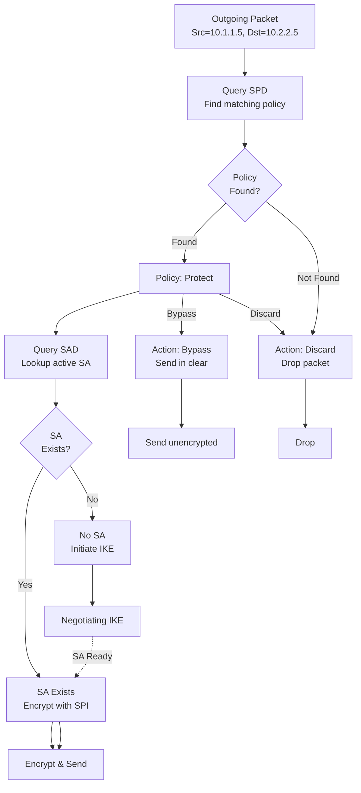

---

## IKEv1 Detailed Phases

### Phase 1: Main Mode (6 messages)

Main mode protects peer identity; required when identities should not be exposed to passive
eavesdroppers.

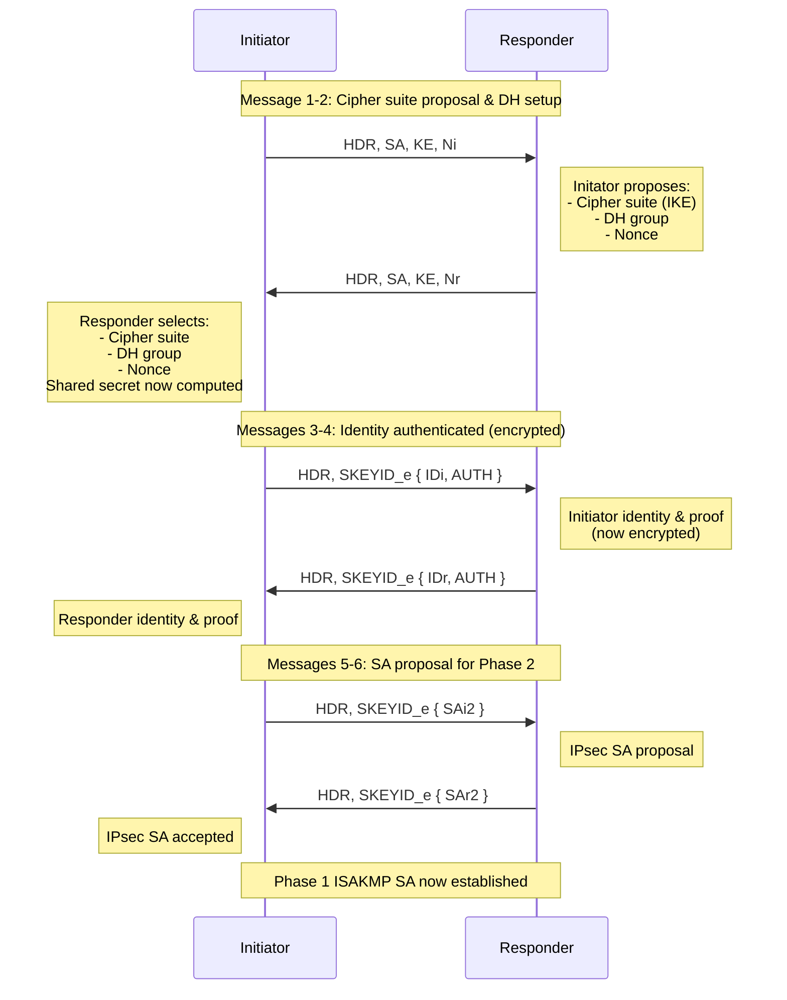

#### Key Derivation After DH Exchange

```text
SKEYID = HMAC(Ni XOR Nr, pre-shared-key | nonce_data)
SKEYID_ae = HMAC(SKEYID, "ae" | CookieI | CookieR)  [auth encryption]
SKEYID_ai = HMAC(SKEYID_ae, Ni)                      [auth inbound]
SKEYID_ar = HMAC(SKEYID_ae, Nr)                      [auth outbound]
SKEYID_ei = HMAC(SKEYID_ai, Ni | "enc" | CookieI)  [enc inbound]
SKEYID_er = HMAC(SKEYID_ai, Nr | "enc" | CookieR)  [enc outbound]
```

### Phase 1: Aggressive Mode (3 messages)

Aggressive mode is faster but exposes peer identity in message 1 (before encryption).

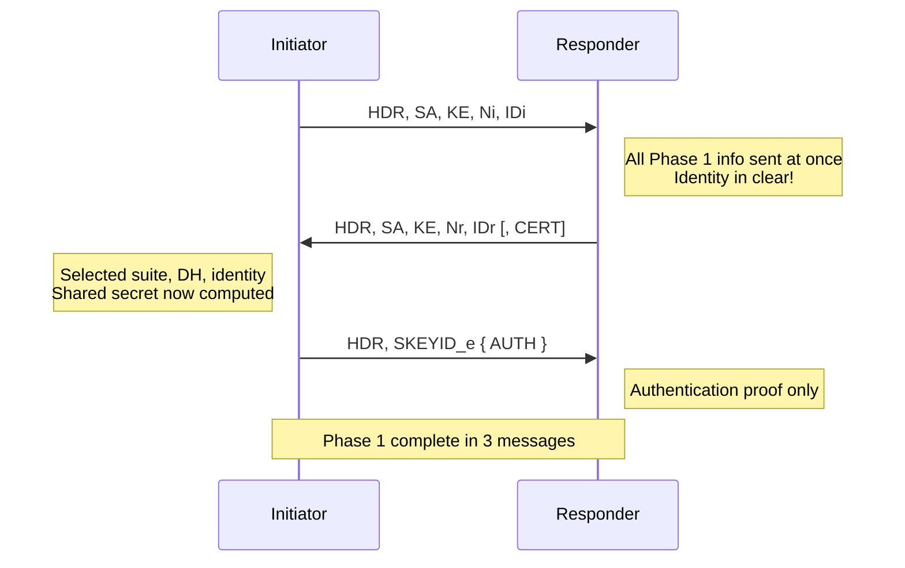

### Phase 2: Quick Mode (3 messages)

Quick Mode runs inside the encrypted Phase 1 SA and negotiates IPsec SAs for data traffic.

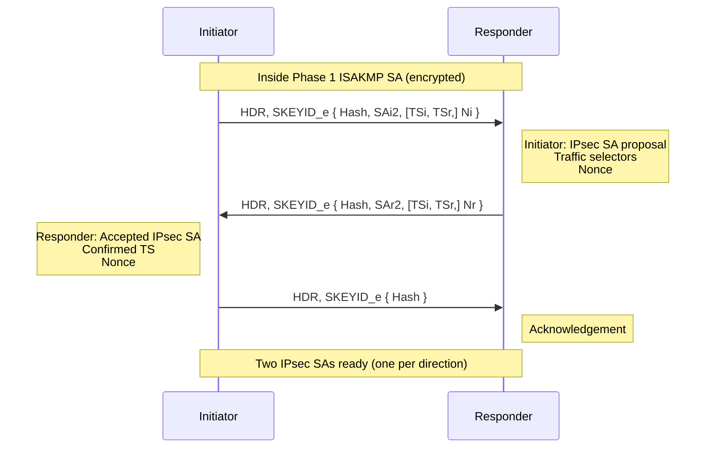

---

## Dead Peer Detection (DPD)

DPD detects when an IKE peer is unreachable and tears down stale SAs, enabling faster failover to
backup tunnels.

### DPD Modes

| Mode | Behavior | Trigger |
| --- | --- | --- |
| **Idle Detect** | Peer sends DPD request if no IKE traffic for N seconds | Configured timeout (e.g., 60s) |
| **Aggressive** | Peer sends DPD request immediately if SA rekey timeout reached | SA lifetime expiry without rekey |

### DPD Exchange

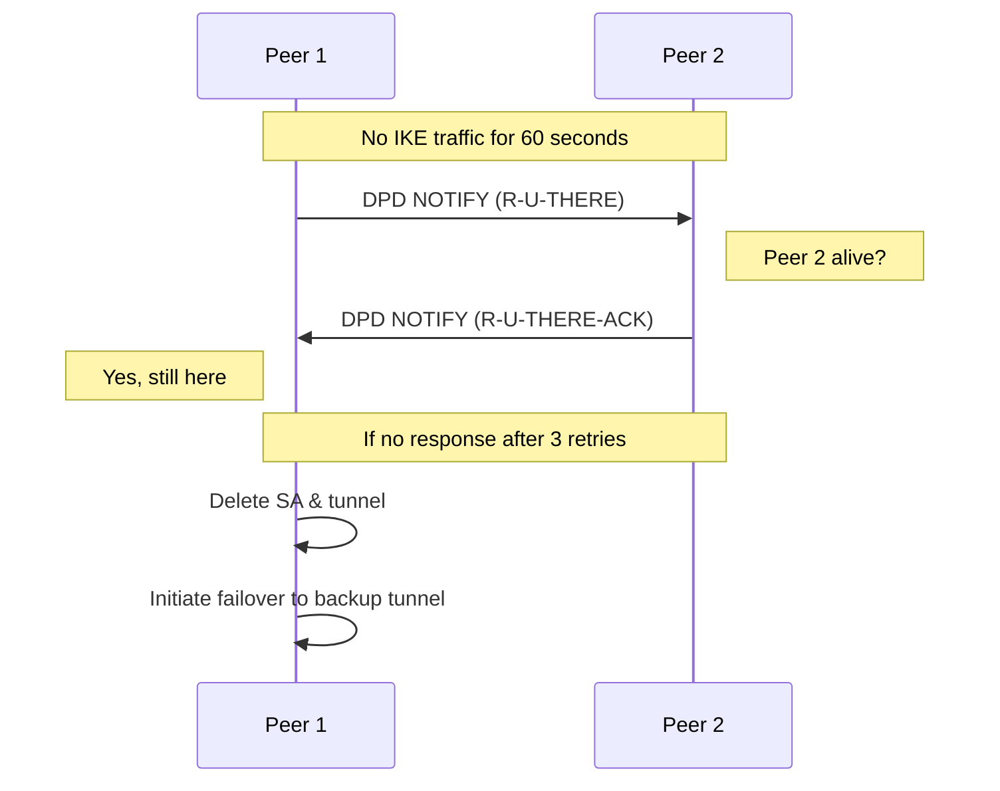

---

## Key Derivation & Rekeying

### Key Derivation (IKEv2)

After `IKE_SA_INIT` DH exchange, keys are derived using HMAC-based KDF:

```text
SKEYSEED = HMAC(Ni | Nr, DH_shared_secret)

SK_d = first N bytes of HMAC(SKEYSEED, SKEYSEED | Ci | Cr | 0x01)
SK_ai = first N bytes of HMAC(SKEYSEED, SK_d | Ni | Nr | Ci | Cr | 0x02)
SK_ar = first N bytes of HMAC(SKEYSEED, SK_d | Nr | Ni | Cr | Ci | 0x03)
SK_ei = first N bytes of HMAC(SKEYSEED, SK_d | Ci | Cr | 0x04)
SK_er = first N bytes of HMAC(SKEYSEED, SK_d | Cr | Ci | 0x05)
SK_pi = first N bytes of HMAC(SKEYSEED, SK_d | Ni | Nr | 0x06)
SK_pr = first N bytes of HMAC(SKEYSEED, SK_d | Nr | Ni | 0x07)

Where:
  SK_d  = Derivation key
  SK_ai = IKE Integrity key (inbound)
  SK_ar = IKE Integrity key (outbound)
  SK_ei = IKE Encryption key (inbound)
  SK_er = IKE Encryption key (outbound)
  SK_pi = IPsec PRF key (inbound)
  SK_pr = IPsec PRF key (outbound)
```

### SA Lifetime & Rekey Triggers

IPsec SAs expire based on:

| Limit | Soft Lifetime | Hard Lifetime | Behavior |
| --- | --- | --- | --- |
| **Time-based** | 3300s (default) | 3600s (default) | At soft, initiate rekey; at hard, delete SA |
| **Byte-based** | 450MB (typical) | 500MB (typical) | After soft, each new packet triggers rekey negotiation |

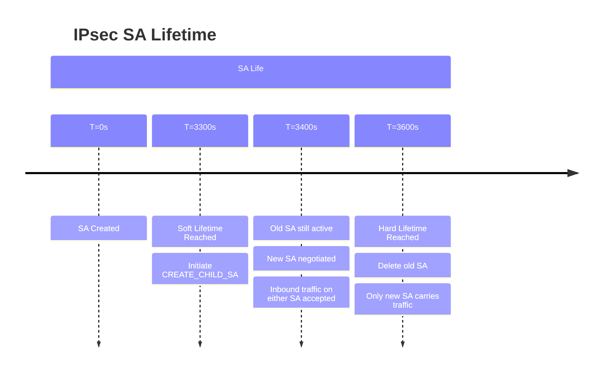

### Rekeying Process (IKEv2)

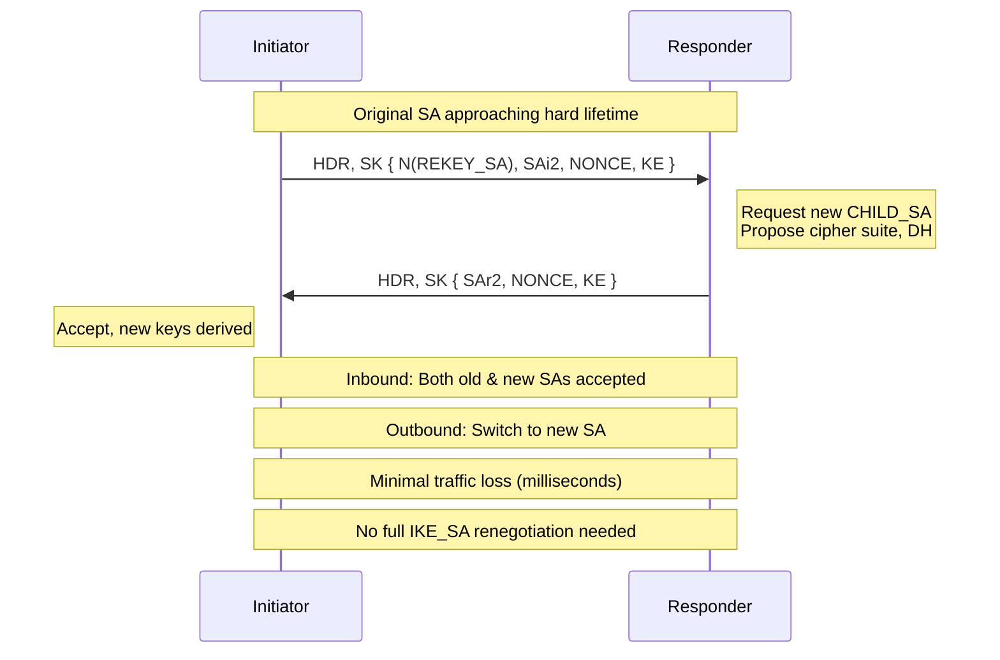

---

## Common Deployment Patterns

### 1. Hub-and-Spoke (Single Gateway Tunnel)

One central gateway (hub) connects to multiple remote sites (spokes). Spoke-to-spoke traffic must
traverse the hub.

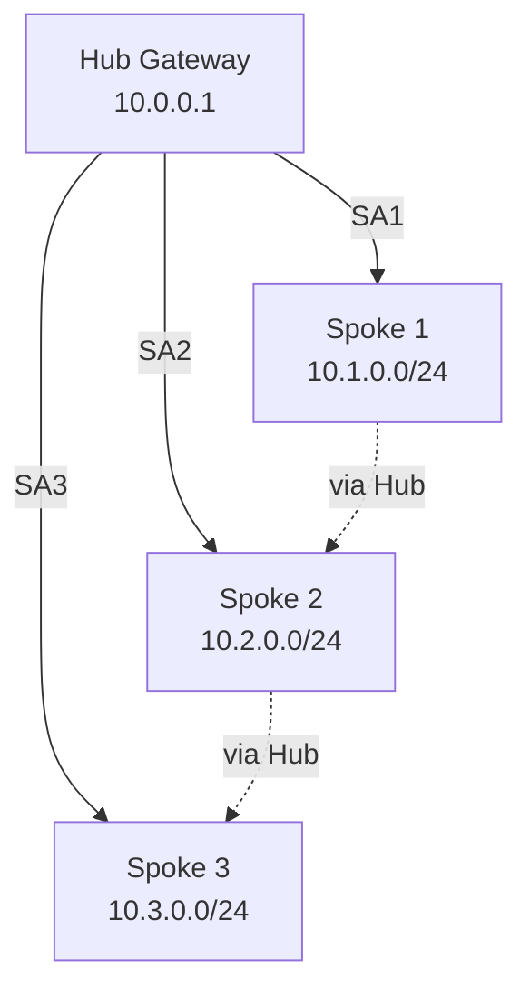

**Use case:** Remote office to headquarters; simpler management (hub is single point of control).

**Trade-off:** Hub becomes bandwidth bottleneck; spoke-to-spoke latency higher.

### 2. Full Mesh (All-to-All Tunnels)

Every site connects directly to every other site. For N sites, requires N × (N-1) / 2 SAs.

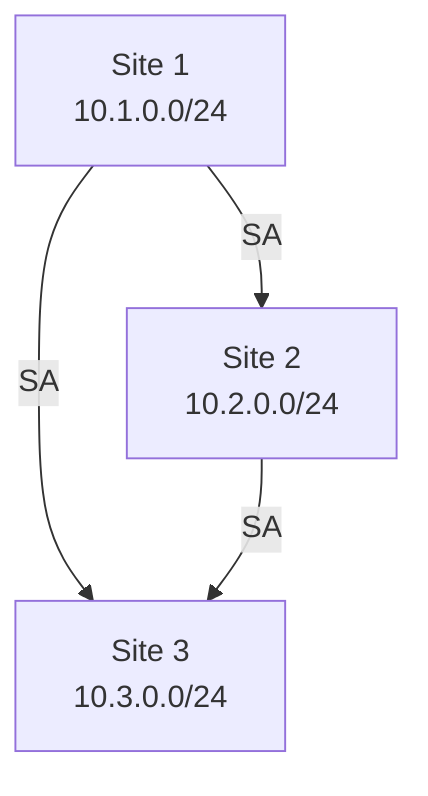

**Use case:** Headquarters with multiple branches; lowest latency.

**Trade-off:** Difficult to scale (6 sites = 15 SAs); high management overhead; certificate/key
distribution complex.

### 3. Dual-Tunnel Redundancy

Two active tunnels from each site for failover and load balancing.

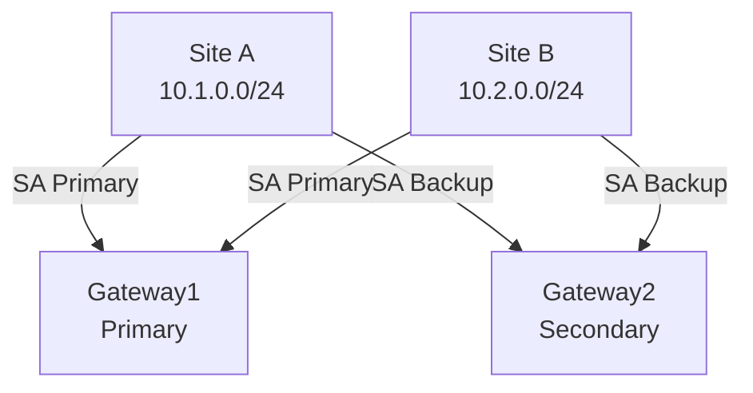

**Use case:** Critical sites requiring sub-second failover.

**Trade-off:** Requires two physical gateways; DPD for fast detection; double encryption overhead.

### 4. Redundant Hub (Hub-and-Spoke with Backup)

Primary hub with a backup hub. Spokes peer with both; spoke traffic prefers primary via route
metrics.

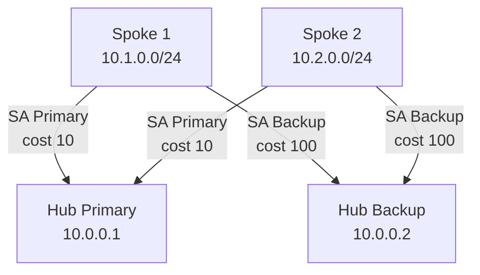

**Use case:** Medium-scale deployments needing hub fault tolerance without full mesh complexity.

**Trade-off:** Moderate management overhead; backup hub capacity must handle failover.

---

## Fragmentation & MTU Handling

IPsec adds overhead to packets, reducing MTU available for original traffic.

### Overhead Calculation

```text
Tunnel Mode Overhead:
  - New IP header: 20 bytes (IPv4) or 40 bytes (IPv6)
  - ESP header: 8 bytes (SPI + Seq)
  - ESP trailer: 1-16 bytes (padding + pad-len + next-header)
  - Authentication tag: 0 bytes (if using AEAD like GCM), or 12-32 bytes (HMAC)
  Total: ~40-80+ bytes

Example: Standard 1500-byte Ethernet MTU
  - IP header: 20 bytes
  - TCP header: 20 bytes
  - Usable payload: 1460 bytes

After IPsec tunnel:
  - Outer IP header: 20 bytes
  - ESP header: 8 bytes
  - Encrypted (IP + TCP + payload + padding): ~1490 bytes
  - Auth tag: 16 bytes (GCM)
  Total: 1534 bytes → Exceeds 1500-byte MTU → Fragmentation
```

### Path MTU Discovery (PMTUD) with IPsec

Traditional PMTUD (using ICMP Unreachable - Fragmentation Needed) breaks with IPsec because:

1. ICMP messages do not contain the original packet's SPI
2. Responder cannot determine which IPsec SA generated the oversized packet
3. ICMP filtering on firewalls prevents messages reaching the initiator

#### Solution: IPsec-aware PMTUD

Modern IPsec stacks use:

- **RFC 4821 (PLPMTUD):** Probe-based MTU discovery (TCP/UDP probes); does not rely on ICMP
- **MTU configuration:** Administratively reduce tunnel MTU to 1280-1400 bytes (safe for most
  networks)
- **MSS clamping:** Reduce TCP MSS (Maximum Segment Size) via `ip tcp adjust-mss` on the tunnel
  interface

### Fragmentation Strategies

| Strategy | Implementation | Trade-off |
| --- | --- | --- |
| **Don't Fragment + MSS Clamp** | Set DF bit, reduce TCP MSS via sysctl | Simple, but reduces throughput |
| **Allow Fragmentation** | Clear DF bit, reassemble at peer | Higher CPU on routers; potential MTU black holes |
| **Jumbo Frames** | Increase MTU to 9000 bytes (if network supports) | Not always available (ISP WAN limits to 1500) |
| **IPsec-specific MTU** | Configure tunnel interface MTU lower | Most reliable; reduces payload to 1200-1350 bytes |

### Recommended MTU Configuration

For standard 1500-byte Ethernet networks with AES-GCM encryption:

```text
MTU = 1500 (physical) - 20 (outer IP) - 8 (ESP) - 16 (GCM tag) = 1456 bytes
Set tunnel MTU = 1400 bytes (conservative, ~100-byte buffer)
```

---

## Related Pages

- [GRE](../packets/gre.md)
- [AWS BGP Stack](../aws/bgp_stack_vpn_over_dx.md)
- [FortiGate SD-WAN](../fortigate/fortigate_sdwan.md)
