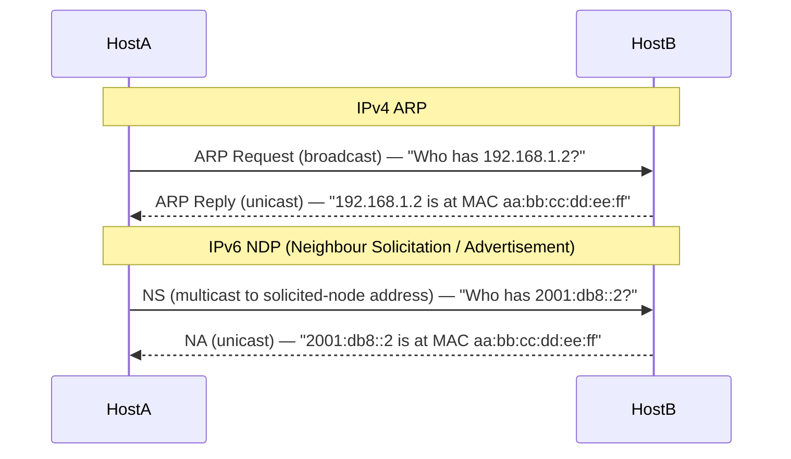

# IPv4 vs IPv6

IPv6 (RFC 8200) was designed to address the exhaustion of the 32-bit IPv4 address space
(RFC 791) and modernise the protocol. Beyond the obvious address space expansion
(32-bit → 128-bit), IPv6 redesigns several mechanisms: no fragmentation in transit,
mandatory ICMPv6 (which replaces ARP), a simplified fixed-length header, and chained
extension headers. Dual-stack deployments run both protocols simultaneously; the routing
and operational differences between them matter for design and troubleshooting.

---

## At a Glance

| Property | IPv4 | IPv6 |
| --- | --- | --- |
| **Standard** | RFC 791 | RFC 8200 |
| **Address size** | 32 bits (4 bytes) | 128 bits (16 bytes) |
| **Address notation** | Dotted decimal (192.168.1.1) | Colon-hex (2001:db8::1) |
| **Header size** | 20 bytes minimum (variable with options) | 40 bytes fixed |
| **Header options** | Inline variable options field | Extension headers (chained via Next Header) |
| **Fragmentation** | At routers and source | Source only (PMTUD mandatory) |
| **Broadcast** | Yes (limited + directed) | No broadcast — multicast replaces it |
| **Multicast** | Optional (IGMP) | Mandatory (MLD — ICMPv6 based) |
| **ARP** | Yes (RFC 826) | No ARP — Neighbour Discovery (NDP, ICMPv6) |
| **Link-local address** | Optional (169.254.x.x APIPA) | Mandatory (fe80::/10 — auto-generated) |
| **Loopback** | 127.0.0.1 | ::1 |
| **Unspecified** | 0.0.0.0 | :: |
| **IP header checksum** | Yes (recomputed at every hop) | No (upper layers cover integrity) |
| **TTL / Hop Limit** | TTL (8 bits) | Hop Limit (8 bits, same function) |
| **Flow label** | None | 20-bit flow label (load balancing hint) |
| **Traffic class / DSCP** | ToS / DSCP (8 bits) | Traffic Class / DSCP (8 bits, same encoding) |
| **IPsec** | Optional | Optional (was mandatory in early RFCs; now optional per RFC 6434) |
| **NAT** | Widely used | Designed to avoid (NAT64 exists for transition) |
| **Address assignment** | DHCP (RFC 2131) | DHCPv6 (RFC 8415) or SLAAC (RFC 4862) |
| **Minimum MTU** | 576 bytes | 1280 bytes |
| **Wireshark filter** | `ip` | `ipv6` |

---

## Header Comparison

### IPv4 Header Fields (20 bytes minimum)

`Version(4)` `IHL(4)` `DSCP(6)` `ECN(2)` `Total Length(16)` `Identification(16)`
`Flags(3)[DF/MF]` `Fragment Offset(13)` `TTL(8)` `Protocol(8)` `Header Checksum(16)`
`Source IP(32)` `Destination IP(32)` `Options(variable)`

### IPv6 Header Fields (40 bytes fixed)

`Version(4)` `Traffic Class(8)` `Flow Label(20)` `Payload Length(16)` `Next Header(8)`
`Hop Limit(8)` `Source IP(128)` `Destination IP(128)`

### Key simplifications in IPv6

- **No IHL** — header length field removed; header is always exactly 40 bytes
- **No header checksum** — upper-layer protocols (TCP/UDP) cover integrity; eliminates
  per-hop recalculation overhead

- **No fragmentation fields** — moved to the Fragment Extension Header; only the source
  may fragment

- **No inline options** — replaced by chained Extension Headers referenced via the
  Next Header field

---

## IPv6 Extension Headers

| Next Header Value | Extension Header |
| --- | --- |
| `0` | Hop-by-Hop Options (processed by every router in path) |
| `43` | Routing Header (source routing) |
| `44` | Fragment Header |
| `50` | ESP (IPsec Encapsulating Security Payload) |
| `51` | AH (IPsec Authentication Header) |
| `59` | No Next Header (end of chain) |
| `60` | Destination Options |
| `135` | Mobility |

---

## IPv6 Address Types

| Prefix | Type | Description |
| --- | --- | --- |
| `::1/128` | Loopback | Equivalent to 127.0.0.1 |
| `::/128` | Unspecified | Equivalent to 0.0.0.0 |
| `fe80::/10` | Link-local | Auto-configured, mandatory on every interface, not routable |
| `fc00::/7` | Unique Local (ULA) | Private routable (like RFC 1918), not globally routable |
| `2000::/3` | Global Unicast | Globally routable public addresses |
| `ff00::/8` | Multicast | Replaces broadcast; scope field defines propagation range |
| `2001:db8::/32` | Documentation | Reserved for examples and documentation (RFC 3849) |
| `64:ff9b::/96` | NAT64 Well-Known Prefix | IPv4-mapped prefix for NAT64 translation |
| `::ffff:0:0/96` | IPv4-mapped | Represent IPv4 addresses in IPv6 socket APIs |

---

## Neighbour Discovery (NDP) Replaces ARP

NDP (RFC 4861) uses ICMPv6 messages for address resolution, router discovery, and
Duplicate Address Detection (DAD):

| ICMPv6 Type | Message | Function |
| --- | --- | --- |
| 133 | Router Solicitation (RS) | Host asks for router advertisements |
| 134 | Router Advertisement (RA) | Router advertises prefix, gateway, MTU |
| 135 | Neighbour Solicitation (NS) | "Who has IPv6 address X?" — replaces ARP Request |
| 136 | Neighbour Advertisement (NA) | "I have IPv6 address X" — replaces ARP Reply |
| 137 | Redirect | Router informs host of a better next-hop |

---

## SLAAC (Stateless Address Autoconfiguration)

Host receives a Router Advertisement containing the /64 prefix, then appends its own
EUI-64 identifier (derived from MAC address) or a random Interface ID — forming a global
unicast address without any DHCP interaction. Privacy extensions (RFC 4941) use
randomised IIDs that rotate periodically to prevent tracking.

---

## Routing Protocol Differences

| Protocol | IPv4 | IPv6 |
| --- | --- | --- |
| **BGP** | BGP-4 (MP-BGP adds IPv6 via AFI 2, SAFI 1) | Same process, separate address family |
| **OSPF** | OSPFv2 (RFC 2328) | OSPFv3 (RFC 5340) — separate process, link-scoped flooding |
| **IS-IS** | IS-IS for IPv4 (RFC 1195) | Same process with IPv6 TLVs (RFC 5308, MT-ISIS) |
| **EIGRP** | Classic or named mode | Named mode supports both IPv4 and IPv6 in one process |

---

## Dual-Stack Operation

Both protocols run simultaneously. Each interface carries an IPv4 address and one or
more
IPv6 addresses (at minimum a link-local). Applications connect via whichever protocol
resolves successfully. RFC 6555 (Happy Eyeballs) defines the mechanism: attempt both
IPv4
and IPv6 connections concurrently; use whichever completes first.

---

## Notes

- IPv6 link-local addresses (`fe80::/10`) are mandatory and used as next-hops for
routing

routing

  protocol adjacencies. OSPFv3, IS-IS, and MP-BGP neighbours typically peer over
  link-local addresses when running IPv6.

- Cisco IOS-XE: `ipv6 unicast-routing` enables IPv6 forwarding globally.
  `ipv6 address <prefix/len> eui-64` auto-generates the IID from the interface MAC.

- FortiGate supports dual-stack natively; IPv6 firewall policies are maintained in a
  separate policy table from IPv4 (`config firewall policy6`).

- Never route `fe80::/10` — link-local addresses are non-routable by design. Use global
  unicast or ULA for any routed IPv6 traffic.
