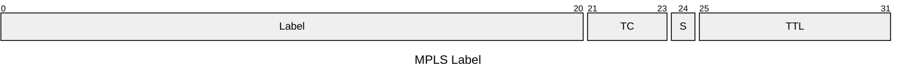
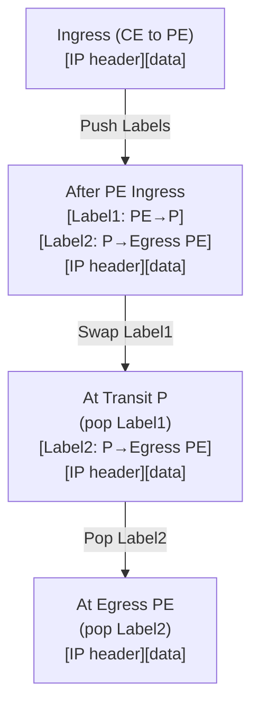
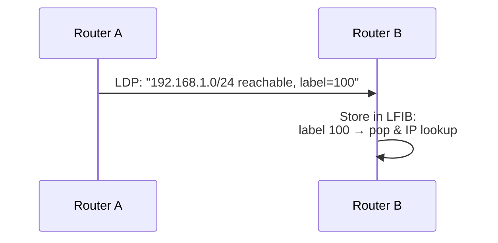
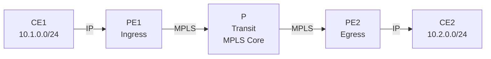

# MPLS Fundamentals

Multiprotocol Label Switching (MPLS) is a forwarding mechanism that prepends short,
fixed-length labels to packets, enabling fast switching based on label lookups rather
than longest-prefix-match routing table searches. This guide covers MPLS architecture,
label distribution, and PE/CE interactions.

---

## At a Glance

| Aspect | Purpose | Key Attributes |
| --- | --- | --- |
| **MPLS Label** | Forwarding identifier | 20 bits; locally significant per hop |
| **LSP (Label Switched Path)** | Predetermined forwarding path | Pre-established by LDP or BGP |
| **PE (Provider Edge)** | Edge of MPLS domain | Pushes labels on ingress; pops on egress |
| **P (Provider/Transit)** | Backbone router | Swaps labels; no IP header inspection |
| **CE (Customer Edge)** | Customer router | Unaware of MPLS; sends/receives IP packets |
| **LDP (Label Distribution Protocol)** | Label binding distribution | Dynamic; hop-by-hop LSP creation |
| **BGP as signaling** | Label distribution via BGP | For VPN routes; provider routes |
| **LFIB (Label FIB)** | Label forwarding table | Hardware-based; faster than IP lookup |
| **Stack Depth** | Multiple labels possible | Common: 2–3 labels (VPN + IGP + BGP) |

---

## MPLS Overview

### Core Concept

MPLS operates at OSI Layer 2.5 (between Layer 2 and Layer 3):

- **IP routing** determines the path to a destination
- **MPLS** creates a predetermined forwarding path (LSP) and labels packets for that
path
path

- **Forwarding** is done via label swapping in hardware, which is faster than IP lookups

### Label Format

An MPLS label is a 32-bit header inserted between Layer 2 and Layer 3:



- **Label** (20 bits): Forwarding identifier; locally significant per hop
- **TC** (3 bits): Traffic Class; used for QoS marking (replaces ToS from IP header)
- **S** (1 bit): Bottom of Stack flag; indicates if this is the last label
- **TTL** (8 bits): Time-to-live; prevents loops, decremented at each hop

### Label Stack

Multiple labels can be stacked on a packet. The **top label** is used for forwarding at the current
hop; when removed, the next label (if present) is used at the next hop.



## Key Components

### LSR (Label Switching Router)

Any router that performs MPLS forwarding. Three roles:

- **Ingress LSR (Ingress PE)**: Receives unlabeled packets, assigns top label, forwards into MPLS domain
- **Transit LSR (P)**: Swaps labels based on LFIB (Label Forwarding Information Base); does not examine
  IP header

- **Egress LSR (Egress PE)**: Removes label(s), hands packet back to IP forwarding

### PE (Provider Edge)

Routers at the edge of the MPLS domain, connected to customers (CEs). Responsibilities:

- **Ingress PE**: Accept customer packets, determine destination, assign label, push onto stack
- **Egress PE**: Receive labeled packets, pop labels, route using IP lookup, send to CE
- Maintain routing table and MPLS label bindings
- Run IGP and/or BGP to learn remote destinations

### CE (Customer Edge)

Customer routers connected to the MPLS domain. They:

- Send/receive IP packets to/from PE routers
- Do **not** know about MPLS; treat PE as a standard IP next-hop
- Can use static routes, dynamic routing (BGP, OSPF, RIP), or default route to PE
- Are unaware of label distribution or MPLS forwarding inside the provider network

### P (Provider)

Interior routers within the MPLS domain. They:

- Forward based on top label only; do not examine IP header
- Swap labels (LFIB lookup)
- Do not need customer routes; only internal topology and label bindings
- Scale better than BGP-based designs because they don't carry customer routes

## Label Distribution

Labels are distributed among LSRs so each router knows which outgoing port to use for
each label. Two main protocols:

### LDP (Label Distribution Protocol)

- **Peer-to-peer**: Label bindings distributed directly between adjacent LSRs
- **Topology-driven**: LDP follows the path determined by IGP (OSPF, IS-IS)
- **Process**: Each LSR allocates local labels for each prefix in its routing table and
advertises them to neighbors
advertises them to neighbors

- **Use case**: IP prefix reachability in the core; simpler than BGP

**LDP Session Setup:**



### BGP (Border Gateway Protocol)

- **BGP signaling**: Labels are distributed alongside route announcements in BGP updates
- **Policy-driven**: Label paths can differ from IGP paths (traffic engineering)
- **Use case**: Inter-domain MPLS, MPLS VPN, traffic engineering
- **Example**: BGP announces "10.0.0.0/8 via PE2, label=200" instead of just "10.0.0.0/8 via PE2"

**BGP with MPLS (RFC 3107):**

```text

BGP Update:
  NLRI: 10.0.0.0/8
  Next Hop: PE2
  Label: 200
```

## MPLS Forwarding

### LFIB (Label Forwarding Information Base)

A table of label mappings: for each label, which outgoing interface to use and what action to take.

| Incoming Label | Action | Outgoing Label | Outgoing Interface |
| --- | --------- | --- | --------- |
| 100 | Swap | 200 | eth1 |
| 101 | Pop | — | eth2 |
| 102 | Swap | 103 | eth0 |

### Forwarding Lookup

At each LSR:

1. **Look up incoming label** in LFIB (O(1) hardware lookup)
1. **Perform action**: Swap, Pop, or Push label(s)
1. **Forward** to outgoing interface (no IP header examination needed at transit hops)

This is much faster than IPv4 longest-prefix-match at each hop.

## PE and CE Interaction

### Scenario: CE Behind PE in MPLS Domain



#### Step 1: IGP and BGP Setup

- **PE1 and PE2** run IGP (OSPF/IS-IS) in the core; learn each other's loopback addresses
- **PE1 and PE2** run BGP; PE2 announces "10.2.0.0/24 reachable via PE2, label=X"
- **P** runs IGP only; learns PE1 and PE2 loopbacks; does not know about 10.1.0.0 or 10.2.0.0

#### Step 2: CE1 Sends Packet to CE2

CE1 generates packet: `SRC=10.1.1.10, DST=10.2.2.20`

**At PE1 (Ingress):**

1. IP lookup: destination 10.2.0.0/24 → next-hop is PE2
1. BGP label binding: label=200 for 10.2.0.0/24
1. Push label 200 (and possibly another label for PE2 reachability)
1. Forward frame with MPLS label stack to P

**Resulting frame structure:**

```text

[Ethernet][Label: 200 → PE2][IP: SRC=10.1.1.10, DST=10.2.2.20][data]
```

#### Step 3: P Forwards (Transit)

**At P (Transit):**

1. Pop top label (200) from stack
1. Next label on stack: 300 (PE2's loopback)
1. Swap 300 → 301 (outgoing label toward PE2)
1. Forward to PE2

#### Step 4: PE2 Receives and Strips Labels

**At PE2 (Egress):**

1. Remove all labels (this is the egress PE for this destination)
1. IP lookup: destination 10.2.2.20 → next-hop is CE2
1. Forward IP packet to CE2

**CE2 receives:** `SRC=10.1.1.10, DST=10.2.2.20` (unmodified IP header)

### Key Points: PE and CE Interaction

- **CE does not see MPLS labels**: Sees only IP packets in/out
- **PE adds labels on ingress**: Determines outgoing label based on IP destination and
BGP/LDP bindings
BGP/LDP bindings

- **P swaps labels**: Does not touch IP header; only swaps labels based on LFIB
- **PE removes labels on egress**: Routes based on IP header to deliver to CE

---

## Label Assignment Strategies

### Downstream Unsolicited (DU)

- LSR announces labels for all prefixes in its routing table to all neighbors without
being asked
being asked

- **Used by**: LDP (default for link-based LSPs)
- **Behavior**: Labels assigned and advertised proactively

### Downstream on Demand (DoD)

- LSR only announces a label when an upstream LSR requests it
- **Used by**: Some LDP configurations, BGP signaling
- **Behavior**: Labels assigned reactively

---

## MPLS Use Cases

### 1. Fast IP Forwarding (Core MPLS)

Eliminates longest-prefix-match at transit hops; enables Hardware-based label switching
for higher throughput.

### 2. MPLS VPN (RFC 2547 / RFC 4364)

- Each customer gets a separate VPN routing table (VRF) on PE routers
- PE routers prepend a **VPN label** (second label) identifying the customer
- Inter-PE communication uses BGP; traffic isolation ensured by VPN labels
- **Result**: Provider network carries multiple customer routes without mixing traffic

### 3. Traffic Engineering (MPLS TE)

- Use BGP or explicit label paths to route traffic through non-shortest paths
- Enable load balancing, protection, and QoS enforcement
- Example: Route high-priority traffic through lower-latency path, other traffic through
alternate path

alternate path

### 4. Fast Reroute (FRR)

- Pre-compute backup LSPs for critical paths
- On primary path failure, switch to backup in milliseconds
- Faster than waiting for BGP convergence (seconds)

---

## Comparison: LDP vs BGP

| Aspect | LDP | BGP |
| --- | --------- | --- |
| **Driver** | IGP topology | Routing policy |
| **Path** | Follows IGP shortest path | Can differ from IGP |
| **Scalability** | Per-prefix label (many labels) | Aggregates labels per route |
| **Convergence** | Fast (topology-driven) | Slower (policy-driven) |
| **Use Case** | Core MPLS, simple deployments | Inter-domain MPLS, TE, VPN |
| **Configuration** | Simple (global enable) | Requires BGP + label extensions |

---

## Summary

- **MPLS** is a Layer 2.5 forwarding mechanism using short labels for O(1) lookup speed
- **PE routers** add labels based on IP destination; remove labels before delivering to
CE
CE

- **P routers** swap labels without examining IP headers; scale better than BGP-only
designs
designs

- **CE routers** send/receive IP packets; unaware of MPLS
- **Label distribution** via LDP (topology-driven) or BGP (policy-driven)
- **Key benefit**: Fast hardware-based forwarding, support for traffic engineering, VPN
isolation, and fast reroute

---

## See Also

- [BGP Fundamentals](../theory/bgp_fundamentals.md) — BGP for label distribution
- [Quality of Service (QoS)](../theory/qos.md) — Traffic Class in MPLS labels
- [SD-WAN (Software-Defined WAN)](../theory/sdwan.md) — Modern MPLS-based WAN optimization
- [Cisco MPLS Configuration](../cisco/cisco_mpls_config.md) — IOS-XE MPLS setup
- [Multiprotocol BGP (MP-BGP)](../routing/bgp.md) — Label signaling in BGP
