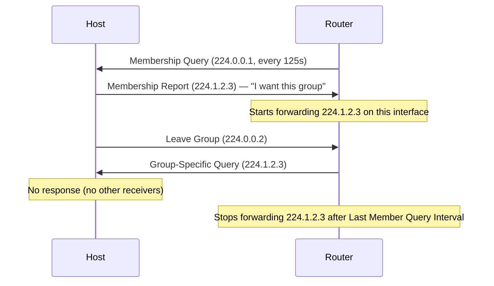
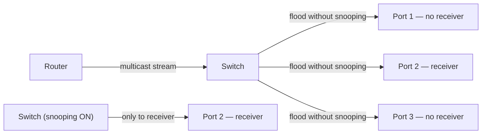
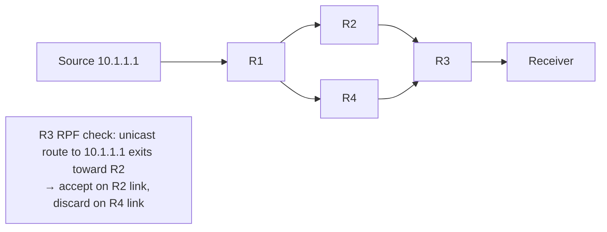
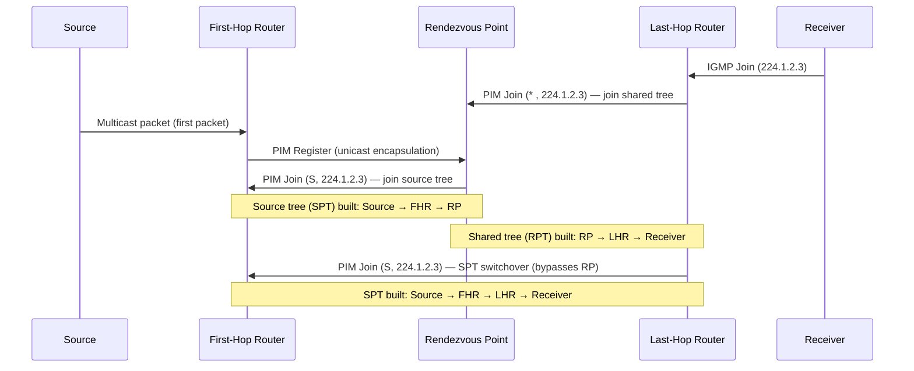

# IP Multicast

Multicast delivers a single packet stream to multiple receivers simultaneously. The
source sends one copy; the network replicates it only where paths diverge. This is
fundamentally more efficient than unicast replication (source sends one copy per
receiver) and more controlled than broadcast (delivered to every host regardless of
interest).

The two core components are **IGMP** — the protocol by which hosts join and leave
multicast groups — and **PIM** — the protocol by which routers build distribution
trees to forward multicast traffic to interested receivers.

---

## Multicast Addressing

### IPv4 — 224.0.0.0/4

The entire 224.0.0.0/4 block (224.0.0.0 – 239.255.255.255) is reserved for multicast.

| Range | Scope | Purpose |
| --- | --- | --- |
| `224.0.0.0/24` | Link-local | Routing protocols and network protocols. Never forwarded by routers. |
| `224.0.1.0/24` | Global (internetwork) | Well-known global groups (e.g. `224.0.1.1` NTP, `224.0.1.129` PTP) |
| `232.0.0.0/8` | Source-Specific (SSM) | RFC 4607 — receivers subscribe to a specific source + group |
| `233.0.0.0/8` | GLOP addressing | RFC 3180 — AS-embedded globally unique ranges |
| `239.0.0.0/8` | Organisation-local | RFC 2365 — administratively scoped; like RFC 1918 for multicast |

**Link-local well-known groups (never routed):**

| Address | Used by |
| --- | --- |
| `224.0.0.1` | All hosts on segment |
| `224.0.0.2` | All routers on segment |
| `224.0.0.5` | OSPF — all OSPF routers |
| `224.0.0.6` | OSPF — DR/BDR |
| `224.0.0.9` | RIP |
| `224.0.0.10` | EIGRP |
| `224.0.0.13` | PIM routers |
| `224.0.0.18` | VRRP |
| `224.0.0.102` | HSRP v2 |

### Multicast MAC Address Mapping

IPv4 multicast addresses map to Ethernet MAC addresses deterministically:
the low-order 23 bits of the IP address are embedded into `01:00:5E:00:00:00/25`.

```text
224.1.2.3  →  01:00:5E:01:02:03
239.255.1.1 → 01:00:5E:7F:01:01
```

The high bit of the IP group address is always 1 (multicast), and bits 25–28 are
ignored in the mapping — meaning 32 different IP multicast addresses map to each MAC.
This causes multicast traffic for different groups to be delivered to the same MAC,
which can reach unintended hosts unless IGMP snooping is used.

### IPv6 Multicast — FF00::/8

IPv6 multicast addresses begin with `FF`. The next 4 bits are flags; the following
4 bits are the scope:

| Scope | Value | Meaning |
| --- | --- | --- |
| Interface-local | `1` | Loopback only |
| Link-local | `2` | Single link; not forwarded |
| Site-local | `5` | Within a site |
| Organisation-local | `8` | Within an organisation |
| Global | `E` | Internet-wide |

Important IPv6 multicast addresses:

- `FF02::1` — all nodes on link
- `FF02::2` — all routers on link
- `FF02::5` / `FF02::6` — OSPFv3
- `FF02::D` — PIM
- `FF02::1:2` — DHCP relay agents

---

## IGMP — Internet Group Management Protocol

IGMP runs between hosts and their directly connected routers. Hosts use IGMP to
express interest in receiving traffic for a group; routers use IGMP to determine
which groups have active receivers on each interface.

| Version | RFC | Key Features |
| --- | --- | --- |
| IGMPv1 | RFC 1112 | Basic join; no explicit leave; relies on query timeout |
| IGMPv2 | RFC 2236 | Adds explicit Leave Group message; Group-Specific Query |
| IGMPv3 | RFC 3376 | Source filtering — hosts can specify which source addresses to accept (required for SSM) |

### IGMPv2 Exchange



**Querier election:** On a multi-router segment, routers elect a single Querier (the
router with the lowest IP address) to send periodic Membership Queries, avoiding
duplicate queries.

**Leave latency:** In IGMPv2, when a host sends a Leave, the router sends a
Group-Specific Query and waits for the Last Member Query Interval (default 1s × 2
retries). If no Membership Report is received, the group is removed. This introduces
up to 2–3 seconds of residual traffic after the last receiver leaves.

IGMPv3 eliminates most of this delay and adds source-specific subscriptions:
a host can join group `224.1.2.3` with source filter `INCLUDE(10.0.0.1)`, telling
the router it only wants traffic from that specific source.

---

## IGMP Snooping

Switches are not aware of multicast at Layer 3 — without intervention, they flood
multicast frames to all ports in the VLAN (since the destination MAC is a multicast
address, not in the MAC table). **IGMP snooping** allows the switch to inspect IGMP
messages and build a per-port group membership table, restricting multicast forwarding
to only ports with active receivers.



IGMP snooping is enabled by default on most managed switches. The switch must have a
**Querier** to drive IGMP — if no router is present on the VLAN, configure the switch
as an IGMP snooping querier:

```ios

ip igmp snooping querier address 10.0.1.1 vlan 10
```

---

## PIM — Protocol Independent Multicast

PIM builds multicast distribution trees across routers. It is "protocol independent"
because it uses the existing unicast routing table (RIB) for Reverse Path Forwarding
checks rather than running its own routing protocol.

### Reverse Path Forwarding (RPF)

RPF is the loop-prevention mechanism for multicast. A router only accepts a multicast
packet on the interface that the unicast routing table says is the best path *back to
the source*. Packets arriving on any other interface are discarded.



RPF relies on the unicast RIB being consistent with the multicast source topology. In
asymmetric routing environments (where the unicast path to a source differs from the
multicast-optimal path), static mroutes may be needed to correct RPF.

### PIM-SM — Sparse Mode

PIM Sparse Mode (RFC 7761) is the standard mode for most networks. It uses a
**Rendezvous Point (RP)** as a meeting point for sources and receivers:

1. **Receivers join the shared tree:** A receiver's IGMP Report triggers the local

   router to send a PIM Join toward the RP, building a Shared Tree (RPT) from RP to receivers.

2. **Source registers with the RP:** The first-hop router (DR) encapsulates multicast

   packets in PIM Register messages and unicasts them to the RP.

3. **RP joins the source tree:** The RP sends a PIM Join toward the source, building a

   Shortest Path Tree (SPT) from source to RP.

4. **Last-hop switchover to SPT:** Once traffic begins flowing, the last-hop router can

   send a PIM Join directly toward the source, bypassing the RP. This is the **SPT
   switchover** — the default behaviour on Cisco IOS (controlled by
   `ip pim spt-threshold`).



### PIM-DM — Dense Mode

PIM Dense Mode assumes receivers exist everywhere. It **floods** multicast traffic to
the entire network, then **prunes** branches with no receivers. Prune state expires
every 3 minutes, causing re-flooding. PIM-DM is not recommended for production — it
generates excessive traffic and does not scale. Use PIM-SM or PIM-SSM instead.

### PIM-SSM — Source-Specific Multicast

SSM (RFC 4607) eliminates the RP entirely. Receivers subscribe to a specific
`(source, group)` pair using IGMPv3. The router builds a direct SPT from the source
to the receiver with no shared tree or RP involved.

SSM uses the `232.0.0.0/8` address range. It is simpler, more secure (receivers must
know the source address in advance), and has no RP single point of failure. Ideal for
one-to-many applications (IPTV, financial data feeds) where the source is well-known.

---

## Rendezvous Point (RP)

The RP is a critical component of PIM-SM. It must be reachable by all PIM routers
in the domain. RP discovery methods:

| Method | Description | Pros / Cons |
| --- | --- | --- |
| **Static RP** | `ip pim rp-address <ip>` configured on every router | Simple; no extra protocols; single point of failure |
| **Auto-RP** | Cisco proprietary; RP announces itself via `224.0.1.39`/`224.0.1.40` | Easy; redundant RPs possible; requires PIM-DM or Bidir for bootstrap traffic |
| **BSR (Bootstrap Router)** | RFC 5059; standard equivalent of Auto-RP; BSR floods RP-Set in PIM domain | Vendor-neutral; standard; preferred for new deployments |
| **Anycast RP** | Multiple routers share the same RP address; MSDP synchronises state | High availability; load distribution; recommended for large deployments |

---

## Multicast State: (S,G) and (*,G)

PIM routers maintain state entries for each active multicast flow:

- **(*, G)** — shared tree entry: any source sending to group G. Used on the path
  from RP to receivers.

- **(S, G)** — source tree entry: traffic specifically from source S to group G.
  Created after SPT switchover.

`show ip mroute` displays both types. The `(*, G)` entry shows the RP and the shared
tree OIL (Outgoing Interface List); the `(S, G)` entry shows the source and the SPT
path.

---

## Multicast in the Data Centre

Traditional multicast (PIM-SM with RP) is complex to operate in a spine-leaf fabric.
Modern data centre multicast uses one of two approaches:

**Underlay multicast (PIM on spine-leaf):** PIM-SM or PIM-Bidir runs on the IP
underlay. VXLAN BUM (Broadcast, Unknown unicast, Multicast) traffic uses multicast
groups in the underlay for flood-and-learn. Requires PIM on all spine and leaf switches.

**BGP EVPN (recommended):** Eliminates underlay multicast for BUM traffic. BGP EVPN
distributes MAC/IP reachability so leaf VTEPs know exactly where to send frames
without flooding. Only ingress replication (head-end unicast) is used for true
broadcast (ARP). Far simpler to operate — no PIM configuration on the fabric.

---

## Notes

- `show ip igmp groups` — groups with active receivers on each interface
- `show ip pim neighbor` — PIM adjacencies and DR election state
- `show ip mroute` — multicast routing table; `(*, G)` and `(S, G)` entries with OIL
- `show ip pim rp mapping` — RP address and discovery method per group range
- Multicast TTL scoping: set TTL on the source to limit propagation across RP/domain
  boundaries. TTL-scoped multicast (TTL < 16 = site-local by convention) is an
  alternative to administratively scoped addresses (239.0.0.0/8).

- IGMPv3 is required for SSM. Verify all hosts and routers support it before deploying
  SSM — legacy hosts may not send IGMPv3 Membership Reports.
