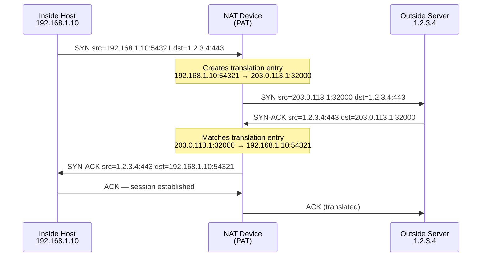

# Network Address Translation (NAT)

NAT rewrites IP addresses (and in most deployments, port numbers) in packet
headers as traffic crosses a boundary between address spaces. Its primary
motivation is IPv4 exhaustion: RFC 1918 private address space (10.0.0.0/8,
172.16.0.0/12, 192.168.0.0/16) is not globally routable, so hosts using private
addresses require translation to reach the public internet. NAT also provides a
secondary security benefit — internal addressing is hidden from external observers
— and is used in cloud environments for public-facing virtual IPs and load
balancer frontends.

For Cisco IOS-XE configuration see [Cisco NAT Configuration](../cisco/cisco_nat_config.md).
For FortiGate configuration see [FortiGate NAT](../fortigate/fortigate_nat.md).

---

## NAT Terminology

| Term | Definition |
| --- | --- |
| **Inside local** | The IP address of an internal host as seen from inside the network — typically an RFC 1918 address |
| **Inside global** | The public IP address representing the internal host as seen from outside |
| **Outside local** | The IP address of an external host as seen from inside the network |
| **Outside global** | The real IP address of the external host as seen from outside |

In a standard single-layer NAT deployment (the common case), outside local and
outside global are the same — the destination address is not rewritten. The
distinction matters in double-NAT scenarios where both source and destination are
translated.

---

## Types of NAT

### Static NAT

A permanent one-to-one mapping between a single inside local address and a single
inside global address. The mapping exists regardless of whether traffic is
flowing.

- Used for servers that must be reachable from outside (mail servers, web servers,

  VPN endpoints)

- Bidirectional: external hosts can initiate connections to the inside global

  address and the NAT device forwards them to the inside local address

- Does not conserve public IPs — each internal host requires one public IP

### Dynamic NAT

A pool of public IP addresses assigned on demand to internal hosts. When a host
initiates an outbound connection, it is assigned an available public IP from the
pool for the duration of the session.

- Still one-to-one (no port translation); each active session consumes one public

  IP

- If the pool is exhausted, new connections are dropped
- Rarely used in modern deployments — PAT achieves the same goal with far fewer

  public IPs

### PAT (Port Address Translation) / NAT Overload

Many internal hosts share a single public IP address. The NAT device differentiates
sessions by translating the source port as well as the source IP, creating a unique
5-tuple for each session.

- Standard mechanism for internet breakout from enterprise and home networks
- A single public IP can support tens of thousands of simultaneous sessions

  (limited by the 16-bit port space and platform capacity)

- The NAT device maintains a translation table mapping each internal

  (IP, port) pair to an external (IP, port) pair

### DNAT (Destination NAT)

Rewrites the destination IP address (and optionally the destination port) of
inbound packets. Used for port forwarding, load balancer VIPs, and cloud
endpoint mapping.

- Packets arriving at the public IP on a specific port are forwarded to an

  internal host and port

- SNAT (source NAT) is applied to return traffic to maintain session symmetry
- In FortiGate terminology, inbound VIPs are implemented as DNAT policies

---

## PAT Session Flow

---

## Stateful Translation Table

NAT devices track active sessions in a translation table. Each entry contains:

| Field | Description |
| --- | --- |
| Inside local IP &#124; port | Source address before translation |
| Inside global IP &#124; port | Source address after translation |
| Outside IP &#124; port | Destination (used for return traffic matching) |
| Protocol | TCP, UDP, or ICMP |
| State / timer | Session state; entry is removed after idle timeout |

Return traffic is matched by reversing the 5-tuple lookup. If no matching entry
exists (e.g., entry timed out, or unsolicited inbound packet), the packet is
dropped. TCP sessions typically time out after 24 hours of inactivity; UDP
sessions after 30–300 seconds depending on platform defaults.

---

## NAT Limitations and ALG

NAT breaks the end-to-end IP transparency that the internet architecture assumes.
Key limitations:

**IPsec compatibility:** AH (Authentication Header) authenticates the IP header,
which NAT modifies — AH is incompatible with NAT. ESP can traverse NAT using
**NAT-T (NAT Traversal)**: ESP packets are encapsulated in UDP port 4500, which
NAT can rewrite without breaking the IPsec payload. See [IPsec and IKE](ipsec.md).

**Protocols that embed IP addresses in payload:** FTP (PORT command), SIP (SDP
body), H.323, and RTSP embed IP addresses and port numbers in the application
payload. A NAT device that only rewrites headers leaves stale internal addresses
in the payload, breaking the protocol. **ALG (Application Layer Gateway)**
modules inspect and rewrite these payloads; they are enabled by default on many
platforms but can cause issues with encrypted variants of the same protocols.

**Peer-to-peer and some VoIP:** NAT complicates direct host-to-host connectivity.
STUN, TURN, and ICE were developed specifically to traverse NAT for WebRTC and
VoIP applications.

---

## NAT in Cloud Contexts

Cloud providers implement NAT at the hypervisor/VPC level rather than on a
dedicated appliance:

| Provider | Model |
| --- | --- |
| **AWS** | Elastic IPs are 1:1 static NAT mappings; NAT Gateway provides PAT for private subnet internet breakout |
| **Azure** | Public IP addresses are 1:1 mapped to NICs or load balancer frontends; NAT Gateway for outbound PAT |

In both cases, the cloud NAT is 1:1 for inbound-capable resources — no port
sharing on the public IP for inbound connections. When a FortiGate or Cisco
device at the network edge adds an additional NAT layer between internal hosts
and the cloud provider's NAT, **double NAT** results. Symptoms include IPsec
failures (NAT-T may not be configured), broken ALG-dependent protocols, and
asymmetric routing if NAT tables become out of sync.

---

## Hairpin NAT (NAT Loopback)

Hairpin NAT (also called NAT loopback or NAT reflection) allows an internal host
to reach an internal server using the server's *public* IP address. Without it,
a DNS response pointing to `203.0.113.50` would send traffic out through the NAT
device and back in — many NAT implementations do not support routing a packet back
out the same interface it arrived on.

- Not supported on all platforms; behaviour is vendor-specific
- Adds load to the NAT device for what is otherwise local traffic
- The preferred solution is **split-horizon DNS** (split-brain DNS): an internal

  DNS server returns the private IP for internal clients, and the public DNS
  returns the public IP for external clients. No NAT loopback required.

---

## Related Pages

- [Cisco NAT Configuration](../cisco/cisco_nat_config.md)
- [FortiGate NAT](../fortigate/fortigate_nat.md)
- [IPsec and IKE](ipsec.md)
