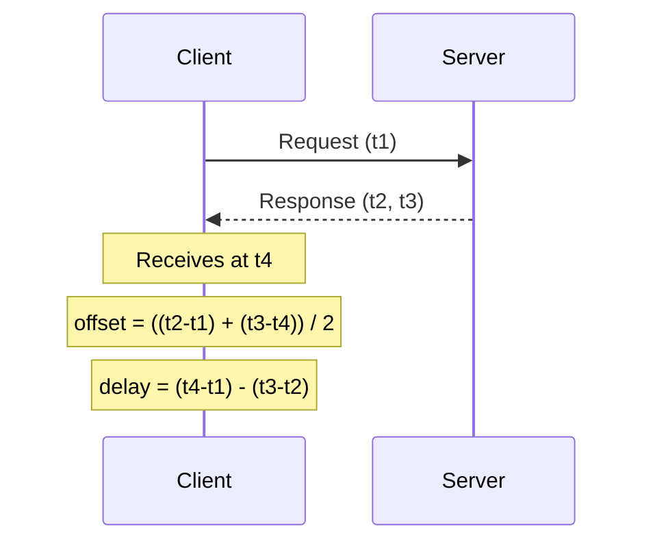
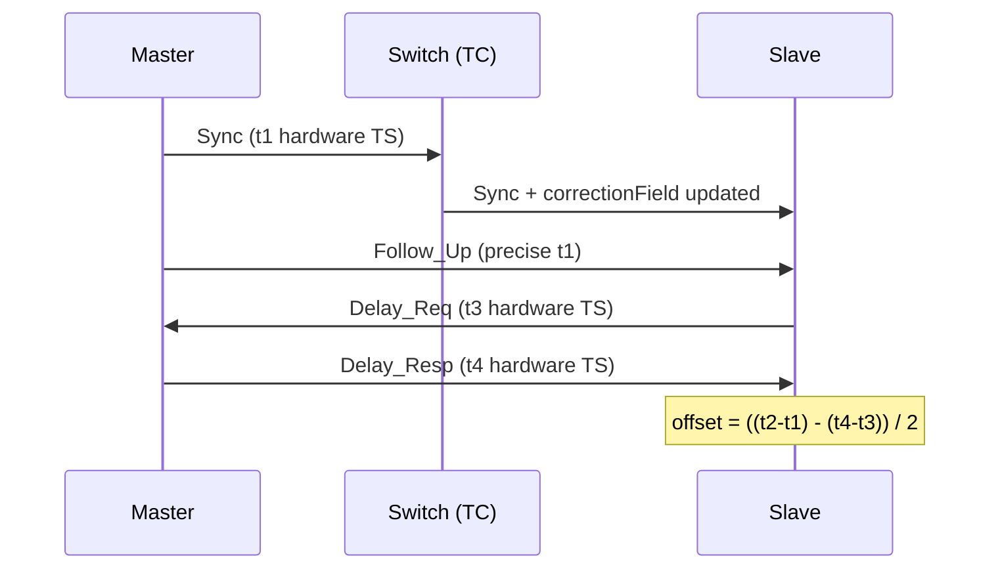

# NTP vs PTP

NTP (Network Time Protocol) and PTP (Precision Time Protocol) both synchronise clocks
across a network but target very different accuracy requirements. NTP is widely
deployed, simple to operate, and achieves millisecond accuracy on LANs. PTP achieves
sub-microsecond accuracy with hardware timestamping and is used in telecom, broadcast,
financial trading, and industrial automation.

---

## At a Glance

| Property | NTP (v4) | PTP (IEEE 1588v2) |
| --- | --- | --- |
| **Standard** | RFC 5905 | IEEE 1588-2008 |
| **Typical accuracy (LAN)** | 1–10 ms | < 1 µs (hardware TS) |
| **Typical accuracy (WAN)** | 10–100 ms | 1–10 µs (with telecom profile) |
| **Transport** | UDP/123 | UDP/319-320 or Ethernet 0x88F7 |
| **Timestamping** | Software | Hardware (NIC/switch) |
| **Hierarchy** | Stratum (0–16) | Master/slave + BMCA |
| **Path delay correction** | Symmetric path assumed | Measured per-message (E2E or P2P) |
| **Intermediate node support** | None | Transparent / Boundary Clocks |
| **Authentication** | NTS (RFC 8915), MD5 (legacy) | Profile-dependent (optional) |
| **Config complexity** | Low | Medium–High |
| **Cost** | Free (software only) | Hardware NIC/switch required |

---

## How Each Protocol Measures Time

### NTP — Symmetric Delay Model

NTP assumes the path delay is symmetric (equal in both directions) and estimates
offset by averaging the round-trip exchange.

Accuracy is limited by software timestamping jitter (kernel scheduling, interrupt
latency) and asymmetric network paths.

### PTP — Per-Message Hardware Timestamps

PTP timestamps each message at the hardware level (NIC or PHY), eliminating software
jitter. Intermediate Transparent Clocks update the `correctionField` to account for
switch residence time, so delay accumulation across hops is precisely tracked.

---

## Hierarchy

### NTP — Stratum

| Stratum | Description |
| --- | --- |
| `0` | Reference clock (GPS, atomic, GNSS) — not on the network |
| `1` | Primary time server — directly connected to stratum 0 |
| `2` | Synchronized to a stratum 1 server |
| `3`–`15` | Each hop adds one stratum |
| `16` | Unsynchronized / unreachable |

NTP clients automatically select the best server based on stratum, round-trip delay,
and jitter using a clock filter and selection algorithm.

### PTP — Best Master Clock Algorithm (BMCA)

PTP clocks elect a Grandmaster automatically using the BMCA, comparing:
`priority1` → `clockClass` → `clockAccuracy` → `offsetScaledLogVariance` →
`priority2` → `clockIdentity` (lower = better at each step).

Clocks in the domain form a spanning tree rooted at the Grandmaster. Boundary Clocks
segment the domain and present a local master to downstream slaves, reducing
Grandmaster fan-out.

---

## Accuracy Comparison

| Scenario | NTP | PTP |
| --- | --- | --- |
| Internet (public NTP pools) | 10–100 ms | Not applicable |
| LAN, software timestamping | 1–10 ms | 1–100 µs |
| LAN, hardware TS (NIC only) | N/A | 100 ns – 1 µs |
| LAN, hardware TS + TC switches | N/A | < 100 ns |
| Telecom (G.8275.1, full on-path) | N/A | < 100 ns |

---

## Network Infrastructure Requirements

| Requirement | NTP | PTP |
| --- | --- | --- |
| Standard switch | Yes | Yes (software TS only, ~µs accuracy) |
| PTP-aware (Transparent Clock) switch | Not required | Required for sub-µs accuracy |
| Hardware timestamping NIC | Not required | Required for sub-µs accuracy |
| GPS / GNSS source | Optional (for stratum 1) | Required for Grandmaster |
| Dedicated management | Minimal | Moderate (profile, domain, BMCA tuning) |

---

## When to Use Each

### Use NTP

- General-purpose time sync is sufficient (servers, network devices, logging).
- Millisecond accuracy meets requirements.
- Infrastructure is heterogeneous (standard switches, no PTP hardware).
- Simplicity and ubiquity matter — NTP clients are built into every OS.

### Use PTP

- Sub-microsecond accuracy is required (mobile fronthaul, trading systems, broadcast

  video, industrial control).

- Complying with telecom standards: ITU-T G.8273 / G.8275.
- Phase alignment is required, not just frequency synchronisation.
- SMPTE ST 2059-2 (broadcast) or AES67 (audio) profiles mandate PTP.

### Use Both

Large networks often run PTP for high-precision domains (telecom, AV) and NTP for
general IT infrastructure, with boundary points where PTP Grandmasters also serve as
NTP stratum 1 servers.

---

## Protocol Reference

| Property | NTP v4 | PTP v2 |
| --- | --- | --- |
| **RFC / Standard** | RFC 5905 | IEEE 1588-2008 |
| **UDP Port** | `123` | `319` (event), `320` (general) |
| **Multicast** | `224.0.1.1` | `224.0.1.129`, `224.0.0.107` |
| **Wireshark Filter** | `ntp` | `ptp` |
| **Packet docs** | [NTP](../application/ntp.md) | [PTP](../application/ptp.md) |

---

## Notes

- **NTPsec** is a hardened NTP implementation for Linux that replaces the reference

  ntpd. It supports NTS (RFC 8915) for authenticated, encrypted NTP over TLS/QUIC.

- **chrony** (`chronyd`) is the recommended NTP implementation on modern Linux

  (RHEL/Debian default). It converges faster than ntpd after long gaps and handles
  intermittent connectivity well.

- **PTP on Linux**: `ptp4l` handles the PTP protocol; `phc2sys` synchronises the

  system clock from the PTP hardware clock (PHC) on the NIC.

- **GPS disciplining**: a GPS receiver with a 1PPS output connected to a stratum 1

  NTP server or PTP Grandmaster is the most common reference clock in enterprise
  networks.
