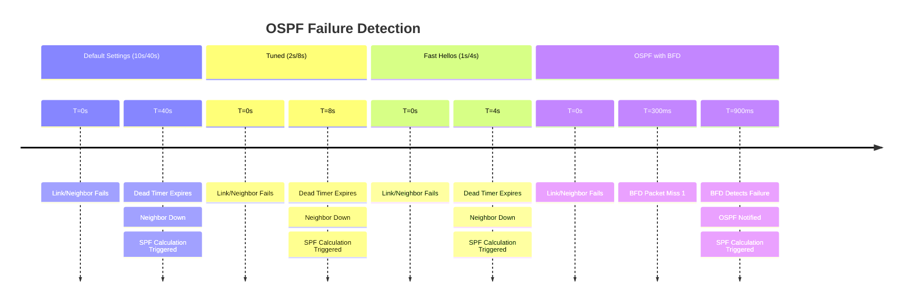
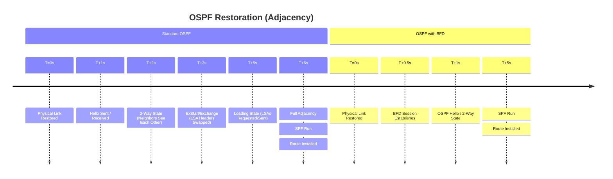

# OSPF Convergence: Standard vs. Tuned vs. Fast Hellos vs. BFD

## At a Glance

| Aspect | Default Settings | Tuned Timers | Fast Hellos | OSPF with BFD |
| --- | --- | --- | --- | --- |
| **Hello / Dead Timer** | 10s / 40s | 2s / 8s | 1s / 4s | 10s / 40s (backup) |
| **Detection Time** | ~40 seconds | ~8 seconds | ~4 seconds | **< 1 second** |
| **CPU Impact** | Very low | Low-medium | High | Low (offloaded) |
| **Stability** | Very high | High | Moderate | High |
| **SPF Trigger** | Dead timer expire | Dead timer expire | Dead timer expire | Immediate (BFD) |
| **Best For** | Stable legacy networks | Balanced performance | Time-critical production | Sub-100ms convergence |

---

## 1. Overview & Principles

OSPF detects failure when it stops receiving "Hello" packets. While naturally faster
than BGP, Default Settings rely on a "Dead Timer" that can lead to significant traffic
loss.

### The Dead Timer Problem

In standard OSPF, a router waits 4 times the Hello interval before declaring a neighbor
dead. On a 10Gbps link, 40 seconds of failure (Default Settings) results in **400
Gigabits of dropped data**.

### Tuned Timers vs. Fast Hellos

- **Tuned Timers (2s/8s):** A safe compromise for legacy hardware. Reduces detection

    from 40s to 8s without significantly stressing the CPU.

- **Fast Hellos (Sub-second):** Setting OSPF to sub-second hellos (e.g., `minimal

    hello-multiplier`) forces the CPU to process hellos constantly. Risks "False
    Positives" if the CPU hits 100% due to an unrelated task.

- **BFD (The Watchdog):** Sub-second detection offloaded to the forwarding plane.

    Allows OSPF to bypass the Dead Timer and run SPF immediately.

## 2. Failure Detection & Restoration Timelines

### Failure Detection (Neighbor Down)



### Restoration Timeline (Adjacency)



## 3. Configuration Snippets

### Cisco IOS-XE OSPF with BFD

```ios

router ospf 1
 router-id 1.1.1.1
 bfd all-interfaces
 !
 ! Tune SPF throttling to react immediately to the BFD trigger
 timers throttle spf 50 200 5000
 timers lsa arrival 100
```

## 4. Comparison Summary

| Metric | Default Settings | Tuned Timers | Fast Hellos | OSPF + BFD |
| ----- | ----- | ----- | ----- | ----- |
| **Hello / Dead** | 10s / 40s | 2s / 8s | 1s / 4s | 10s / 40s (Backup) |
| **Detection Time** | \~40 Seconds | \~8 Seconds | \~4 Seconds | **< 1 Second** |
| **CPU Impact** | Low | Low-Medium | **High** | Low (Offloaded) |
| **Stability** | Very High | High | Moderate | **High** |
| **SPF Trigger** | After Dead Timer | After Dead Timer | After Dead Timer | **Immediate (via BFD)** |

## 5. Verification & Troubleshooting

| Command | Purpose |
| ----- | ----- |
| `show ip ospf interface` | Confirm OSPF BFD is enabled on the interface. |
| `show bfd neighbors` | Verify active heartbeats and negotiated intervals. |
| `show ip ospf neighbor` | Confirm adjacency status is "FULL". |
| `debug ip ospf adj` | Monitor adjacency state machine transitions. |

### Engineering Guidance

- **Use BFD** whenever the hardware supports it. It is the only way to achieve
sub-second

sub-second

    convergence safely.

- **Tuned Timers (2s/8s)** are a safe compromise for networks where BFD is not available

    and 8 seconds of downtime is acceptable.

- **Fast Hellos** should be a last resort for links where BFD is not available and

    convergence must be under 5 seconds.

- **LSA Throttling:** Pair BFD with tuned LSA generation timers (throttle SPF) for

    true "carrier-grade" convergence.

---

## Notes / Gotchas

- **Dead Timer is Still Required, Not Replaced:** BFD notifies OSPF of failure, but the Dead
  Timer is not removed. If BFD fails to start, OSPF falls back to the Dead Timer. Set it
  conservatively (4× hello) to avoid false positives.

- **Fast Hellos Create False Positives on CPU Spikes:** A CPU overload of >1 second causes a
  missed hello and can trigger SPF. BFD at 300 ms is less susceptible — it runs in the
  forwarding plane, not the control-plane CPU.

- **SPF Throttling Must Match Convergence Goals:** With `timers throttle spf 5000 10000 20000`,
  SPF waits 5 seconds even after instant BFD detection. Use aggressive throttling
  (`timers throttle spf 50 200 5000`) when deploying BFD.

- **Adjacency State Machine Still Runs:** BFD failure triggers SPF, but the FULL → DOWN
  transition still takes a few milliseconds while the OSPF state machine processes the
  BFD notification.

- **Multicast Connectivity Required:** BFD on OSPF uses multicast (224.0.0.5). If multicast
  is filtered on the segment, BFD will fail to establish. Verify multicast is permitted on
  all OSPF segments before enabling BFD.

---

## See Also

- [BFD (Bidirectional Forwarding Detection)](../theory/bfd_fundamentals.md)
- [OSPF Fundamentals](../theory/ospf_fundamentals.md)
- [OSPF vs EIGRP](../theory/ospf_vs_eigrp.md)
- [BGP vs OSPF](../theory/bgp_vs_ospf.md)
- [Cisco OSPF Configuration](../cisco/ospf_configuration.md)
