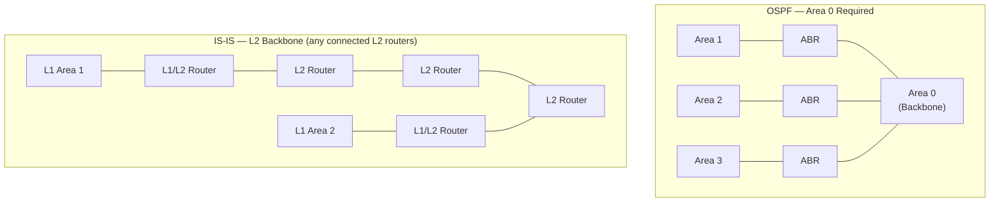

# OSPF vs IS-IS

OSPF (RFC 2328) and IS-IS (ISO 10589, adapted for IP by RFC 1195) are both link-state IGPs
using Dijkstra's SPF algorithm. They are functionally similar at a high level but differ
significantly in operation, design, and deployment context. OSPF is dominant in enterprise
networks; IS-IS is the predominant IGP in service provider and large-scale ISP backbones,
and has growing datacentre adoption.

---

## At a Glance

| Property | OSPF | IS-IS |
| --- | --- | --- |
| **Standard** | RFC 2328 (v2), RFC 5340 (v3) | ISO 10589, RFC 1195 (IP), RFC 5308 (IPv6) |
| **IP Protocol** | 89 (runs over IP) | Layer 2 directly (not over IP — uses CLNP/IS-IS PDUs) |
| **Multicast** | 224.0.0.5 (all routers), 224.0.0.6 (DR/BDR) | Layer 2 multicast (01:80:C2:00:00:14/15) |
| **Area hierarchy** | Backbone area 0 + standard areas | L1 (intra-area), L2 (inter-area/backbone), L1/L2 boundary routers |
| **IPv4 + IPv6** | Separate processes (OSPFv2 / OSPFv3) | Single process (multi-topology) |
| **LSA/LSP flooding** | Within area | Within L1 domain or L2 domain |
| **Metric** | Cost (based on bandwidth) | Metric 0–63 per link (narrow), 0–16,777,215 (wide) |
| **Authentication** | MD5 (v2), optional (v3 uses IPsec) | HMAC-MD5, HMAC-SHA (per adjacency or area) |
| **DR/BDR election** | Yes (on broadcast segments) | DIS (Designated IS) — all routers still send hellos |
| **Admin Distance (Cisco)** | 110 | 115 |
| **Vendor support** | Universal | Primarily SP (Cisco, Juniper, Nokia); growing in DC |

---

## Area Design

### OSPF

OSPF uses a two-level hierarchy: Backbone (area 0) + non-backbone areas. All areas must
connect to area 0, either directly or via virtual links. Area Border Routers (ABRs)
summarise routes between areas.

### IS-IS

IS-IS uses Level 1 (L1, intra-area) and Level 2 (L2, backbone/inter-area). L1 routers
exchange topology only within their area; L2 routers form the backbone. L1/L2 routers
connect the two levels. There is no strict requirement for a single backbone — the L2
domain is any set of L2-capable routers.

**Key difference:** OSPF requires all areas to connect to a central area 0, making
area 0 a potential bottleneck in design. IS-IS has no equivalent constraint — L2
can be any
connected set of routers.

---

## Flooding Comparison

Both protocols flood LSAs/LSPs to build an identical topology database within a domain.
Key differences:

- OSPF LSAs have individual sequence numbers and ages; LSAs are reflooded every MaxAge
  (3600 s default).
- IS-IS LSPs have sequence numbers and remaining lifetime; LSPs are refreshed every
  15 minutes by default.
- IS-IS PDUs are smaller than OSPF LSAs for equivalent topology due to more efficient
  encoding.

---

## IS-IS Runs Over Layer 2 (Not IP)

IS-IS PDUs are encapsulated directly in Ethernet frames using a specific EtherType
(`0xFEFE`). This means IS-IS adjacencies form even if IP is misconfigured — useful in
some scenarios, but requires Layer 2 connectivity (cannot traverse routers that do not
participate in IS-IS).

---

## Metric Behaviour

OSPF metrics default to `reference-bandwidth / interface-bandwidth` (must raise reference
bandwidth for GbE links). IS-IS uses a flat metric per interface (default 10 for all link
speeds) — must be manually configured to reflect actual link costs. Wide metrics
(RFC 3784) extend IS-IS to 24-bit per-link metrics to support traffic engineering.

---

## Multi-Topology IS-IS (MT-ISIS, RFC 5120)

A single IS-IS process can run separate topologies for IPv4 and IPv6 simultaneously —
topology ID 0 for IPv4, topology ID 2 for IPv6 only. This avoids the need to run separate
OSPFv2 and OSPFv3 processes.

---

## When to Use Each

### Use OSPF for

- Enterprise and campus networks (multi-vendor, familiar to engineers)
- Environments where OSPF tooling and expertise are mature
- Networks where IPv4 and IPv6 can have separate processes without operational burden

### Use IS-IS for

- Service provider backbone (proven at scale, widely used by ISPs)
- Large-scale datacentre fabrics (Clos/spine-leaf with BGP as overlay, IS-IS as underlay)
- Networks requiring a single IGP process for both IPv4 and IPv6
- Environments where IS-IS's lower flooding overhead at scale is beneficial

---

## Notes

- IS-IS does not require IP to form adjacencies — the neighbour relationship is Layer 2
  based. This is both an advantage (works even if IP is misconfigured) and a constraint
  (neighbours must be on the same Layer 2 segment unless using GRE or other encapsulation).
- Cisco IOS IS-IS: `router isis`, `net <NSAP>` — the NSAP (Network Service Access Point)
  identifies the router in IS-IS. Format: `49.0001.1921.6800.0001.00`, where `49` = private
  use AFI, `0001` = area 1, `1921.6800.0001` = router system ID (192.168.0.1 in hex).
- IS-IS has no concept of passive interfaces in the same way as OSPF — interfaces not
  running IS-IS are simply not configured with `ip router isis`. Use `passive-interface`
  under `router isis` to advertise a prefix without forming adjacencies.
