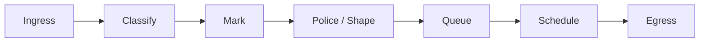
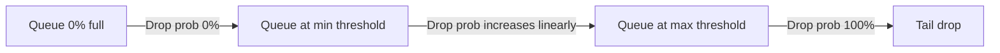
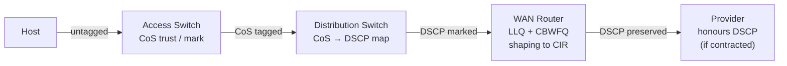

# Quality of Service

QoS provides differentiated treatment for network traffic when links are congested.
Without QoS, all packets compete equally for bandwidth — a bulk file transfer can
starve a VoIP call sharing the same link. QoS solves this by classifying traffic,
marking it, queuing it into priority groups, and scheduling transmission according
to policy.

For DSCP values and PHB definitions see the [DSCP & QoS Reference](../reference/dscp_qos.md).
This page covers the conceptual pipeline, design decisions, and how the mechanisms
interact.

---

## The QoS Pipeline

Every packet traverses the same logical pipeline at each QoS-enabled node:



**Classify:** Identify what the packet is (application, DSCP value, ACL match, NBAR
protocol recognition). This is the most expensive operation — done once at the trust
boundary; downstream nodes trust the DSCP mark.

**Mark:** Write the DSCP value into the IP header (or CoS into the 802.1Q tag). Marks
persist through the network and drive behaviour at every hop.

**Police / Shape:** Enforce a rate limit. Policing drops or re-marks excess traffic
immediately; shaping buffers it and smooths the output rate.

**Queue:** Place the packet into a class-specific queue. Multiple queues hold different
traffic classes while waiting for transmission.

**Schedule:** Decide which queue to service next, and how much bandwidth each queue
gets. Scheduling is where priority and bandwidth guarantees are actually enforced.

---

## Classification

### At the Trust Boundary

Traffic should be classified and marked **once**, at the network edge (the trust
boundary) — typically the access switch port or the ingress interface of the first
router a packet touches. All interior nodes then trust the DSCP marking and act
on it without re-classifying.

Classify using the most reliable signal available:

| Signal | Method | Notes |
| --- | --- | --- |
| IP address / subnet | ACL match | Coarse; matches all traffic from a source |
| IP protocol + port | ACL match (L4) | More specific; UDP 5060 = SIP, etc. |
| Application (DPI) | NBAR (Network Based App Recognition) | Deep inspection; CPU-intensive; do at edge only |
| Existing DSCP mark | `match dscp` | Trust upstream marking (internal only) |
| CoS (802.1Q tag) | `match cos` | From access switch; map to DSCP at L3 boundary |

### Never Trust External DSCP

Inbound traffic from the internet or customer sites must not be trusted — a host can
set arbitrary DSCP values. Re-mark on ingress:

```ios

policy-map UNTRUSTED-INGRESS
 class class-default
  set dscp default    ! Reset all external markings to BE
```

---

## Marking

DSCP is the primary marking mechanism. Write it at ingress, read it at every hop.
The 6-bit field provides 64 codepoints; in practice, networks use 4–8 classes.

A simple four-class marking scheme:

| Class | DSCP | Value | Traffic |
| --- | --- | --- | --- |
| Network Control | CS6 | 48 | Routing protocols, BFD, management |
| Real-Time | EF | 46 | VoIP RTP, video conferencing bearer |
| Business Critical | AF31 | 26 | ERP, transactional applications |
| Best Effort | CS0 | 0 | Everything else |

Cisco IOS marking in a policy-map:

```ios

class-map match-any VOIP
 match protocol rtp audio
 match dscp ef                  ! Trust if already marked EF

policy-map MARK-INGRESS
 class VOIP
  set dscp ef
 class CRITICAL
  set dscp af31
 class class-default
  set dscp default
```

---

## Policing vs Shaping

Both enforce a rate limit. They differ in what happens to excess traffic:

| Property | Policing | Shaping |
| --- | --- | --- |
| Excess action | Drop or re-mark immediately | Buffer (delay) |
| Latency impact | None on conforming traffic | Adds latency and jitter |
| Buffer required | No | Yes (shaping buffer) |
| Where used | Ingress (trust boundary) or contracted rate enforcement | Egress (smooth output to match provider CIR) |
| Effect on TCP | Causes retransmission (dropped packets) | TCP self-throttles due to delay (smoother) |

**Policing** is appropriate at ingress to enforce what a traffic class is *allowed*
to send. **Shaping** is appropriate at egress to conform to a provider's committed
information rate (CIR) — particularly on WAN interfaces where exceeding the CIR
causes the provider to drop traffic anyway.

```ios

! Police EF to 1 Mbps; re-mark excess to AF31 (not drop)
policy-map POLICE-VOIP
 class VOIP
  police rate 1000000 bps
   conform-action transmit
   exceed-action set-dscp-transmit af31

! Shape egress to match 10 Mbps WAN CIR
policy-map SHAPE-WAN
 class class-default
  shape average 10000000
```

---

## Queuing

Queuing separates traffic into class-specific buffers to prevent one class from
monopolising shared bandwidth during congestion.

### FIFO — First In, First Out

No queuing policy — single queue, transmitted in arrival order. Default on high-speed
interfaces where congestion is rare. Provides no differentiation.

### WFQ — Weighted Fair Queuing

Automatically classifies flows and assigns each a fair share of bandwidth inversely
proportional to its IP precedence. Low-volume interactive flows (Telnet, DNS) get
low latency without explicit configuration. Does not support explicit bandwidth
guarantees. Used as a default on slow serial interfaces.

### CBWFQ — Class-Based Weighted Fair Queuing

Explicitly allocates bandwidth to named traffic classes. Each class gets at minimum
its configured share; unused bandwidth is distributed to other classes.

```ios

policy-map WAN-CBWFQ
 class CRITICAL
  bandwidth percent 40     ! Minimum 40% of link bandwidth
 class BULK
  bandwidth percent 20
 class class-default
  fair-queue               ! WFQ for remaining classes
```

### LLQ — Low-Latency Queuing

LLQ adds a **strict priority queue** to CBWFQ. The priority queue is serviced first,
before any other class, providing guaranteed low latency and jitter for real-time
traffic. All other classes use CBWFQ for their share of remaining bandwidth.

```ios

policy-map WAN-LLQ
 class VOIP
  priority 512             ! Strict priority, 512 Kbps guaranteed; never waits
 class CRITICAL
  bandwidth percent 30
 class BULK
  bandwidth percent 20
 class class-default
  fair-queue
```

**Priority queue starvation:** If the priority class exceeds its configured rate,
other classes are starved. Always **police the priority class at ingress** to its
configured rate, ensuring it never overruns.

---

## Scheduling

Scheduling determines the order in which queued packets are transmitted. The
scheduler runs continuously; it decides which queue gets the next transmission
opportunity.

### Strict Priority

The priority queue is always serviced first. Only when the priority queue is empty
does the scheduler service other queues. Guarantees minimum latency for real-time
traffic but risks starvation of other classes under sustained priority load.

### Weighted Round-Robin (WRR)

Each queue is served in rotation, weighted by its configured bandwidth share. A class
with 40% weight gets approximately 40% of transmission opportunities. No class is
ever completely starved (unlike strict priority), but real-time traffic does not get
a latency guarantee.

### Deficit Weighted Round-Robin (DWRR)

An enhancement to WRR that accounts for variable packet sizes. Each queue
accumulates a "deficit counter" of bytes; the scheduler services queues whose counter
is positive. Provides fair byte-level bandwidth sharing.

Cisco LLQ combines strict priority (for EF) with CBWFQ (effectively WRR) for all
other classes — the practical best-of-both approach.

---

## Congestion Avoidance: WRED

**WRED (Weighted Random Early Detection)** proactively drops packets before queues
fill completely. As a queue depth increases, WRED begins randomly dropping packets
— probabilistically more likely to drop higher drop-precedence traffic (AF12, AF13
etc.) than lower (AF11). This signals TCP senders to slow down *before* the queue
is full, preventing global synchronisation (where all flows reduce simultaneously
after a queue-full drop event).



WRED parameters per DSCP class:

- **min-threshold:** Queue depth below which WRED does not drop
- **max-threshold:** Queue depth above which all packets are dropped (tail drop)
- **mark-probability:** Maximum drop probability at max-threshold (default 1/10)

Higher DSCP drop precedence (AF*3 > AF*2 > AF*1) gets a lower min-threshold — it
starts being dropped sooner, protecting lower-precedence traffic in the same class.

WRED only helps TCP — UDP (VoIP, video) does not respond to drops by slowing down.
Keep real-time traffic in the priority queue, away from WRED-managed queues.

---

## End-to-End QoS Design

QoS is only effective if consistently applied at every node in the path. A packet
marked EF at ingress is useless if the WAN router has no LLQ for EF traffic.



**Design rules:**

1. **Mark early, mark once.** Classify at the first device that can reliably identify

   the traffic. All downstream devices trust the mark.

1. **Enforce at the bottleneck.** QoS only matters where congestion occurs. Apply

   LLQ/CBWFQ at WAN interfaces, uplinks, and any link that can become congested.
   High-speed core links rarely need queuing.

1. **Police the priority queue.** Rate-limit EF/priority traffic to a fraction of link

   capacity (typically ≤ 33%). Unconstrained priority queues starve everything else.

1. **Use at most 4–8 classes.** More classes increase operational complexity without

   meaningfully improving outcomes. Network control (CS6), real-time (EF), critical
   business (AF3x), standard (AF1x), best effort (CS0) covers most enterprise needs.

1. **Never trust external markings.** Re-mark all inbound traffic from untrusted

   sources (internet, customer sites, unmanaged devices).

1. **Verify end-to-end.** `show policy-map interface` on every hop in the path. Queue

   drops in the wrong class indicate misconfiguration or under-provisioning.

---

## Cisco MQC Reference

The Modular QoS CLI (MQC) separates classification (`class-map`), policy
(`policy-map`), and application (`service-policy`):

```ios

! 1. Classify
class-map match-any VOIP
 match dscp ef
 match dscp cs5

class-map match-any CRITICAL
 match dscp af31 af32 af33

! 2. Policy
policy-map WAN-EDGE
 class VOIP
  priority percent 20       ! Strict priority, 20% of link
 class CRITICAL
  bandwidth percent 35      ! CBWFQ, minimum 35%
  random-detect dscp-based  ! WRED on AF drop precedences
 class class-default
  bandwidth percent 25
  fair-queue
  random-detect

! 3. Apply
interface GigabitEthernet0/0
 service-policy output WAN-EDGE
```

---

## Notes

- QoS does not create bandwidth — it only prioritises how existing bandwidth is used.

  If a link is consistently at 100% utilisation, the only real fix is more bandwidth.

- `show policy-map interface <int>` shows per-class packet/byte counts, queue depths,

  and drop counts. Non-zero drops in the wrong class indicate a policy problem.

- FortiGate traffic shaping uses DSCP matching under `config firewall shaper` and

  `config firewall shaping-policy`. FortiGate SD-WAN SLA thresholds are a complementary
  mechanism — see [FortiGate SD-WAN](../fortigate/fortigate_sdwan.md).

- DSCP is preserved across MPLS networks via EXP/TC bits (3-bit field; maps to the top

  3 bits of DSCP). Verify with your provider that DSCP is honoured end-to-end.
