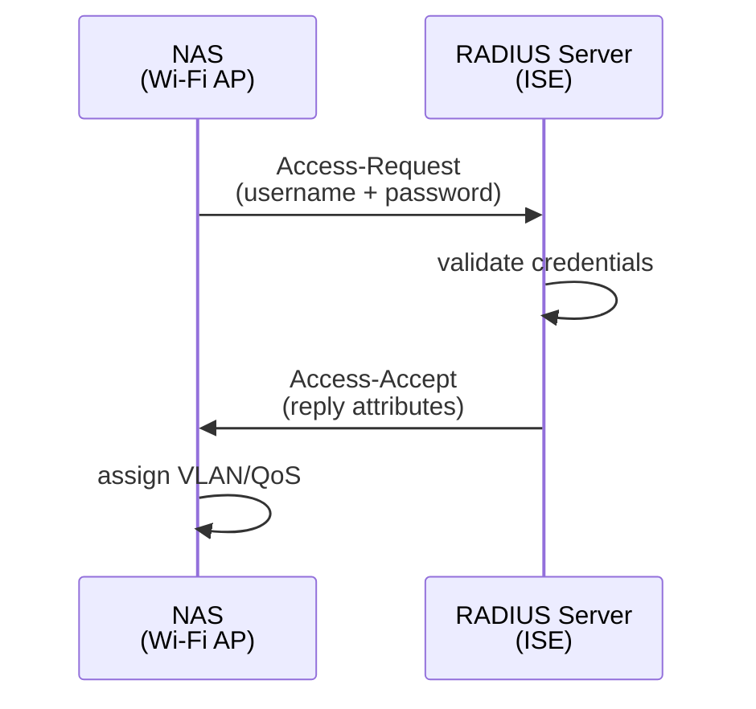
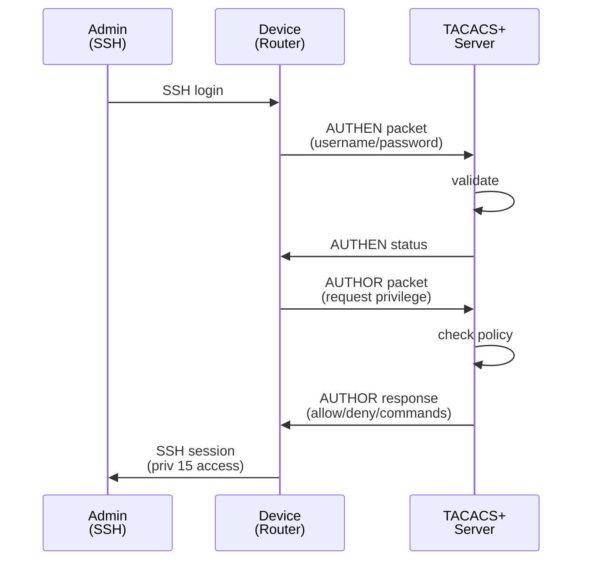
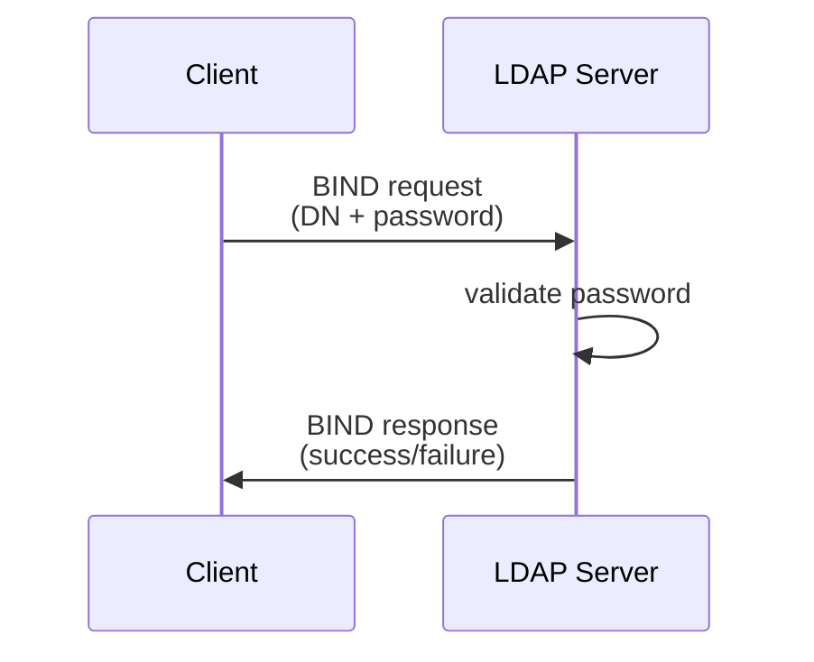
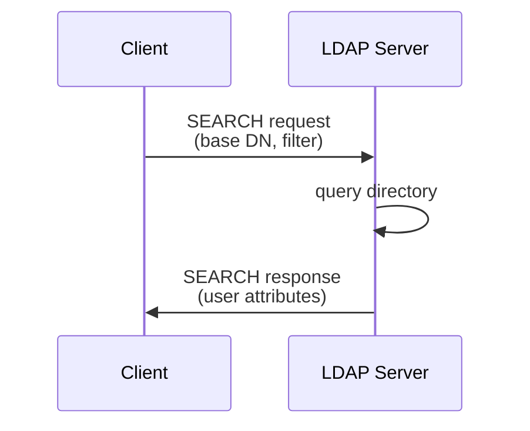
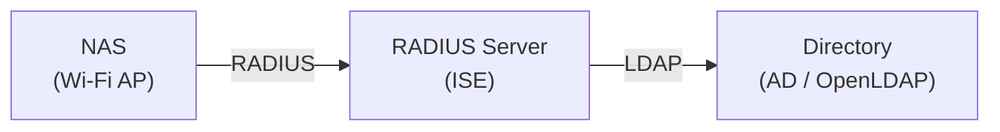
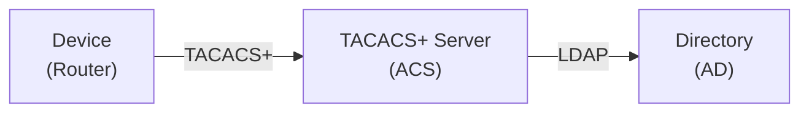
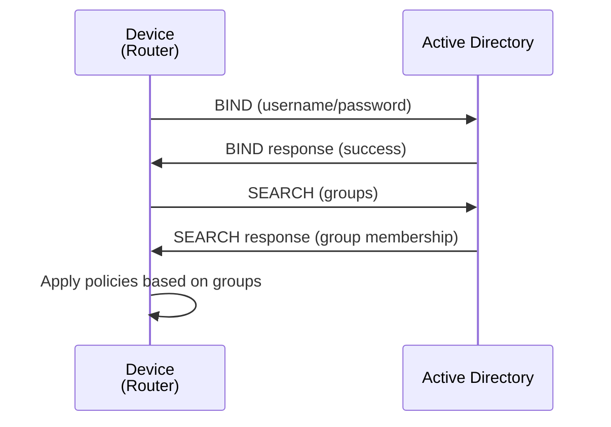
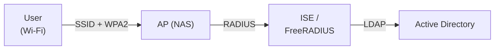
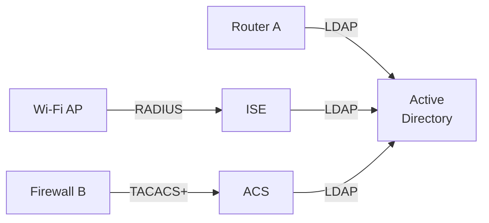
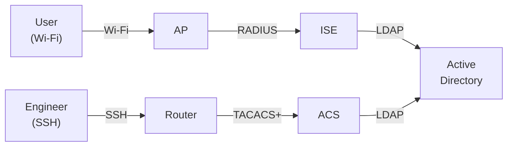

# RADIUS vs TACACS+ vs LDAP — Network Authentication Protocols

RADIUS (Remote Authentication Dial-In User Service), TACACS+ (Terminal Access Controller
Access-Control System Plus), and LDAP (Lightweight Directory Access Protocol) are three
distinct approaches to centralised network authentication and authorisation. RADIUS is
UDP-based, stateless, and designed for network access (dial-up modems, VPN, wireless).
TACACS+ is TCP-based, stateful, and optimised for device administration (CLI access to
routers and switches). LDAP is a directory service protocol that provides authentication
and authorization by querying a user directory (Active Directory, OpenLDAP). Most
enterprises use all three, often in combination: RADIUS for network access, TACACS+ for
device management, LDAP as the backing directory. This guide clarifies the differences and
use cases.

For detailed packet formats, see [RADIUS Packet Format](../application/radius.md).

---

## At a Glance

| Property | RADIUS | TACACS+ | LDAP |
| --- | --- | --- | --- |
| **RFC / Standard** | RFC 2865 (Auth/Authz), RFC 2866 (Accounting) | Cisco proprietary (de-facto standard, RFC 6613 draft) | RFC 3389 (simplified X.500) |
| **Transport** | UDP `1812` / `1813` | TCP `49` | TCP `389` (plain), `636` (SSL/TLS) |
| **State** | Stateless (fire-and-forget) | Stateful (persistent TCP connection) | Stateful (persistent TCP connection) |
| **Packet size** | Fixed header + TLV attributes | Fixed header + Cisco-specific fields | LDAP ASN.1 BER encoded |
| **Encryption** | Shared secret (MD5 hash) | Entire body encrypted | TLS (modern LDAP) or StartTLS |
| **Authentication** | Challenge-response (PAP, CHAP) | Challenge-response (ASCII, PAP variants) | BIND request (simple, SASL, Kerberos) |
| **Authorisation** | Implicit in Auth-Accept | Explicit AUTHOR packets | LDAP group membership + attributes |
| **Accounting** | RFC 2866 standard, via UDP | Custom via ACCNTZ packet type | Not natively; often paired with RADIUS |
| **Primary use case** | Network access (dial-up, VPN, wireless, 802.1X) | Device admin access (SSH/console to routers/switches) | User directory and identity management |
| **Command authorisation** | Per-user privilege level (limited) | Per-command granularity (TACACS+ feature) | Via group membership and LDAP attributes |
| **Scalability** | High (stateless, simple) | Medium (TCP connections per user) | High (directory queries, caching) |
| **Third-party support** | All devices (network, firewalls, VPNs, wireless APs) | Cisco, some Fortinet/Juniper | All directory services (AD, OpenLDAP, FreeIPA) |
| **Vendor backend** | Custom attributes per vendor | Proprietary, Cisco-specific | LDAP directory (Microsoft AD, OpenLDAP, etc.) |

---

## How Each Protocol Works

### RADIUS: Simple Request/Response Authentication

RADIUS uses a **stateless UDP request/response model**. A network access server (NAS —
e.g., a wireless access point or VPN gateway) sends an Access-Request packet to a RADIUS
server. The server validates the credentials and responds with Access-Accept or Access-
Reject.

**RADIUS flow:**



**Packet structure:**

```text
Code (1 byte): 1=Access-Request, 2=Access-Accept, 3=Access-Reject
ID (1 byte): Matches request to response
Length (2 bytes): Total packet length
Authenticator (16 bytes): MD5(code + id + length + attributes + shared_secret)
Attributes (variable): TLV-encoded user and policy attributes
```

**Examples of attributes:**

- User-Name
- User-Password (encrypted with shared secret)
- Reply-Message
- Framed-IP-Address (assign IP to user)
- Framed-Protocol (PPP, SLIP)
- Service-Type (Login, Framed, etc.)
- Vendor-Specific (vendor-specific extensions)

### TACACS+: TCP-Based Command Authorisation

TACACS+ uses a **stateful TCP connection** for authentication, authorisation, and
accounting. Unlike RADIUS, TACACS+ separates these three functions into distinct packet
types. TACACS+ is primarily used for device administration (SSH/console access to routers,
switches) rather than network access.

**TACACS+ flow:**



**Key difference from RADIUS:** TACACS+ separates authentication (login), authorisation
(what the user can do), and accounting (command logging) into distinct packet types.
RADIUS combines them.

**TACACS+ packet structure:**

```text
Header (12 bytes):
  Version/Type (1 byte)
  Status (1 byte): TAC_PLUS_AUTHEN_STATUS_PASS, FAIL, GETDATA, GETUSER, etc.
  Seq_no (1 byte): Sequence number (separate exchanges)
  Flags (1 byte): Encrypted, Single-connect, TAC_PLUS_UNENCRYPTED_FLAG
  Session_id (4 bytes): Session identifier
  Length (4 bytes): Length of body

Body (variable):
  Encrypted with shared secret (RC4 or similar)
  Type-specific fields (AUTHEN/AUTHOR/ACCNTZ)
```

**Authorisation granularity:** TACACS+ allows **per-command authorisation**. An admin
can be restricted to specific commands:

```text
permit command = "show ip route"
permit command = "ping"
deny command = "*"  ! All other commands denied
```

This level of granularity is not available in standard RADIUS.

### LDAP: Directory Service and Authentication

LDAP is a **directory service protocol** — it is fundamentally different from RADIUS and
TACACS+. LDAP stores user and organisational data in a tree structure (directory) and
allows clients to query, add, modify, and delete entries. Authentication is one of its
functions, but LDAP also serves as the backing store for user attributes, group
membership, and organisational information.

**LDAP directory structure (example):**

```text
dc=example,dc=com (root)
├── ou=Users
│   ├── cn=alice (user object)
│   │   ├── uid=alice
│   │   ├── mail=alice@example.com
│   │   ├── memberOf=Engineering
│   │   └── memberOf=VPN-Users
│   └── cn=bob (user object)
│       ├── uid=bob
│       ├── mail=bob@example.com
│       └── memberOf=Sales
├── ou=Groups
│   ├── cn=Engineering
│   │   ├── member=cn=alice,ou=Users,dc=example,dc=com
│   │   └── member=cn=charles,ou=Users,dc=example,dc=com
│   └── cn=VPN-Users
│       ├── member=cn=alice,ou=Users,dc=example,dc=com
│       └── member=cn=dave,ou=Users,dc=example,dc=com
└── ou=Devices
    ├── cn=router-1
    │   ├── ipHostNumber=10.0.1.1
    │   └── description=HQ router
    └── cn=switch-1
        ├── ipHostNumber=10.0.1.2
        └── description=HQ switch
```

**LDAP authentication (BIND):**



**LDAP query (after authentication):**



**Typical use case:** A network device authenticates a user via LDAP, then queries the
directory to retrieve group membership and apply policies.

```text
Device: "User alice is logging in. Let me bind to LDAP with her credentials."
LDAP: "OK, alice is authenticated. Here are her attributes: memberOf=[Engineering,
VPN-Users]"
Device: "Alice is in the VPN-Users group. I'll apply VPN-specific policies."
```

---

## Key Differences

### Transport and Statefulness

**RADIUS:** Stateless, UDP-based. A NAS sends a packet; the server responds. No persistent
connection. If the server is unreachable, the NAS must retry or fail the request.

**TACACS+:** Stateful, TCP-based. A device maintains a persistent connection to the
TACACS+ server. Multiple exchanges (AUTHEN, AUTHOR, ACCNTZ) happen over the same
connection. More reliable (TCP guarantees delivery) but more resource-intensive.

**LDAP:** Stateful, TCP-based. A directory client (e.g., a router, Cisco ISE, AD
connector) maintains a persistent connection to the directory for queries. Designed for
high-throughput directory operations.

### Encryption

**RADIUS:** Uses **shared secret** to encrypt sensitive attributes (User-Password,
Tunnel-Password). The shared secret is a pre-shared key configured on both NAS and
server. Other attributes are not encrypted.

```text
User-Password = MD5(shared_secret + request_auth) XOR (password)
```

This is not strong encryption by modern standards but provides basic confidentiality.

**TACACS+:** The **entire packet body** is encrypted using the shared secret (RC4 or AES).
Even non-sensitive fields are encrypted, providing better privacy.

**LDAP:** No encryption by default (plaintext). Modern deployments use **LDAPS (LDAP over
TLS)** on port `636` or **StartTLS** to upgrade plaintext connections to encrypted.
Passwords are not sent in LDAP; instead, the client authenticates via BIND, which is
safer than transmitting passwords.

### Authorisation

**RADIUS:** Authorisation is **coarse-grained**. The Access-Accept packet contains
attributes that determine the user's access (e.g., Framed-IP-Address, Reply-Message,
Service-Type). No command-level control.

**TACACS+:** Authorisation is **fine-grained**. The AUTHOR packet explicitly lists allowed
commands, shell access level, and other restrictions. A user can be restricted to a
specific set of commands (read-only, configuration, debugging).

**LDAP:** Authorisation is **attribute and group-based**. A user's group membership and
LDAP attributes determine access. The network device applies policies based on these
attributes. Requires additional configuration on the device (e.g., "if user is in group
VPN-Users, assign VPN policy").

### Vendor Support

**RADIUS:** Supported by all device vendors — wireless APs, VPN gateways, firewalls,
switches, routers. It is the de-facto standard for network access control.

**TACACS+:** Primarily Cisco, some Fortinet and Juniper support. Not universal.

**LDAP:** Supported by all directory services (Microsoft Active Directory, OpenLDAP,
FreeIPA, Apple Open Directory). Often used as the backing store for RADIUS/TACACS+
(device queries LDAP to retrieve credentials for RADIUS/TACACS+ validation).

---

## Configuration Backends

### RADIUS Backend

A RADIUS server is typically a dedicated appliance or software (Cisco ISE, FreeRADIUS,
NPS) that authenticates against a local database or LDAP directory.



The RADIUS server receives credentials from the NAS and validates them against a backend
(local database or LDAP directory).

### TACACS+ Backend

Like RADIUS, TACACS+ is typically a dedicated server (Cisco ACS, Fortinet FortiAuthenticator,
etc.) that can backend to LDAP or a local database.



### LDAP Backend

LDAP is not a separate authentication server — it IS the directory. Devices query LDAP
directly for user attributes and group membership. Authentication can be via LDAP BIND
(password validation) or by checking group membership against other credentials (e.g.,
RADIUS username).



---

## Use Cases and Deployment Scenarios

### Scenario 1: Network Access (Wireless, VPN, 802.1X)

**Protocol:** RADIUS

A user connects to a wireless network. The access point (NAS) challenges the user for
credentials, then sends them to a RADIUS server for validation.



**Configuration on AP:**

```ios
aaa new-model
radius server isep
 address ipv4 192.168.1.100 auth-port 1812
 key MySharedSecret123

aaa authentication login default group radius local
aaa authorization exec default group radius local

interface Gi0/0
 ip address 10.0.1.1 255.255.255.0
```

### Scenario 2: Device Administration (SSH/Console to Routers)

**Protocol:** TACACS+

An engineer logs in to a router via SSH. The router authenticates the user via TACACS+,
then checks what commands the user is allowed to execute.

```text
Engineer ----SSH----> Router
      (username/password)
                     Router ----TACACS+----> TACACS+ Server
                                            |
                                            Policy enforcement
                                            |
                                            (user can run: show, ping, no config)
```

**Configuration on Router:**

```ios
aaa new-model
tacacs server ACS
 address ipv4 192.168.1.200
 key MyTacacsSecret456

aaa authentication login default group tacacs+ local
aaa authorization exec default group tacacs+ local
aaa authorization commands 0 default group tacacs+ local
aaa authorization commands 15 default group tacacs+ local

line vty 0 15
 login authentication default
 authorization commands 0 default
 authorization commands 15 default
```

### Scenario 3: Enterprise User Directory

**Protocol:** LDAP (with optional RADIUS or TACACS+ integration)

A company wants a single user repository: Active Directory. All devices (routers,
switches, firewalls, etc.) authenticate against AD. Some devices use RADIUS (e.g., APs
via ISE which backs to AD); others use LDAP directly.



### Scenario 4: Hybrid (RADIUS + TACACS+)

Large enterprises often use:

- **RADIUS** for network access (wireless, VPN, 802.1X)
- **TACACS+** for device administration (router, switch CLI)
- **LDAP** (Active Directory) as the backing directory



---

## Feature Comparison Table

| Feature | RADIUS | TACACS+ | LDAP |
| --- | --- | --- | --- |
| **Packet encryption** | Shared secret (attributes only) | Entire body encrypted | TLS (LDAPS) or StartTLS |
| **Authentication methods** | PAP, CHAP | ASCII, PAP, Token card | BIND (simple, SASL, Kerberos) |
| **Authorisation** | Coarse (attributes) | Fine-grained (commands) | Attribute and group-based |
| **Accounting** | Built-in (RFC 2866) | Built-in (ACCNTZ packet) | Not native; often paired with RADIUS |
| **Scalability** | Scales well (stateless) | Scales OK (stateful) | Scales very well (directory caching) |
| **Multi-server failover** | Simple (retry logic) | Persistent connection (more complex) | Replication and failover built-in |
| **User attributes** | Limited (protocol-specific) | Limited (Cisco-specific) | Extensible (any LDAP schema) |
| **Group management** | Not natively; via attributes | Not natively; via policies | Built-in (DN-based groups) |
| **Third-party support** | Universal (all vendors) | Limited (Cisco-centric) | Universal (all directories) |

---

## Cisco Configuration Examples

### RADIUS Configuration (Network Access)

```ios
! Configure RADIUS server
aaa new-model
radius server ISE
 address ipv4 192.168.1.100 auth-port 1812 acct-port 1813
 key MySharedSecret123
 timeout 5
 retransmit 3

! Use RADIUS for login and exec authorisation
aaa authentication login default group radius local
aaa authentication enable default group radius local
aaa authorization exec default group radius local

! Account RADIUS login and commands
aaa accounting exec default start-stop group radius
aaa accounting network default start-stop group radius

! Enable on line
line vty 0 15
 login authentication default
 exec-timeout 10 0

! Verify
show aaa servers
show radius statistics
```

### TACACS+ Configuration (Device Admin)

```ios
! Configure TACACS+ server
aaa new-model
tacacs server ACS
 address ipv4 192.168.1.200 port 49
 key MyTacacsSecret456
 timeout 10

! Use TACACS+ for login, command auth, and accounting
aaa authentication login default group tacacs+ local
aaa authentication enable default group tacacs+ local

! Authorise enable and commands
aaa authorization exec default group tacacs+ local
aaa authorization commands 0 default group tacacs+ local  ! User exec (level 0)
aaa authorization commands 15 default group tacacs+ local ! Privileged (level 15)

! Account all command execution
aaa accounting exec default start-stop group tacacs+
aaa accounting commands 0 default start-stop group tacacs+
aaa accounting commands 15 default start-stop group tacacs+

! Enable on console and VTY
line console 0
 login authentication default
 authorization commands 0 default
 authorization commands 15 default

line vty 0 15
 login authentication default
 authorization commands 0 default
 authorization commands 15 default

! Verify
show tacacs statistics
show aaa servers
```

### LDAP Configuration (Direct Query)

```ios
! Configure LDAP server (for direct queries)
aaa new-model
ldap server AD
 server-ip 10.0.1.5
 port 389
 timeout 5
 root cn=Administrator,cn=Users,dc=example,dc=com
 password MyADPassword
 base-dn dc=example,dc=com

! Alternatively, use LDAP for authentication (BIND)
aaa authentication login default group ldap local

! Verify
show ldap statistics
debug aaa ldap
```

### Hybrid Setup (RADIUS + TACACS+)

```ios
aaa new-model

! RADIUS for network access
radius server ISE
 address ipv4 192.168.1.100 auth-port 1812
 key RadiusSecret

! TACACS+ for device admin
tacacs server ACS
 address ipv4 192.168.1.200
 key TacacsSecret

! Use appropriate protocol for each function
aaa authentication login default group radius local
aaa authorization exec default group tacacs+ local  ! Admin access via TACACS+
aaa authorization commands 15 default group tacacs+ local

! Verify RADIUS is used for login, TACACS+ for admin
```

---

## FortiGate Configuration Examples

### RADIUS Configuration (Network Access)

```fortios
! Enable RADIUS server
config user radius
 edit "ISE"
  set server 192.168.1.100
  set secret MySharedSecret123
  set port 1812
  set timeout 5
 next
end

! Use RADIUS for authentication
config user local
 edit "local_users"
 next
end

config authentication rule
 edit 1
  set srcintf "port1"
  set srcaddr "all"
  set protocol "https"
  set active enable
  set groups "local_users"
  set auth-method "radius"
  set radius-server "ISE"
 next
end
```

### TACACS+ Configuration (Device Admin)

```fortios
config user tacacs+
 edit "ACS"
  set server 192.168.1.200
  set secret MyTacacsSecret456
  set port 49
  set timeout 5
 next
end

config system admin
 edit "admin1"
  set accprofile "super_admin"
  set remote-auth enable
  set remote-group enable
  set authtype tacacs
  set tacacs+-server "ACS"
 next
end
```

---

## When to Use Each

### Use RADIUS When

- **Network access control required** (wireless, VPN, 802.1X, dial-up)
- **Device is a network access server** (AP, VPN gateway, firewall)
- **Multi-vendor environment** — RADIUS is universal
- **Accounting is important** — RADIUS has robust accounting (RFC 2866)

### Use TACACS+ When

- **Device administration** (router, switch, firewall CLI access)
- **Command-level authorisation needed** — restrict users to specific commands
- **Cisco environment** — TACACS+ is Cisco's standard
- **Fine-grained access control** is required

### Use LDAP When

- **Enterprise directory exists** (Active Directory, OpenLDAP, FreeIPA)
- **User attributes and group membership** need to drive policy decisions
- **Single sign-on** is desired — users authenticate once, policies applied across devices
- **Backending RADIUS/TACACS+** — directory stores credentials; RADIUS/TACACS+ servers
  query the directory

### Practical Hybrid Rule (Most Enterprises)

- **RADIUS + LDAP:** Network access (APs, VPNs) → RADIUS → LDAP backend
- **TACACS+ + LDAP:** Device admin (routers, switches) → TACACS+ → LDAP backend
- **LDAP central:** Active Directory is the single source of truth

---

## Notes

- **Shared secret security:** Both RADIUS and TACACS+ use a pre-shared secret. This secret
  must be strong and securely distributed to all NAS/devices. A compromised shared secret
  exposes all credentials.
- **RADIUS accounting:** RFC 2866 defines RADIUS accounting. This is used for usage
  reporting, billing (ISP dial-up), and compliance auditing. TACACS+ has similar
  capabilities but Cisco-specific.
- **Multiple servers:** RADIUS and TACACS+ can be configured with primary and secondary
  servers. If the primary is unreachable, the device falls back to the secondary. LDAP
  replication provides similar resilience via directory replication.
- **Modern alternatives:** OAuth 2.0 and SAML are increasingly used for user authentication
  in cloud and API-based services. RADIUS and TACACS+ remain the standard for network device
  access.
- **RFC references:** RADIUS is RFC 2865 (auth) and RFC 2866 (accounting). TACACS+ was
  proprietary; RFC 6613 is a draft for TACACS+ specification. LDAP is RFC 3389 (simplified
  version of X.500 directory service).

---

## See Also

- [Cisco AAA Configuration](../cisco/cisco_aaa_config.md) — RADIUS, TACACS+, LDAP setup on IOS-XE
- [Fortinet Authentication](../fortigate/fortigate_authentication.md) — FortiGate AAA options
- [RADIUS Packet Format](../packets/radius.md) — Protocol details and attributes
- [Network Access Control (NAC)](../operations/nac_802_1x.md) — RADIUS in 802.1X deployments
- [Zero Trust Identity](../security/zero_trust_identity.md) — Modern LDAP/OAuth/SAML integration
