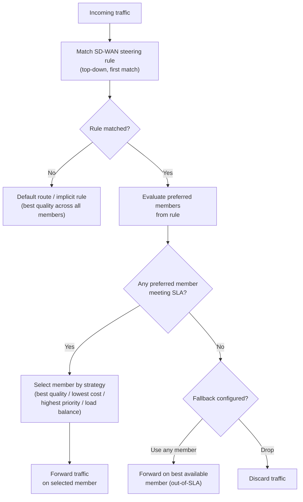

# SD-WAN Design Principles

Traditional WAN routing — static routes, policy-based routing (PBR), or BGP — selects
paths based on topology: which route exists, which prefix is most specific, which
neighbour has the best metric. None of these mechanisms can steer traffic based on
whether a link is actually performing well. A path with 400ms latency and 10% packet
loss looks identical to a healthy path at the routing layer, as long as both are
reachable.

SD-WAN adds a measurement and steering layer on top of standard routing. SLA probes
continuously measure real link quality; steering policies move traffic away from links
that violate thresholds, without any routing change being needed.

For FortiGate SD-WAN configuration see [FortiGate SD-WAN](../fortigate/fortigate_sdwan.md).

---

## At a Glance

| Component | Purpose | Typical Metrics |
| --- | --- | --- |
| **Underlay** | Physical WAN links | MPLS, broadband, LTE, leased line |
| **Overlay** | SD-WAN tunnels (IPsec/GRE) | Encrypted paths independent of underlay |
| **SLA Monitoring** | Measure link quality | Latency, jitter, packet loss, throughput |
| **Steering** | Route based on quality | Per-flow rules; failover on SLA breach |
| **Application Awareness** | Identify traffic type | DPI; port; DNS; NBAR-like classification |
| **Failover** | Automatic path switch | Sub-second on quality breach vs 30s+ BGP |
| **Hub & Spoke** | Centralized policy | Hub enforces routing; spokes tunnel to hub |
| **Mesh** | Direct spokes | Spoke-to-spoke IPsec; full connectivity |

---

## The Problem SD-WAN Solves

A site with two WAN links — MPLS and internet broadband — presents the classic scenario:

- MPLS is expensive and low-latency; it should carry real-time and business-critical
traffic.
traffic.

- Internet broadband is cheap and high-bandwidth; it should carry general web and bulk
traffic.
traffic.

- If MPLS degrades (congestion, provider issue) without going completely down, static
routes

routes

  and PBR cannot detect this. Traffic continues on a degraded path.

- If internet broadband is lost, it must fail over to MPLS automatically.

BGP with BFD can detect a link failure (~900ms), but it cannot detect degraded quality
on
a live link, and it cannot steer individual application flows independently of the
routing
table. PBR can steer flows by application, but it cannot react to quality metrics.

SD-WAN combines the per-flow steering of PBR with real-time quality measurement,
providing
application-aware, quality-driven path selection that reacts to degradation rather than
just outages.

---

## Key Concepts

### Underlay and Overlay

The **underlay** is the set of physical WAN transport links: MPLS circuits, internet
broadband connections, LTE/5G, dedicated leased lines. These are what the provider
delivers to the CPE.

The **overlay** is the logical topology built on top: SD-WAN tunnels (IPsec or GRE) that
create a consistent virtual fabric regardless of the underlying transport. Health
monitoring
and traffic steering operate on the overlay members, not directly on the physical
interfaces.

In many deployments the overlay tunnels terminate at a hub, a cloud gateway, or a
regional
SD-WAN PoP. The underlay provides reachability; the overlay provides the policy plane.

### Health Monitoring

SLA probes are sent continuously from each SD-WAN member (WAN interface or tunnel) to
a target — a provider gateway, an internet host, or a hub device. Probe types include
ICMP echo, HTTP GET, and DNS query.

Each probe response is measured for:

- **Latency:** Round-trip time in milliseconds.
- **Jitter:** Variation in latency between consecutive probes.
- **Packet loss:** Percentage of probes with no response.

These three metrics are compared against configured thresholds to determine whether a
member is meeting its SLA.

### Traffic Steering Rules

Steering rules (called SD-WAN rules or policies depending on vendor) match traffic by
source/destination address, application, DSCP value, or service type, and assign it to
a preferred set of members or a zone.

Within the matching members, the rule applies a selection strategy:

- **Best quality:** Choose the member currently meeting SLA with the best measured
quality.
quality.

- **Lowest cost:** Use the cheapest member that meets SLA; fall back if it fails.
- **Highest priority (manual preference):** Use a specific member; fail over to the next
  if SLA is violated.

- **Load balance:** Distribute sessions across members using ECMP, weighted
distribution,

distribution,

  or per-session round-robin.

### Load Balancing

SD-WAN supports distributing traffic across multiple qualifying members simultaneously:

- **Per-session ECMP:** Each new session is assigned to one member; load is balanced
  at session granularity. Individual sessions are not split across links.

- **Weighted distribution:** Members receive traffic in proportion to configured
weights.

weights.

  A member with weight 2 receives approximately twice the sessions of a member with
  weight 1.

- **Bandwidth-weighted:** Distribution is weighted by the configured bandwidth of each
member.

member.

### Failover Without a Routing Change

This is the defining behaviour of SD-WAN. When a member's measured quality violates an
SLA threshold, the steering rule moves traffic to the next qualifying member
immediately — in under one probe interval. No routing prefix is withdrawn, no BGP
convergence occurs, no static route is removed. The routing table is unchanged; only
the forwarding decision for matching traffic changes.

This means failover time is determined by the probe interval (typically 500ms–1s) and
the number of consecutive failures required to declare an SLA violation, not by routing
protocol timers.

---

## SD-WAN vs Traditional WAN Failover

| Method | Failover trigger | Failover time | Application awareness | Configuration complexity |
| --- | --- | --- | --- | --- |
| Static routes with tracking | Link down only | 5–30 seconds (track timer) | None | Simple |
| PBR (Policy-Based Routing) | Link down only | Moderate (route convergence) | Limited (by ACL match) | Moderate |
| BGP with BFD | Routing change (prefix withdrawn) | ~900ms (BFD default) | None | Complex |
| SD-WAN | SLA threshold violation | <1s (probe interval) | Yes (app, DSCP, service) | Moderate |

Static routes and PBR share the same fundamental limitation: they react to interface
state
(up/down), not to quality. A link that is up but experiencing 30% packet loss looks
identical to a healthy link to these mechanisms.

BGP with BFD approaches sub-second detection but still requires a routing convergence
event — all prefixes learned via that path must be withdrawn and re-advertised via an
alternate path. It provides no quality awareness and cannot steer individual application
flows independently.

---

## FortiGate SD-WAN Architecture

FortiGate SD-WAN is composed of four layered constructs:

### Zones

A zone groups one or more SD-WAN member interfaces. Zones provide a logical abstraction
for policy — firewall policies and SD-WAN steering rules reference zones rather than
individual interfaces.

Common zone design:

| Zone | Members | Purpose |
| --- | --- | --- |
| INTERNET-ZONE | wan1, wan2 | Internet-facing broadband or LTE links |
| MPLS-ZONE | port5 | Dedicated MPLS or leased-line interface |
| OVERLAY-ZONE | ipsec-hub1, ipsec-hub2 | IPsec tunnels to hub or cloud |

### Members

Each interface within a zone is an SD-WAN member. Members have:

- **Interface:** The physical or tunnel interface.
- **Cost:** Used as a tiebreaker in lowest-cost selection strategies.
- **Priority:** Used in manual preference strategies; lower number = higher preference.
- **Weight:** Used in weighted load-balancing strategies.
- **Gateway:** Next-hop for this member's traffic (used for probe source routing).

### Performance SLA (Health Checks)

A Performance SLA defines:

- **Probe target:** IP or hostname to probe (e.g. `8.8.8.8`, a hub interface IP).
- **Probe type:** ICMP, HTTP, DNS.
- **Probe interval:** How often to send probes (default 500ms–1s).
- **Failure threshold:** Number of consecutive probe failures before declaring the
member

member

  down for SLA purposes.

- **SLA thresholds:** Maximum acceptable latency, jitter, and packet loss. Members
  violating any threshold are considered out-of-SLA.

Performance SLAs are assigned to members. A member that fails its SLA probes or violates
a threshold is deprioritised in steering rule decisions — it can still carry
traffic if no qualifying alternative exists, but it will not be selected ahead of
an in-SLA member.

### Traffic Steering Rules

Steering rules are evaluated top-down, first-match. Each rule defines:

- **Match criteria:** Source interface/zone, destination address, application group,
  internet service (ISDB), DSCP value, or protocol/port.

- **Preferred members or zone:** The ordered list of members or a zone to use.
- **Selection strategy:** Best quality, lowest cost, highest priority, or load balance.
- **Fallback behaviour:** If all preferred members are out-of-SLA, use any available
  member or drop traffic (configurable).

---

## Traffic Steering Decision Flow

The SLA check is continuous. If the selected member's quality degrades mid-session and
violates a threshold, subsequent new sessions from the same steering rule are moved to
the next qualifying member. Existing established sessions may remain on the degraded
member unless session re-evaluation is enabled (per-packet or session-based, depending
on configuration and traffic type).

---

## Design Considerations

### Probe Target Selection

Probes must reach a target that is reachable via the member being tested. Using a common
internet target (such as a public DNS server) works for internet members but may not
reflect the actual path quality to enterprise destinations. For MPLS or overlay members,
probe to a target behind the MPLS network or the hub device to test the full path.

### SLA Threshold Calibration

Thresholds that are too tight cause unnecessary failovers on transient probe variation.
Thresholds that are too loose allow degraded paths to remain in service. Measure
baseline
latency and jitter on each member under normal conditions before setting thresholds. A
common starting point is:

- Latency: 2× baseline RTT
- Jitter: 20–30ms above baseline
- Packet loss: 2–5%

### Interaction with BGP and Static Routing

SD-WAN does not replace BGP or static routing for route distribution. BGP or static
routes still provide reachability to the destination. SD-WAN intercepts the forwarding
decision for traffic that matches a steering rule and selects which member to use among
the reachable options.

BGP routes learned via an SD-WAN member remain in the routing table regardless of that
member's SLA status. SD-WAN operates in the forwarding plane — it does not withdraw
routes from the RIB when a member fails its SLA.

### Application Identification

FortiGate uses the Internet Service Database (ISDB) and application control signatures
to match traffic in steering rules. ISDB entries cover major cloud services and CDN
prefixes by name (e.g. `Microsoft-Office365`, `Zoom`), allowing steering rules to direct
these services to preferred members without managing large ACLs.

---

## Notes

- SD-WAN does not create bandwidth — it allocates existing bandwidth more effectively.
  If aggregate demand exceeds the capacity of available members, SD-WAN cannot resolve
  the congestion, only distribute it.

- SD-WAN health checks complement QoS but serve a different function: health checks
  determine which path to use; QoS determines how traffic is treated on the chosen path.
  For real-time traffic, both mechanisms should be deployed together. See
  [Quality of Service](qos.md).

- In hub-and-spoke SD-WAN deployments, the hub device must have sufficient capacity to

handle traffic from all spoke sites simultaneously, including during failover scenarios
  where traffic shifts from direct internet breakout to the hub overlay.

- SD-WAN logging (FortiGate: `Log & Report → Forward Traffic` with SD-WAN fields
  enabled) provides per-session records of which member was selected and why. This is
  the primary tool for verifying that steering rules are behaving as designed.

---

## See Also

- [Quality of Service (QoS)](../theory/qos.md) — Traffic prioritization on selected paths
- [Policy-Based Routing (PBR)](../theory/policy_based_routing.md) — Per-flow steering fundamentals
- [FortiGate SD-WAN Configuration](../fortigate/fortigate_sdwan.md) — FortiOS setup and tuning
- [Cloud Connectivity Comparison](../theory/cloud_connectivity_comparison.md)
- [Cisco SD-WAN (Catalyst)](../cisco/cisco_sd_wan.md) — Cisco IOS-XE SD-WAN deployment
