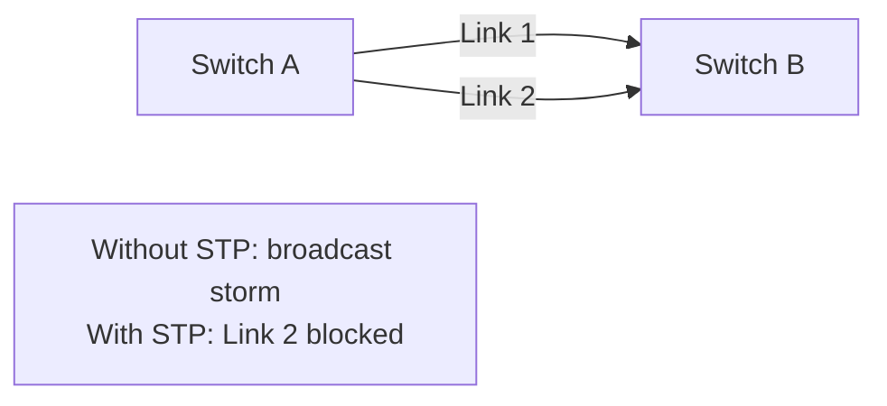
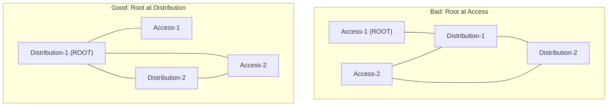
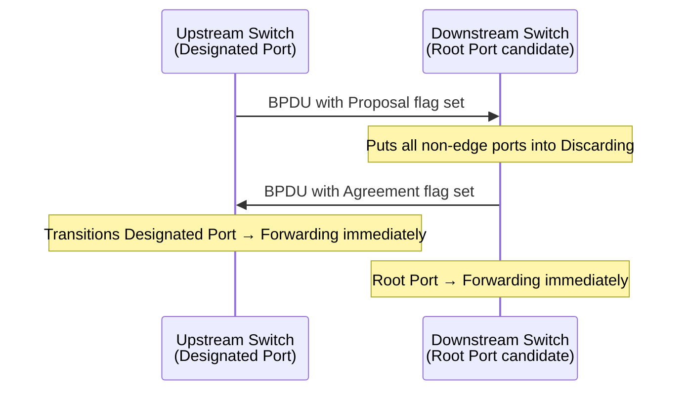
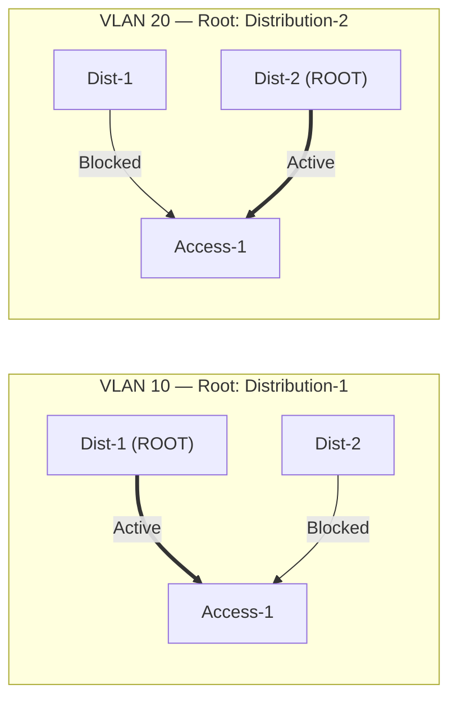

# Spanning Tree: Design and Convergence

Spanning Tree Protocol (STP) and its successor RSTP prevent Layer 2 loops in switched
networks by placing redundant links into a blocking state. While the packet format is
covered in [STP / RSTP](../packets/stp.md), this guide focuses on design principles,
root bridge placement, convergence behaviour, and when spanning tree should — and
should not — be relied upon.

---

## Why Spanning Tree Exists

Ethernet switches flood unknown unicast, broadcast, and multicast frames to all ports.
Without loop prevention, a broadcast frame traversing a redundant link pair creates a
broadcast storm — each switch re-floods the frame indefinitely, saturating all links
within milliseconds.



STP solves this by electing a Root Bridge and blocking all redundant paths, leaving a
single loop-free tree. RSTP (IEEE 802.1D-2004) replaces STP's timer-based convergence
with a proposal/agreement mechanism, reducing failover from 30–50 seconds to 1–2 seconds.

---

## Root Bridge Placement

The Root Bridge is the tree's anchor point — all traffic flows toward and away from it.
Poor root placement forces traffic to take suboptimal paths.

**Elect the Root Bridge deliberately.** Never rely on the default priority (32768) — the
switch with the lowest MAC address wins, which is usually the oldest device in the network.

```ios
! Set the distribution/core switch as root
spanning-tree vlan 1-4094 priority 4096    ! Primary root

! Set a secondary root for redundancy
spanning-tree vlan 1-4094 priority 8192    ! Secondary root (on the standby switch)
```

Or use the macro:

```ios
spanning-tree vlan 1-4094 root primary     ! Sets priority to 24576 or lower
spanning-tree vlan 1-4094 root secondary   ! Sets priority to 28672
```

**Root placement rule:** Place the Root Bridge at the highest point in the topology
that traffic naturally converges toward — typically the distribution or core layer.
If the Root Bridge is at the access layer, traffic between two access switches must
traverse two hops up and two hops back down through the tree.



---

## RSTP Convergence

RSTP eliminates most of STP's timer dependency through the **Proposal/Agreement**
mechanism on point-to-point links:



Ports transition to Forwarding in under 1 second on P2P links without waiting for
Forward Delay timers. The old STP states (Listening → Learning → Forwarding, each
15 seconds) are only used when the P2P link type cannot be negotiated.

**Link types:**

- **Point-to-point:** Full-duplex link between two switches. P/A mechanism applies.
- **Shared:** Half-duplex (hub). Falls back to STP timer behaviour. Rare in modern networks.
- **Edge:** PortFast — immediately forwards, never participates in P/A.

---

## Per-VLAN Spanning Tree (PVST+)

Cisco's PVST+ runs an independent STP instance per VLAN, allowing different VLANs to
use different root bridges and therefore different blocked ports. This enables
load-balancing across redundant uplinks.



```ios
! Distribution-1: root for even VLANs, secondary for odd
spanning-tree vlan 2,4,6,8,10 root primary
spanning-tree vlan 1,3,5,7,9  root secondary

! Distribution-2: root for odd VLANs, secondary for even
spanning-tree vlan 1,3,5,7,9  root primary
spanning-tree vlan 2,4,6,8,10 root secondary
```

**Rapid PVST+** combines per-VLAN instances with RSTP convergence. Enable with:

```ios
spanning-tree mode rapid-pvst
```

---

## Edge Ports and Protection Features

**PortFast** — for access ports connecting to end hosts only:

```ios
interface GigabitEthernet0/1
 spanning-tree portfast
```

Transitions immediately to Forwarding, bypassing Discarding/Learning. Never use on
inter-switch links — a BPDU from a downstream switch will cause the port to lose
PortFast status and re-run STP.

**BPDU Guard** — protects PortFast ports from rogue switches:

```ios
! Per-interface
interface GigabitEthernet0/1
 spanning-tree bpduguard enable

! Global (applies to all PortFast ports)
spanning-tree portfast bpduguard default
```

Puts the port into `err-disabled` state immediately if a BPDU is received.

**Root Guard** — prevents a port from becoming the Root Port:

```ios
interface GigabitEthernet0/2
 spanning-tree guard root
```

Use on downlink ports facing access switches to prevent a rogue switch from claiming
the root role. The port goes into `root-inconsistent` (blocking) state if a superior
BPDU arrives.

**Loop Guard** — protects against unidirectional link failures:

```ios
interface GigabitEthernet0/3
 spanning-tree guard loop
```

If a non-designated port stops receiving BPDUs (which would normally cause it to
transition to Designated/Forwarding), Loop Guard places it in `loop-inconsistent`
state instead of forwarding, preventing a loop from forming.

---

## Topology Change Behaviour

When a port transitions to Forwarding, a **Topology Change Notification (TCN)** is
generated and propagated to the Root Bridge. The Root Bridge then sets the TC flag in
BPDUs flooded to all switches, causing them to flush their MAC tables and shorten
their ageing timers to Forward Delay (15s by default).

MAC table flushing causes temporary flooding of known unicast traffic, which can spike
CPU and bandwidth on all switches in the STP domain. In large flat Layer 2 domains,
frequent topology changes (from link flaps, EtherChannel negotiation, etc.) cause
repeated MAC table flushes and sustained performance degradation.

---

## When to Use Spanning Tree

| Scenario | STP/RSTP Appropriate? | Notes |
| --- | --- | --- |
| Campus access layer (end-hosts) | Yes | PortFast + BPDU Guard on all access ports |
| Distribution layer redundancy | Yes, with care | PVST+ for load-balancing; root placement critical |
| Datacentre access tier (legacy) | Limited | MLAG/vPC preferred to eliminate blocked ports |
| Datacentre spine-leaf fabric | No | Routed L3 fabric; STP not needed and undesirable |
| Server-facing ports | Edge only | PortFast; STP does not run on these ports |
| Provider/WAN handoff | No | Routed interface; no L2 between provider and router |

---

## Spanning Tree Limitations

- **Blocked ports waste bandwidth.** In a two-uplink design, 50% of uplink capacity is
  blocked at all times. MLAG/vPC (Cisco) or similar multi-chassis LAG technologies
  present two physical uplinks as a single LAG to STP, allowing both to forward.
- **Scale limit.** A single STP domain should not span more than ~7 switches in
  diameter. Beyond this, convergence timers become unreliable and topology changes
  cause disproportionate disruption.
- **East-west traffic in the datacentre.** Three-tier topologies with STP at the access
  layer force east-west (server-to-server) traffic to traverse the distribution layer
  even when source and destination are on the same rack. Spine-leaf eliminates this.
- **Modern alternative.** In greenfield datacentres, Layer 3 routing to the access
  layer (each ToR switch is a BGP speaker, no L2 between racks) eliminates spanning
  tree entirely. See [Data Centre Topologies](dc_topologies.md).

---

## Notes

- Always configure `spanning-tree mode rapid-pvst` on Cisco IOS-XE — legacy STP
  (`pvst`) is not appropriate for any modern network.
- Use `show spanning-tree vlan <id> detail` to identify the Root Bridge, root path
  cost, port roles, and port states for each VLAN.
- `show spanning-tree inconsistentports` reveals ports in `root-inconsistent` or
  `loop-inconsistent` state — investigate before clearing.
- STP diameter recommendations: keep STP domain diameter ≤ 7 hops; tune max-age and
  forward-delay only when absolutely necessary, and only with full understanding of the
  convergence implications.
