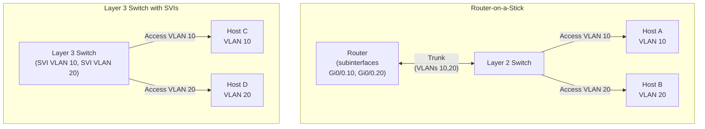

# VLANs and 802.1Q

A VLAN (Virtual LAN) partitions a single physical switch fabric into multiple
independent broadcast domains. Without VLANs, every frame flooded by one device
reaches every other device on the switch — regardless of whether those devices
belong to different departments, security zones, or functions. VLANs eliminate
that coupling without requiring separate physical switches: each VLAN has its
own broadcast domain, its own MAC table scope, and requires a Layer 3 hop to
communicate with any other VLAN.

For IOS-XE configuration see [Cisco VLAN Configuration](../cisco/cisco_vlan_config.md).

---

## At a Glance

| Aspect | Details |
| --- | --- |
| **802.1Q tag** | 4-byte VLAN tag (TPID=0x8100, PCP=3 bits, DEI=1 bit, VID=12 bits) inserted between Src MAC and EtherType |
| **VID range** | 0-4095; VID 0 = priority tag only; VID 4095 reserved; **4094 usable VLANs (1–4094)** |
| **Frame size** | Increases max Ethernet from 1518 to 1522 bytes with 802.1Q tag |
| **Access port** | Carries single VLAN, untagged; endpoints (hosts, printers) connect here |
| **Trunk port** | Carries multiple VLANs, tagged (except native VLAN); switch-to-switch or switch-to-router |
| **Native VLAN** | Untagged VLAN on trunk; both ends must match or misconfig occurs |
| **Allowed VLAN list** | Controls which VLANs traverse trunk; default allows all; prune unused VLANs |
| **Inter-VLAN routing** | Router-on-a-Stick (single physical link, subinterfaces), Layer 3 Switch (hardware SVIs), or separate interfaces |
| **SVI (Switched Virtual Interface)** | Logical interface per VLAN on Layer 3 switch; becomes active when ≥1 port in that VLAN is up |
| **Private VLANs (PVLAN)** | Subdivide VLAN into isolated segments (promiscuous, community, isolated ports); complex; rarely used |

---

## 802.1Q Frame Tagging

802.1Q (colloquially "dot1q") is the IEEE standard that defines how VLAN
membership is carried inside Ethernet frames on trunk links. A 4-byte tag is
inserted into the frame between the Source MAC address and the EtherType field.

| Field | Size | Value / Notes |
| --- | --- | --- |
| **TPID** (Tag Protocol ID) | 16 bits | `0x8100` — identifies the frame as 802.1Q tagged |
| **PCP** (Priority Code Point) | 3 bits | 802.1p CoS value (0–7); used for QoS prioritisation |
| **DEI** (Drop Eligible Indicator) | 1 bit | Formerly CFI; signals the frame may be dropped under congestion |
| **VID** (VLAN Identifier) | 12 bits | 0–4095; VID 0 = priority tag only, VID 4095 reserved; **4094 usable VLANs** (1–4094) |

The 4-byte tag increases the maximum Ethernet frame size from 1518 to 1522 bytes.
Devices that do not understand 802.1Q will typically drop tagged frames.

**Native VLAN** is the one VLAN on a trunk port that is transmitted and received
*without* a tag. Both ends of a trunk must agree on the native VLAN; a mismatch
causes frames to be interpreted as belonging to the wrong VLAN — a common
misconfiguration.

---

## Access Ports vs Trunk Ports

| | Access Port | Trunk Port |
| --- | --- | --- |
| **VLANs carried** | One | Multiple |
| **Tagging** | Untagged (tag stripped on ingress, added on egress) | Tagged for all VLANs except the native VLAN |
| **Typical endpoint** | End host, printer, IP phone data port | Switch-to-switch uplink, switch-to-router link, switch-to-firewall link |
| **Native VLAN** | The one assigned VLAN | Configurable; must match on both ends |

On a trunk, the **allowed VLAN list** controls which VLANs may traverse the link.
The default on Cisco IOS-XE is to allow all VLANs (1–4094). Explicitly pruning
unused VLANs from trunks reduces unnecessary flooding and limits the blast radius
of a misconfiguration. Any VLAN not in the allowed list has its frames dropped at
ingress on that trunk.

---

## Inter-VLAN Routing

Hosts in different VLANs cannot communicate at Layer 2 — a routed hop is
required. Three approaches exist:

### 1. Router-on-a-Stick

A single physical link connects a Layer 2 switch to a router. The link is
configured as a trunk. The router creates a logical **subinterface** for each
VLAN, each with its own IP address (the default gateway for that VLAN).

- Simple to configure; uses one physical interface on the router
- All inter-VLAN traffic passes through a single physical link — that link
  becomes a bottleneck at scale

- Routing is done in router software — lower throughput than hardware switching
- Suitable for small deployments, labs, or where policy enforcement
  (firewall, ACL) in the routing path is required

### 2. Layer 3 Switch with SVIs

A Layer 3 (multilayer) switch creates a **Switched Virtual Interface (SVI)**
for each VLAN. The SVI is a logical interface assigned an IP address; the switch
routes between SVIs in hardware at line rate using its forwarding ASIC.

- Routing occurs in hardware — throughput is not limited by a CPU or a single
  uplink

- Preferred for high-throughput intra-campus routing (inter-VLAN traffic stays
  on the switch fabric)

- SVIs exist in running-config; they become active only when at least one port
  in that VLAN is up and in a forwarding state

### 3. Separate Physical Interfaces per VLAN

One physical router interface per VLAN, each in access mode. Functionally
equivalent to router-on-a-stick but consumes a physical interface for every
VLAN. Rarely used — interface count on routers is limited and cost is high.

---

## Architecture Comparison

Traffic between Host A and Host B in the router-on-a-stick model traverses the
trunk link twice (once up to the router, once back down). In the Layer 3 switch
model, traffic between Host C and Host D is routed internally — no external link
is involved.

---

## VLAN Database vs Configuration Mode

Cisco maintains VLAN definitions in two places:

| Location | Storage | Persistence |
| --- | --- | --- |
| **`vlan.dat`** (VLAN database) | Flash; managed via `vlan database` exec mode or `vlan <id>` global config | Survives `write erase` and config reload; must be deleted separately with `delete flash:vlan.dat` |
| **Running / startup config** | NVRAM | SVIs, port assignments, and trunk configuration live here |

A VLAN can exist in `vlan.dat` without an SVI (Layer 2 only). An SVI can be
configured without the VLAN existing in the database — in which case the SVI
remains in a down/down state until the VLAN is created.

Best practice: create VLANs explicitly in global configuration (`vlan <id>` /
`name <name>`) so the definition is visible in `show running-config` and backed
up with the configuration file.

---

## Private VLANs

Private VLANs (PVLANs, IEEE 802.1Q extension) subdivide a VLAN into isolated
segments. Used primarily in server farms, managed hosting, and DMZ environments
where hosts should not communicate with each other even though they share the
same IP subnet.

| Port Type | Can communicate with |
| --- | --- |
| **Promiscuous** | All ports in the PVLAN (typically the gateway/router) |
| **Community** | Other ports in the same community, plus promiscuous ports |
| **Isolated** | Promiscuous ports only — cannot reach any other host port |

PVLANs require support on the switch (not all platforms); configuration
complexity is higher than standard VLANs. A simpler alternative for
host-isolation at Layer 2 is the Cisco `switchport protected` command (local to
one switch only).

---

## When to Use Each Routing Approach

| Scenario | Recommended Approach |
| --- | --- |
| High-throughput intra-campus routing, many VLANs | Layer 3 switch with SVIs |
| Small site, few VLANs, router already present | Router-on-a-stick |
| Inter-VLAN traffic must pass through a firewall for policy enforcement | Router-on-a-stick (or routed sub-interfaces on the firewall) |
| Data centre leaf layer, east-west traffic | Layer 3 switch with SVIs (or anycast gateway in VXLAN fabric) |

---

## Notes / Gotchas

- **Native VLAN mismatch:** Trunk ports with different native VLANs misinterpret untagged frames,
  breaking inter-switch communication. Verify both ends with
  `show interfaces trunk | include Native`.

- **VLAN database vs config:** Cisco stores VLAN definitions in `vlan.dat` and config in NVRAM.
  A VLAN can exist in one without the other. Define VLANs in global config (`vlan <id>`) so
  they appear in `show running-config`.

- **SVI down/down trap:** An SVI comes up only when at least one port in that VLAN is up and
  forwarding. If all ports are down or STP-blocked, the SVI goes down and breaks inter-VLAN
  routing. Use `show vlan brief` and `show spanning-tree` to diagnose.

- **Router-on-a-Stick bottleneck:** All inter-VLAN traffic traverses the uplink twice. This
  becomes a bottleneck at scale — use a Layer 3 switch with SVIs for high-throughput routing.

- **Trunk pruning:** All VLANs are allowed by default. Explicitly set the allowed VLAN list to
  only those that cross each trunk to reduce unnecessary flooding.

---

## See Also

- [Cisco VLAN Configuration](../cisco/cisco_vlan_config.md)
- [STP / RSTP Configuration](stp_rstp_configuration.md)
- [Switching Fundamentals](switching_fundamentals.md)
