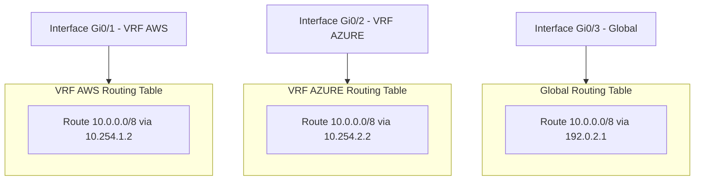

# VRF — Virtual Routing and Forwarding

A Virtual Routing and Forwarding instance creates isolated routing tables within a single
router or firewall, enabling multi-tenancy, cloud provider separation, and management
plane isolation without physical hardware duplication.

---

## At a Glance

| Aspect | VRF-Lite | MPLS VRF | FortiGate VDOM |
| --- | --- | --- | --- |
| **Routing tables** | Isolated per VRF | Isolated + PE/CE label distribution | Isolated + firewall policies |
| **Label switching** | No | Yes (RFC 4364 MPLS VPN) | No |
| **Route Target (RT)** | Optional (for filtering) | Required (policy for import/export) | N/A (firewall rule-based) |
| **Use case** | Cloud separation, simple isolation | Multi-tenant PE, carrier-grade VPN | Cloud separation, multi-tenancy |
| **Scaling** | Limited (one router) | Scales to carrier networks | Limited by firewall throughput |

---

## How VRFs Work

A VRF partitions the router's forwarding plane into independent instances. Each VRF has:

- **Its own routing table** — separate RIB from the global table
- **Interface assignments** — an interface belongs to exactly one VRF
- **BGP address families** — each VRF can have its own BGP session
- **Forwarding isolation** — packets in VRF A never see routes in VRF B



When a packet arrives on an interface, the router looks up the destination in that
interface's VRF routing table only — never in other VRFs.

---

## VRF-Lite vs MPLS VRF

### VRF-Lite (No Label Switching)

VRF-Lite is the simplest form — just isolated routing tables on the same hardware, no
label distribution required.

**When to use:**

- Cloud provider separation (AWS/Azure/GCP each in their own VRF)
- Simple multi-tenancy where tenants don't share routes
- Management plane isolation (VRF Mgmt is built into IOS-XE)

**Gotcha:** Route Target (RT) is still optional but useful for filtering. Even without
MPLS, Route Distinguisher (RD) is required for VPNv4 BGP sessions.

### MPLS VRF (PE/CE Model)

In MPLS VPN architecture (RFC 4364), a Provider Edge (PE) router uses label switching to
reach Customer Edge (CE) routers across a carrier network. Each CE's routes are labeled
and distributed across the MPLS backbone with Route Target import/export policies
controlling which routes go to which customer.

**When to use:**

- Carrier-grade multi-tenant networks (SP networks)
- Cross-domain route distribution with policy control
- Hub-and-spoke designs where route leaking is needed

**Key difference:** RT becomes the policy control — it defines which routes a PE imports
from the backbone and which routes it exports to customers.

---

## Route Distinguisher (RD)

**What it does:** The RD makes overlapping IP prefixes globally unique in the BGP update.

When two VRFs advertise the same prefix (e.g., both have `10.0.0.0/8`), BGP can't carry
both in the same update — they'd be considered duplicates. The RD prepends a unique
identifier to each prefix, creating a virtual address space:

| Prefix | RD | Result in BGP |
| --- | --- | --- |
| `10.0.0.0/8` | `65000:100` | `10.0.0.0/8` RD `65000:100` |
| `10.0.0.0/8` | `65000:200` | `10.0.0.0/8` RD `65000:200` |

**Format options (Type):**

- **Type 0 (ASN:nn):** `65000:100` — ASN in first 2 bytes, value in last 2 bytes
- **Type 1 (IP:nn):** `10.0.0.1:100` — IP address + 2-byte value
- **Type 2 (4-byte ASN:nn):** `65000:100` — for 4-byte AS numbers

**Key point:** RD does NOT control which routes go where. That's Route Target's job. RD
only makes routes globally unique in BGP.

**Required in:** All VRF BGP designs, even VRF-Lite with no MPLS.

---

## Route Target (RT)

**What it does:** RT controls the import and export of routes between VRFs. It's an
extended BGP community attached to each route.

| RT Value | Meaning |
| --- | --- |
| `route-target export 65000:100` | Tag my routes with RT 65000:100 when advertising |
| `route-target import 65000:100` | Pull routes tagged with RT 65000:100 into my table |

### VRF-Lite Isolation (Full Isolation)

In the cloud separation design, each VRF only imports and exports its own RT:

```ios
vrf definition AWS
 rd 65000:100
 route-target export 65000:100
 route-target import 65000:100
```

Result: VRF AWS advertises its routes tagged with RT `65000:100` and only accepts
routes tagged `65000:100` — no cross-VRF mixing.

### Hub-and-Spoke Route Leaking (MPLS Pattern)

In a hub-and-spoke topology with route leaking:

```ios
vrf definition HUB
 rd 65000:999
 route-target export 65000:999
 route-target import 65000:100 65000:200

vrf definition SPOKE-1
 rd 65000:100
 route-target export 65000:100
 route-target import 65000:999

vrf definition SPOKE-2
 rd 65000:200
 route-target export 65000:200
 route-target import 65000:999
```

Result:

- HUB advertises all its routes (RT `65000:999`)
- SPOKE-1 only advertises its own routes (RT `65000:100`)
- Each spoke imports the hub's RT (`65000:999`) to reach hub routes
- Hub imports both spoke RTs to reach all spokes
- Spokes cannot reach each other directly (spoke-to-spoke blocked)

---

## RD/RT Numbering Design (Tied to Routing Process IDs)

A consistent numbering scheme makes configurations scalable and auditable.

### Standard Cisco Pattern

Use the format `<Local-ASN>:<VRF-ID>` for both RD and RT in fully isolated VRFs:

| Component | Convention | Example (BGP AS 65000) |
| --- | --- | --- |
| RD | `<AS>:<VRF-ID>` | `65000:100` |
| RT export | `<AS>:<VRF-ID>` | `65000:100` |
| RT import | `<AS>:<VRF-ID>` | `65000:100` (isolated) |

**VRF-ID assignment:**

- Sequential by purpose: `100` (AWS), `200` (Azure), `300` (GCP), etc.
- Or tied to BGP sub-process instance in complex designs
- Or tied to a standard VPN-ID if used across multiple routers

### Hub-and-Spoke Extension

Reserve a special VRF-ID for the hub:

| VRF | RD | RT export | RT import |
| --- | --- | --- | --- |
| HUB | `65000:999` | `65000:999` | `65000:100, 65000:200, 65000:300` |
| SPOKE-AWS | `65000:100` | `65000:100` | `65000:999` |
| SPOKE-AZURE | `65000:200` | `65000:200` | `65000:999` |
| SPOKE-GCP | `65000:300` | `65000:300` | `65000:999` |

This pattern scales: adding a new spoke is just a new VRF-ID + RT pair.

---

## FortiGate Equivalent: VDOMs

FortiGate firewalls use **Virtual Domains (VDOMs)** instead of VRFs. A VDOM is a more
comprehensive isolation model — it includes routing, firewall policies, and
authentication in a single instance.

### VDOM Basics

- **Root VDOM:** The default domain; always present
- **Tenant VDOMs:** Additional VDOMs for customer/cloud isolation
- **VDOM links:** Inter-VDOM routing (traffic from one VDOM to another)

### Creating a VDOM

```fortios
config vdom
  edit VDOM-AWS
    set comments "AWS cloud transport"
  next
end
```

### Assigning an Interface to a VDOM

```fortios
config system interface
  edit "port2"
    set vdom "VDOM-AWS"
    set ip 10.254.1.2 255.255.255.252
  next
end
```

### Key Differences from Cisco VRF

| Aspect | Cisco VRF | FortiGate VDOM |
| --- | --- | --- |
| **Scope** | Routing only | Routing + firewall + authentication |
| **Default behavior** | All interfaces can share routes (if no VRF) | Strict isolation by default |
| **Route leaking** | RT import/export or manual redistribution | VDOM links + firewall policies |
| **License requirement** | Built-in | Requires VDOM license |

---

## Use Cases

| Use Case | VRF Type | Example | Rationale |
| --- | --- | --- | --- |
| **Cloud provider separation** | VRF-Lite | AWS/Azure/GCP, each in own VRF | Each cloud gets isolated table; FortiGate peers per cloud |
| **Multi-tenant PE router** | MPLS VRF | Carrier backbone to 100 customers | RT controls tenant route visibility across MPLS network |
| **Management plane isolation** | VRF (IOS-XE built-in) | VRF Mgmt for OOB management | Keeps management traffic out of production routing |
| **Shared services leaking** | Hub-and-spoke MPLS VRF | All tenants reach shared DNS/syslog in hub | Hub exports shared services RT; spokes import it |
| **FortiGate multi-cloud** | VDOM | AWS/Azure, each in own VDOM | Separate firewall rules + routing per cloud |

---

## Notes / Gotchas

- **`vrf forwarding` removes IP address:** When you assign a VRF to an interface,
  IOS-XE removes the IP address. Reapply it after the VRF assignment — if you don't,
  the interface will have no IP.

- **RD required even without MPLS:** VRF-Lite still needs RD for VPNv4 BGP, even
  though there's no label switching.

- **RT with no MPLS is still valid:** You can use RT as a BGP community filter in
  VRF-Lite designs for route leaking and redistribution.

- **FortiGate VDOMs require a license:** Standard edition may have limited VDOM
  support; check your FortiGate SKU.

- **Show commands are VRF-specific:** Use `show ip route vrf AWS` (not `show ip route`)
  to see a specific VRF's table. `show ip route` shows the global (default) table only.

- **Troubleshooting can be confusing:** A route might exist in VRF A but not be
  reachable from an interface in VRF B, even if both VRFs see the same neighbor IP.
  Always check which VRF the interface is in.

---

## See Also

- [Cisco IOS-XE: VRF-Lite for Cloud Provider Separation](../cisco/cisco_vrf_config.md)
- [MPLS](mpls.md)
- [eBGP vs iBGP](ebgp_vs_ibgp.md)
- [Route Redistribution](route_redistribution.md)
