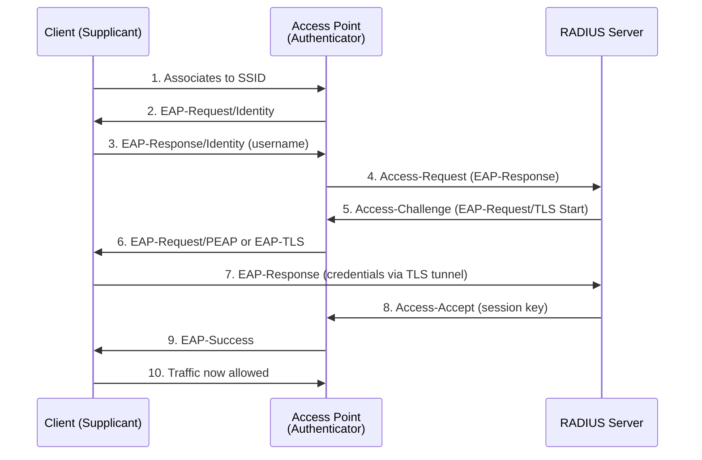

# 802.1X and EAP Authentication

802.1X (Port-Based Network Access Control) with Extensible Authentication Protocol (EAP) provides
enterprise-grade authentication for WiFi networks, replacing pre-shared keys with per-user
credentials, certificate-based authentication, and centralized authorization. Integration with
RADIUS servers enables scalable, auditable access control across multi-site deployments.

---

## At a Glance

| Concept | Purpose | Scope |
| --- | --- | --- |
| **802.1X** | Port-based access control; blocks traffic until authentication succeeds | Link layer (Layer 2) |
| **EAP** | Extensible authentication framework; supports multiple credential types | RADIUS server types |
| **RADIUS** | Centralized authentication server; responds to Access-Request and Access-Accept | Per-user credentials |
| **EAP-PEAP** | Protected EAP with TLS tunnel; hides credentials; easiest for enterprise | Inner method required |
| **EAP-TLS** | Certificate-based; highest security; requires client certificates | Supplicant cert required |
| **EAP-FAST** | Lightweight; PAC-based; suitable for mobile/BYOD deployments | Cisco proprietary |
| **Pre-Shared Key (PSK)** | Legacy mode; no authentication; vulnerable; deprecated for enterprise | Not recommended |

---

## Authentication Flow

### 802.1X Three-Party Model

802.1X introduces three parties:

1. **Supplicant** — The client (laptop, phone, IoT device) requesting access
1. **Authenticator** — The WiFi access point (AP) controlling port access
1. **Authentication Server** — RADIUS server validating credentials

The AP acts as a relay; the supplicant communicates with the RADIUS server via EAP messages
carried inside RADIUS packets. Traffic from the supplicant is blocked until authentication
succeeds.

### Authentication Sequence



---

## EAP Methods

### EAP-PEAP (Protected EAP)

**EAP within TLS tunnel. Inner authentication can be MSCHAP-v2, GTC, or other methods.**

**Characteristics:**

- Server certificates only (no client certificates needed)

- Credentials hidden within TLS encryption

- Fast authentication (~1 second)

- Compatible with most devices

- **Best for:** Enterprise with centralized user directory (Active Directory, LDAP)

**Flow:**

1. Client and AP establish TLS tunnel (authenticate server certificate)
1. Client sends username/password inside tunnel
1. RADIUS verifies credentials
1. Session key issued; client connected

### EAP-TLS (TLS)

**Certificate-based mutual authentication. Both client and server present X.509 certificates.**

**Characteristics:**

- Highest security (certificate pinning possible)

- Requires client certificate provisioning (infrastructure overhead)

- Slower than PEAP (~2–3 seconds, PKI overhead)

- Immune to phishing (client validates server cert)

- **Best for:** High-security environments (finance, government, healthcare)

**Requirements:**

- Internal PKI or third-party CA for client certificates

- Certificate distribution mechanism (MDM, SCEP)

- Certificate lifecycle management (renewal, revocation)

### EAP-FAST (Flexible Authentication via Secure Tunneling)

**PAC (Protected Access Credential) -based lightweight tunneling. Cisco proprietary.**

**Characteristics:**

- Lighter than TLS (faster establishment)

- No client certificate required

- PAC-based provisioning

- Suitable for BYOD (Bring-Your-Own-Device)

- **Best for:** Large enterprises with high device mobility

### Legacy/Weak Methods (Avoid)

| Method | Problem | Status |
| --- | --- | --- |
| **LEAP** (Lightweight EAP) | Weak password hashing; vulnerable to brute-force | Obsolete; remove |
| **EAP-MD5** | No mutual authentication; vulnerable | Obsolete; remove |
| **Open System** | No authentication | Only for guest networks |

---

## RADIUS Integration

### RADIUS Server Role

RADIUS (Remote Authentication Dial-In User Service) is the standard authentication backend for
802.1X. APs send Access-Request packets containing the supplicant's EAP response; the RADIUS
server validates credentials and returns Access-Accept or Access-Reject.

**Common RADIUS implementations:**

- **FreeRADIUS** — Open-source; standard for Linux deployments

- **Windows Server NPS** (Network Policy Server) — Integrates with Active Directory

- **Cisco ISE** — Cisco Identity Services Engine; BYOD, guest, and profiling features

- **Fortinet FortiAuthenticator** — Integrated with FortiGate; AD/LDAP integration

### Access-Request Attributes

When the AP relays the supplicant's credentials, it includes:

| Attribute | Example | Purpose |
| --- | --- | --- |
| **User-Name** | `john@example.com` | Supplicant identity |
| **User-Password** | Encrypted | Not used in EAP (EAP carries credentials in tunnel) |
| **NAS-IP-Address** | `192.168.1.1` | AP's IP address |
| **Calling-Station-Id** | `aa:bb:cc:dd:ee:ff` | Client MAC address |
| **Called-Station-Id** | `11:22:33:44:55:66:SSID` | AP MAC + SSID |
| **Service-Type** | Framed-User | Service requested |
| **Framed-Protocol** | PPP | Protocol (PPP for 802.1X) |

### VLAN Assignment via RADIUS

RADIUS can dynamically assign clients to VLANs based on authentication result:

```text
User Profile:
  Username: john@example.com
  Password: <hashed>
  RADIUS Attributes:
    Tunnel-Type = VLAN
    Tunnel-Medium-Type = 802
    Tunnel-Private-Group-ID = 100  # VLAN 100 for this user
```

AP receives `Tunnel-Private-Group-ID = 100` and moves the client to VLAN 100 after
authentication. Enables per-user or per-group network segmentation.

---

## Supplicant Configuration

### Windows (Native)

Windows 10/11 includes native 802.1X supplicant. Configuration via Group Policy or XML profile:

```text
Profile (XML):
  SSID: corporate
  Security Type: WPA2-Enterprise
  EAP Method: PEAP
  Inner Authentication: MSCHAP-v2
  Validate Server Certificate: Yes
  Trust Root CA: (issued CA certificate)
```

### macOS/iOS

macOS and iOS support 802.1X via native supplicant or MDM profiles. Certificate provisioning
typically via MDM (Mobile Device Management) like Intune or Jamf.

### Android

Android 5.0+ supports EAP-PEAP and EAP-TLS. Enterprise deployments often use MDM (Samsung Knox,
Intune, Jamf) for automatic profile and certificate deployment.

### Linux

Supplicant via `wpa_supplicant`:

```bash
network={
    ssid="corporate"
    key_mgmt=WPA-EAP
    eap=PEAP
    identity="john@example.com"
    password="secret"
    phase1="peapver=0"
    phase2="auth=MSCHAPV2"
}
```

---

## 802.1X Deployment Models

### Enterprise Mode (Recommended)

- **User base:** 100+ users; dedicated IT team

- **RADIUS backend:** Windows NPS, Cisco ISE, or FreeRADIUS

- **Credentials:** Active Directory, LDAP, or local user database

- **Supplicant:** Native OS support or MDM-deployed profiles

- **Certificates:** Internal PKI for EAP-TLS (optional; PEAP only needs server cert)

- **Advantages:** Per-user credentials, centralized audit log, VLAN assignment, conditional access

- **Overhead:** PKI management, RADIUS redundancy, supplicant configuration

### BYOD / Guest Access

- **User base:** Contractors, visitors, partners

- **Model:** Simplified credentials (temporary username/password) or self-service onboarding

- **RADIUS:** Can be same backend with separate user pool and shorter password expiry

- **Supplicant:** Installed via web portal or MDM

- **Certificates:** Usually skip EAP-TLS for guests; use PEAP with temporary credentials

- **Advantages:** No device management overhead; self-service reduces IT burden

- **Limitations:** Lower security; shorter session lifetime

### Cisco Meraki Deployment

Meraki (cloud-managed) simplifies 802.1X by centralizing all configuration in the cloud
dashboard:

- **Configuration:** Meraki Dashboard (no per-AP CLI)

- **RADIUS integration:** Point dashboard at RADIUS server; Meraki handles all AP coordination

- **Scaling:** Single dashboard manages 100+ APs across multiple sites

- **Zero-touch provisioning:** New APs auto-enroll; settings automatically applied

- **Client onboarding:** Splash page or QR code for BYOD without manual supplicant config

- **Advantages:** Simplest deployment; no need to SSH into APs; automatic updates

- **Limitations:** Cloud dependency (Meraki reachability required); cannot operate fully offline

---

## Failure Modes and Troubleshooting

### Client Cannot Authenticate

**Symptoms:** Client associates but fails 802.1X authentication; drops after 30 seconds.

**Root causes:**

- Wrong username/password

- Supplicant not sending correct EAP method

- Server certificate not trusted (PEAP/TLS)

- RADIUS server unreachable or misconfigured

**Troubleshooting:**

1. Verify credentials with RADIUS server directly (e.g., `radtest` on Linux)
1. Check AP logs for Access-Reject from RADIUS
1. Verify supplicant EAP method matches RADIUS configuration
1. If PEAP/TLS, validate server certificate chain on client
1. Increase AP-to-RADIUS timeout; may be too aggressive

### Slow Authentication (>3 seconds)

**Causes:**

- RADIUS server overloaded or distant (high latency)

- EAP-TLS certificate validation overhead (PKI chain validation)

- Supplicant pre-calculating TLS handshake

**Fix:** Add RADIUS redundancy (backup server), reduce PKI chain depth, or switch to faster EAP
method (PEAP instead of TLS).

### Certificate Expiration Issues

**Symptoms:** PEAP/TLS clients suddenly fail after server certificate expires.

**Fix:** Deploy intermediate/backup RADIUS server before certificate expires; implement certificate
renewal automation.

---

## Best Practices

| Practice | Reason |
| --- | --- |
| **Use EAP-PEAP for most enterprises** | Balance of security, ease of use, fast auth |
| **Validate server certificates on clients** | Prevents rogue AP attacks (MITM) |
| **Implement RADIUS redundancy** | Failover to backup if primary is down |
| **Log all authentication attempts** | Audit trail for compliance; detect attacks |
| **Rotate server certificates annually** | PKI hygiene; reduce risk if key compromised |
| **Use strong user passwords or certificates** | Rainbow tables and brute-force attacks possible |
| **Deploy VLAN assignment via RADIUS** | Segment guests from corporate traffic |
| **Test supplicant deployment before rollout** | Catch configuration issues early |

---

## Notes / Gotchas

- **Open Network with 802.1X:** Traffic is not encrypted until 802.1X completes; use PEAP or
  EAP-TLS to protect credentials in transit.

- **RADIUS Server Latency:** High latency from AP to RADIUS causes slow authentication (>2s).
  Deploy RADIUS locally or use RADIUS proxy for distributed sites.

- **Legacy Devices and LEAP:** Old printers, IoT devices may only support LEAP (deprecated).
  If modern alternatives unavailable, isolate these devices in separate VLAN.

- **Certificate Pinning:** For highest security (government/finance), configure clients to pin
  specific server certificate; prevents rogue RADIUS server compromise.

- **MAC Filtering Not a Substitute:** 802.1X-enabled APs can still accept unauthenticated clients
  on open SSID; use PSK mode + WPA3 or enforce MAC filtering + 802.1X together.

---

## See Also

- [WiFi Security](wifi_security.md)

- [WiFi Standards Comparison](wifi_standards_comparison.md)

- [WiFi RF Fundamentals](wifi_rf_fundamentals.md)

- [WiFi Roaming (802.11r/k/v)](wifi_roaming.md)

- [RADIUS vs TACACS+ vs LDAP](radius_vs_tacacs_vs_ldap.md)
