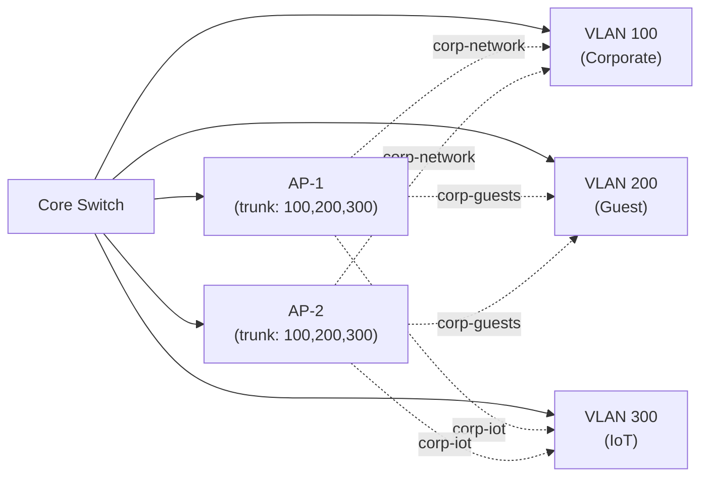

# WiFi Network Design

Successful WiFi deployments depend on proper site surveying, AP placement strategy, SSID and
VLAN design, capacity planning, and security segmentation. Unlike wired networks where cabling
follows fixed routes, WiFi requires understanding RF propagation, client density, throughput
requirements, and coverage overlap to achieve consistent performance across large areas.

---

## At a Glance

| Design Element | Purpose | Key Consideration |
| --- | --- | --- |
| **Site Survey** | Measure RSSI and SNR at client locations | Identifies dead zones and interference |
| **AP Density** | Number and placement of APs | ~1 AP per 3000–4000 sq ft (low density) or 1 per 1500 sq ft (high density) |
| **Channel Planning** | Non-overlapping channel assignment | 2.4 GHz: only 3 (1, 6, 11); 5 GHz: 20+ options |
| **SSID Strategy** | Naming and segmentation | Corporate, guest, IoT → separate SSIDs → separate policies |
| **VLAN Design** | Isolate traffic by group | Corporate VLAN ≠ Guest VLAN ≠ IoT VLAN |
| **Power Settings** | AP transmit power | Too high: overlapping coverage, roaming issues; too low: dead zones |
| **DFS Compliance** | Dynamic Frequency Selection | 5 GHz UNII-2 channels (52–144) vacate on radar detection |
| **Capacity Planning** | Max clients per AP | 802.11ax: 20–30 clients per AP typical; 802.11ac: 10–20 |

---

## Site Survey

### Pre-Deployment Survey

Before deploying APs, conduct a physical RF survey to identify coverage gaps and interference.

**Steps:**

1. **Walk the building with WiFi analyzer:**

    - Measure RSSI at multiple locations (every 10 meters)
    - Note RSSI >–67 dBm for reliable coverage
    - Identify interference from neighboring networks
    - Document channel congestion (especially 2.4 GHz)
1. **Map signal strength:**

    - Create heatmap of RSSI across floor plan
    - Identify dead zones (RSSI <–75 dBm)
    - Note multipath areas (highly variable RSSI)
1. **Test throughput:**

    - Measure actual data rates in each area
    - Compare to expected rates for standard/distance
    - Note areas with unexpected throughput degradation
1. **Identify interference sources:**

    - Microwave ovens (2.4 GHz)
    - Cordless phones (2.4 GHz)
    - Bluetooth devices (2.4 GHz)
    - Neighboring WiFi networks
    - Radar or other 5 GHz users

### Tools

| Tool | Platform | Purpose |
| --- | --- | --- |
| **WiFi Analyzer** | iOS/Android | Heatmap, neighbor detection |
| **inSSIDer** | Windows/Mac | RF analysis, channel congestion |
| **Ekahau Site Survey** | Windows | Professional-grade RF prediction |
| **NetSpot** | Windows/Mac | Visual heatmaps, roaming analysis |

---

## AP Placement Strategy

### Coverage Overlap

APs should overlap coverage by 15–20% to provide seamless roaming:

```text
AP-A Coverage Zone: RSSI = -65 dBm (strong)
                    RSSI = -75 dBm (moderate)
AP-B Coverage Zone: RSSI = -65 dBm (strong)
                    RSSI = -75 dBm (moderate)

Overlap Zone:       Both APs at -72 dBm
                    Client can roam with minimal latency
```

**Too little overlap (<10%):** Dead zones; roaming causes disconnections.

**Too much overlap (>30%):** Co-channel interference; clients stay on degraded AP.

### Typical Spacing

| Environment | Density | Spacing | Reasoning |
| --- | --- | --- | --- |
| **Office building** | Low | 50–70 meters | Coverage > capacity; users in offices/cubicles |
| **Open office / warehouse** | Medium | 30–50 meters | Higher density; more clients per AP |
| **Stadium / university** | High | 15–25 meters | Very dense; AP per section |

### Vertical Placement

**In-building (multi-floor):**

- Place APs on ceiling near center of area (not corners)
- Avoid placement directly above/below APs on adjacent floors (creates co-channel interference)
- Stagger AP placement between floors to avoid overlap

**Outdoor:**

- Mount on walls or poles 3–5 meters high
- Avoid RF obstacles (metal structures, dense trees)
- Plan line-of-sight paths between campus APs

---

## Channel Planning

### 2.4 GHz Band (Limited)

**Only 3 non-overlapping channels:** 1, 6, 11 (US/EIRP).

**Design pattern:**

```text
Floor 1:        AP1 (ch 1)   AP2 (ch 6)   AP3 (ch 11)
Floor 2:        AP4 (ch 1)   AP5 (ch 6)   AP6 (ch 11)
Vertical offset: APs on same channel on different floors, separated vertically
```

Advantage: Simple, limited interference. Disadvantage: Only 3 APs simultaneously active (capacity
limited).

### 5 GHz Band (Abundant)

**20+ non-overlapping 20-MHz channels; 80-MHz channels reduce to ~10; 160-MHz to ~3.**

**Design pattern (80-MHz channels):**

```text
UNII-1 (36–48):      1 option (36–48)
UNII-2 (52–144):     4 options (52–64, 100–112, 120–132, 140–144) — DFS required
UNII-3 (149–165):    2 options (149–157, 161–165)
UNII-4 (165–177):    Additional channels in some regions
```

**For a 9-AP deployment:** Assign channels in sequence (36, 40, 44, 48, 52, 56, 60, 64, 100) to
maximize spacing.

### Channel Width Trade-Offs

| Width | Throughput | Interference Resistance | Channel Count | Typical Use |
| --- | --- | --- | --- | --- |
| **20 MHz** | Lower | High | 11 (2.4 GHz) or 25 (5 GHz) | Dense networks |
| **40 MHz** | Medium | Medium | Limited on 2.4 GHz (3 total) | Small deployments |
| **80 MHz** | High | Lower | 10 on 5 GHz | Most enterprises |
| **160 MHz** | Highest | Lowest | 3 on 5 GHz | Outdoor/campus |

**Recommendation:** Use 80-MHz channels on 5 GHz in enterprise; 20-MHz on 2.4 GHz to maximize
channels available.

---

## SSID and VLAN Design

### SSID Strategy

**Separate SSIDs by security level and user type:**

| SSID | Purpose | Security | VLAN | Device Type |
| --- | --- | --- | --- | --- |
| **corp-network** | Corporate users | WPA3-Enterprise + 802.1X | VLAN 100 | PCs, phones, laptops |
| **corp-guests** | Contractors / visitors | WPA3-Personal or OWE | VLAN 200 (guest) | Any |
| **corp-iot** | IoT (printers, sensors) | WPA2-PSK or open | VLAN 300 (IoT) | Legacy devices |
| **corp-iot-modern** | Modern IoT (cameras) | WPA3-Personal | VLAN 300 | WiFi 6E capable |

**Benefits:**

- Separate encryption standards don't degrade each other
- Firewall policies applied per VLAN
- Guest access not mixed with corporate data
- IoT devices cannot access corporate resources (even if compromised)

### VLAN Design



**AP-to-VLAN Mapping:**

Each AP supports multiple SSIDs mapped to different VLANs. The AP forwards each SSID's traffic
to the corresponding VLAN (configured on the wired trunk port).

---

## Capacity Planning

### Clients Per AP

**Factors:**

1. **Standard (802.11ac vs 802.11ax):**

    - 802.11ac: 10–20 clients per AP typical
    - 802.11ax: 20–30 clients per AP (better MU-MIMO and OFDMA)
1. **Application type:**

    - Light browsing: 30 clients per AP acceptable
    - VoIP/video: 10–15 clients per AP
    - Real-time / low-latency: 5–10 clients per AP
1. **Per-user throughput requirement:**

    - Web browsing: 2–5 Mbps
    - Video streaming: 5–25 Mbps
    - Voice: 0.1–0.5 Mbps
    - Bandwidth per client = (app throughput × concurrent sessions)

### Calculation Example

**Scenario:** 150 users in building; 60% simultaneously connected (90 users); 5% on video
(4–5 users).

```text
Light users (85 users × 2 Mbps):      170 Mbps
Video users (5 users × 15 Mbps):       75 Mbps
Total required:                        245 Mbps

802.11ac AP (theoretical 1.3 Gbps):
  Realistic throughput (60% overhead): 800 Mbps per AP
  APs needed: 245 Mbps ÷ 800 Mbps = 0.3 APs minimum

Plus redundancy (2×):                  1 AP for 240 Mbps capacity

Deployment: 2–3 APs for 90 concurrent users at comfortable 50–70% utilization
```

---

## Roaming and Mobility

### Roaming Optimization

1. **AP power calibration:**

    - Reduce transmit power to force tighter coverage zones
    - Clients roam more frequently but at shorter distances (faster handovers)
1. **Enable 802.11r (FT):**

    - Enables <100 ms handover
    - Required for VoIP on WiFi
1. **Enable 802.11k (RRM):**

    - Clients make smarter roaming decisions
    - AP assists neighbor discovery
1. **Enable 802.11v (BTM):**

    - AP can actively balance load
    - Gracefully move clients during maintenance

### Min/Max RSSI Thresholds

Configure APs to control when clients are forced to roam:

```text
Min RSSI: -75 dBm  (force roam if RSSI drops below this)
Max RSSI: -50 dBm  (disassociate if RSSI higher than this from adjacent AP)
Hysteresis: 5 dB   (client must improve by 5 dB before re-associating)
```

Too aggressive (–65 dBm min): Clients roam constantly (excess handover overhead).

Too lenient (–85 dBm min): Clients stay on degraded AP (poor throughput).

---

## Performance Tuning

### Band Steering (Dual-Band APs)

Force capable clients to 5 GHz if they prefer 2.4 GHz:

```text
Client connects to 2.4 GHz (lower throughput)
  ↓
AP detects: Client is capable of 5 GHz
  ↓
AP: Denies association on 2.4 GHz; client re-associates on 5 GHz
  ↓
Result: Capable clients on high-throughput band; legacy on 2.4 GHz
```

### Load Balancing

Distribute clients across APs to prevent overload:

```text
New client associates
  ↓
AP-1 current load: 20 clients
AP-2 current load: 5 clients
  ↓
AP-1: Denies association (exceeds load threshold)
Client: Re-associates on AP-2
  ↓
Result: Balanced load across APs
```

---

## Outdoor and Mesh Networks

### Campus WiFi (Multiple Buildings)

**Design:**

- Each building: Dense AP coverage (50m spacing)
- Buildings connected via wired backbone
- Roaming seamlessly between buildings

**Challenge:** Roaming across buildings may require 802.11r + careful channel planning to avoid
interference.

### Mesh Networks

**When to use:** Areas where wired backbone not feasible (outdoor campus, warehouse).

**Characteristics:**

- APs relay traffic wirelessly to gateway AP
- Backhaul consumption (APs must allocate bandwidth for upstream relay)
- Higher latency than wired
- Capacity degrades with each hop (half bandwidth per hop in worst case)

**Deployment:** Use 5 GHz for backhaul (separate SSID, wired clients unaware).

---

## Cisco Meraki Design Considerations

**Meraki simplifies design through centralized cloud analytics:**

- **AP Density:** Real-time analytics in dashboard show actual client count, throughput per AP;
  adjust placement based on live data

- **Channel Planning:** Automatic channel optimization (AI-driven); manual planning optional
- **SSID/VLAN Mapping:** Create all SSIDs and VLAN assignments in dashboard; all APs sync
  instantly

- **Band Steering:** Automatic (built-in); no configuration needed
- **Load Balancing:** Automatic 802.11v BTM available; APs intelligently move clients
- **Roaming:** 802.11r/k/v enabled by default on enterprise networks
- **Site Surveys:** Predictive heatmaps built into dashboard; physical validation still recommended

**Meraki Limitations:**

- Cloud dependency: APs require internet connectivity for management
- Enterprise features (advanced analytics, advanced security) require higher license tiers
- On-premises deployment not available (cloud-only architecture)

---

## Best Practices

| Practice | Reason |
| --- | --- |
| **Always conduct pre-deployment survey** | Identifies coverage gaps and interference upfront |
| **Plan for 15–20% coverage overlap** | Enables seamless roaming |
| **Use 80-MHz channels on 5 GHz** | Balance of throughput and channel availability |
| **Separate SSIDs by security level** | Prevents degradation of enterprise traffic by legacy clients |
| **Monitor client density and throughput** | Detect capacity issues before users complain |
| **Enable 802.11r/k/v on enterprise APs** | Sub-second handover for VoIP and video |
| **Implement band steering** | Forces capable clients to 5 GHz; conserves 2.4 GHz |
| **Document AP locations and channels** | Facilitates troubleshooting and future expansions |
| **Plan for growth (2-3x current capacity)** | AP density needs grow as usage increases |

---

## Notes / Gotchas

- **Site Surveys Must Be Physical:** RF heatmaps from design tools are approximations; walls,
  furniture, and metal structures vary widely. Always conduct a physical walk-through.

- **5 GHz DFS Channels:** UNII-2 channels (52–144) require DFS; if radar detected, APs vacate
  within 30 seconds (causing roaming). Use non-DFS channels (36–48, 149–165) for stable roaming
  unless you need UNII-2 capacity.

- **2.4 GHz Saturation:** In dense urban areas, 2.4 GHz may be unusable; all 3 non-overlapping
  channels congested. Disable 2.4 GHz entirely if possible; migrate legacy devices to 5 GHz.

- **VLAN Mismatch:** If AP trunk port misconfigured, SSID traffic may not reach intended VLAN
  (causing connectivity issues or security bypass). Verify trunk configuration against network
  diagram.

- **Capacity vs Density Mismatch:** High client density without sufficient backhaul (wired
  connection to core) causes throughput bottleneck upstream. Ensure wired network capacity ≥
  aggregate AP throughput.

---

## See Also

- [WiFi RF Fundamentals](wifi_rf_fundamentals.md)
- [WiFi Standards Comparison](wifi_standards_comparison.md)
- [WiFi Security](wifi_security.md)
- [802.1X and EAP Authentication](wifi_authentication_8021x.md)
- [WiFi Roaming (802.11r/k/v)](wifi_roaming.md)
- [QoS](qos.md)
