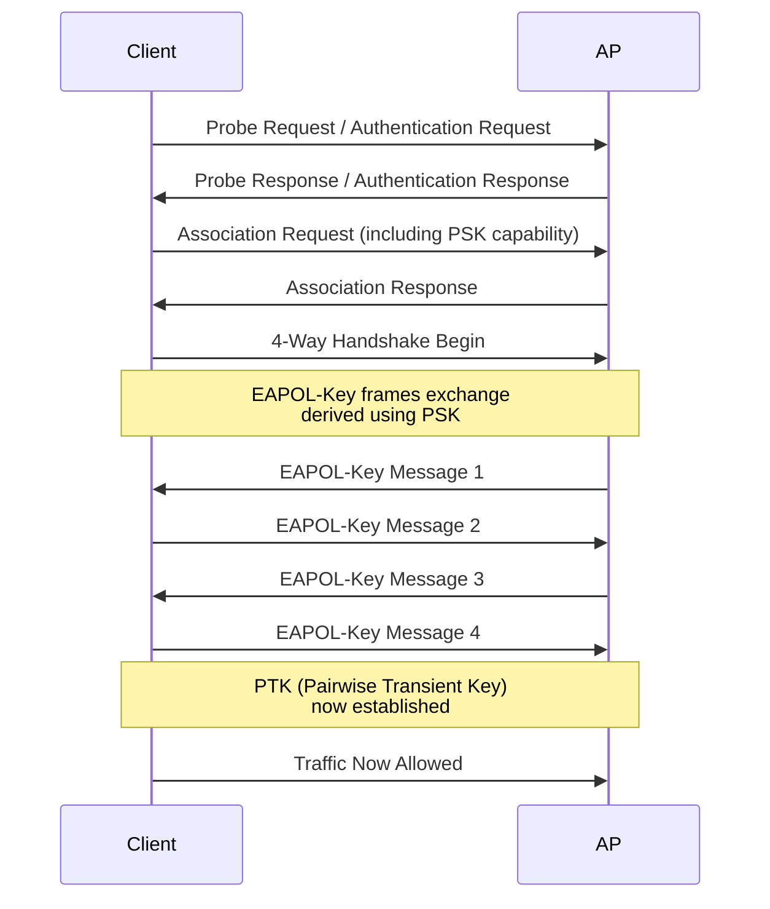

# WiFi Security

WiFi Protected Access (WPA) standards define encryption and authentication methods for wireless
networks. WPA2 (802.11i) is current baseline; WPA3 adds protection against brute-force attacks,
open-network encryption, and post-quantum algorithms. Understanding the differences between
WPA3-Personal, WPA3-Enterprise, and legacy WPA2 is essential for deployment decisions and
threat analysis.

---

## At a Glance

| Standard | Year | Encryption | Auth | Per-User | Vulnerability | Status |
| --- | --- | --- | --- | --- | --- | --- |
| **WEP** | 1997 | RC4 | MAC filter | No | Broken (IV reuse) | Obsolete |
| **WPA** | 2003 | TKIP | PSK/802.1X | No | Key recovery attacks | Deprecated |
| **WPA2** | 2004 | AES-CCMP | PSK/802.1X | Yes (802.1X) | KRACK attacks on weak APs | Current |
| **WPA3** | 2018 | AES-GCMP | SAE/802.1X | Yes (all modes) | Post-quantum resistant | Emerging |

---

## Security Models

### WPA3-Personal (SAE)

**Use:** Home, small office, SOHO deployments with PSK.

**Characteristics:**

- Single pre-shared key (PSK) for all clients
- SAE (Simultaneous Authentication of Equals) replaces PSK handshake
- Protects against brute-force dictionary attacks on weak passwords
- WPA3-Transition mode allows older clients

**Handshake:**

```text
Client ↔ AP: SAE Handshake (exchange commitments)
           → Hashes password with nonces (prevents dictionary attack)
           → Derives Peer Message Authentication Code (PMAC)
Mutual authentication → PTK derived
Client & AP: Both can trust each other; PMAC mismatch = attack detected
```

SAE is fundamentally different from WPA2-PSK. Even if attacker has the handshake capture, they
cannot extract password from captured frames (unlike WPA2, which is vulnerable to offline
dictionary attacks).

### WPA3-Enterprise (802.1X)

**Use:** Enterprise deployments with RADIUS backend and per-user authentication.

**Characteristics:**

- Per-user credentials (username/password or certificate)
- 802.1X authentication via RADIUS
- Individualized Data Encryption Key (IDEK) derived per user
- Requires authenticated access point and RADIUS server

**Advantages:**

- Credentials not shared across users
- Audit trail per user
- User revocation doesn't require re-keying network
- Compliance-friendly (HIPAA, PCI-DSS, SOC2)

### WPA2-Personal (PSK)

**Status:** Current baseline for consumer deployments; acceptable for enterprise guests with
frequent key rotation.

**Characteristics:**

- Pre-shared key for all clients
- Vulnerable to KRACK attacks on some APs
- Fast authentication (<500 ms)
- Supported by all modern devices

### WPA2-Enterprise (802.1X)

**Status:** Enterprise standard before WPA3; still widely deployed.

**Characteristics:**

- Same 802.1X model as WPA3-Enterprise
- CCMP (AES-128) encryption
- Support is universal (older phones, IoT, legacy devices)

**vs WPA3-Enterprise:** WPA3 adds protection against key recovery attacks (KRACK improvements);
otherwise functionally similar.

---

## Encryption Ciphers

### WPA2: CCMP (Counter Mode with CBC-MAC)

**Algorithm:** AES-128 in counter mode + CBC-MAC for integrity.

**Characteristics:**

- Robust against known attacks
- Hardware acceleration available on modern chips
- Standard across all WPA2 implementations
- 128-bit keys (sufficient for decades)

**Frame Protection:**

```text
Plaintext frame: [MAC header] [IP header] [Payload]
Apply CCMP:      Encrypt [payload]
                 Add MIC (Message Integrity Code) for tamper detection
Encrypted frame: [MAC header] [ICV (encrypted MIC)] [encrypted payload]
```

### WPA3: GCMP-256

**Algorithm:** AES-256 in Galois/Counter Mode (GCMP).

**Characteristics:**

- 256-bit keys (post-quantum resistant)
- Better authenticated encryption than CCMP
- Minimal performance difference on modern hardware
- Backward compatible with CCMP

### Legacy: TKIP

**Status:** Deprecated; do not deploy.

**Issue:** IV (Initialization Vector) reuse allows key recovery in minutes. Remove TKIP support
from APs.

---

## Authentication Methods

### PSK (Pre-Shared Key)

**Model:** Single key shared among all users.

**Handshake:**



**Vulnerabilities:**

- Dictionary attacks if PSK is weak
- KRACK attack on some APs (replaying encrypted frames)
- Shared PSK allows any client to decrypt others' traffic (in theory; in practice, clients
  typically don't monitor each other)

### SAE (Simultaneous Authentication of Equals)

**Status:** WPA3-Personal only; replaces PSK handshake.

**Improvements over PSK:**

1. **Protection Against Brute-Force:** Attacker cannot test password offline from captured
   handshake
1. **Forward Secrecy:** Even if password is compromised, past traffic remains encrypted
1. **Mutual Authentication:** Both client and AP prove knowledge of password

**Handshake:**

```text
Client & AP share password P
  Both commit to random values:
    Client: Commit(P, client_nonce) → Server
    AP: Commit(P, ap_nonce) → Client
  Both confirm with peer message authentication:
    Client: PMAC = Hash(P || all_commits || role_indicator)
    AP: PMAC = Hash(P || all_commits || role_indicator)
  If PMAC mismatch: Handshake fails (attack detected)
  Mutual auth success: Derive PMK and continue with 4-Way
```

### 802.1X

**Status:** Enterprise standard; works with WPA2, WPA3, and legacy WPA.

**Model:** Per-user credentials validated by RADIUS server.

**Benefits:**

- No shared PSK
- User-level audit logs
- Flexible credential types (password, certificate, token)
- Scales to thousands of users

---

## Open Networks and Opportunistic Wireless Encryption (OWE)

### Standard Open (Unencrypted)

**Status:** Common for guest networks; traffic in clear.

**Threat:** Attackers eavesdrop on unencrypted traffic. Use only if all applications use
HTTPS/TLS.

### OWE (Opportunistic Wireless Encryption)

**Standard:** WPA3 addition; available in WPA2-OWE (RFC 8110).

**Purpose:** Encrypts open-network traffic using a server-generated key; no PSK needed.

**How it works:**

```text
Client → AP: "I want to connect to open network"
AP → Client: Server's Diffie-Hellman public key
Both derive shared secret via DH exchange
Both use shared secret to derive PTK
Result: Traffic encrypted; attacker cannot eavesdrop
```

**Use case:** Guest networks where users have no shared password but still want encryption.

---

## Transition and Compatibility

### WPA3-Transition Mode

Allows both WPA3 and WPA2 clients on the same SSID for backward compatibility.

```text
SSID: "corp-network"
  WPA Version: WPA3-Transition
  Clients:
    WPA3-capable: Negotiate WPA3-Personal (SAE)
    WPA2-only: Negotiate WPA2-Personal (PSK)
```

**Risk:** Weakest client capability determines network strength. Migrate legacy clients to
WPA3-capable devices; then disable WPA2 mode.

### Legacy WPA Support

**Status:** Do not deploy. Some embedded systems require WPA (TKIP); isolate these in
separate VLAN with WPA + mandatory HTTPS enforcement.

---

## Vendor-Specific Implementation

### Cisco Meraki (Cloud-Managed)

Meraki simplifies WPA3 deployment via dashboard; no CLI configuration:

- **WPA3-Personal:** Dashboard → SSID Settings → Security: "WPA3 Personal"; set PSK
- **WPA3-Enterprise:** Dashboard → SSID Settings → Security: "WPA3 Enterprise"; configure RADIUS
  server

- **Automatic AP Sync:** All APs in network inherit settings instantly
- **Roaming Optimization:** Built-in 802.11r/k/v enabled by default on WPA3-Enterprise
- **Certificate Management:** Server certificates managed centrally in Meraki dashboard

Meraki also supports WPA3-Transition mode for mixed-device environments (automatic detection of
client capabilities).

### Cisco IOS-XE and FortiGate

WPA3 configured via CLI with explicit commands (as shown in standards guides). Requires per-AP
configuration or controller synchronization.

---

## Deployment Models

### Small Office / Home (SOHO)

| Scenario | Recommendation |
| --- | --- |
| **WiFi Router at home** | WPA3-Personal with strong PSK (20+ chars) |
| **SOHO with 5–10 users** | WPA3-Personal or small-site 802.1X (local auth) |
| **IoT-heavy deployment** | WPA3-Personal on main network; separate open/OWE for legacy devices |

### Enterprise

| Scenario | Recommendation |
| --- | --- |
| **Corporate internal networks** | WPA3-Enterprise (802.1X + RADIUS) |
| **Guest networks** | WPA3-Personal or OWE + RADIUS-based rate limiting |
| **Mixed-device environment** | WPA3-Transition mode; migrate legacy devices |
| **High-security environments** | WPA3-Enterprise + EAP-TLS (certificate auth) |

---

## Known Attacks and Mitigations

### Dictionary Attack on WPA2-PSK

**Threat:** Attacker captures 4-Way Handshake, tries password offline.

**Mitigation:**

- Use strong PSK (20+ characters, random)
- WPA3-Personal (SAE) removes this attack entirely
- 802.1X (Enterprise) not vulnerable (per-user auth)

### KRACK (Key Reinstallation Attack)

**Threat:** Replaying encrypted frames to force key reuse (state-machine in WiFi vulnerable to
replay if not properly validated).

**Mitigation:**

- Update AP firmware to patch key retransmission logic
- WPA3 significantly hardens against KRACK
- Most modern APs patched (2017+)

### Evil Twin (Rogue AP)

**Threat:** Attacker creates SSID with same name as legitimate; clients connect to rogue AP.

**Mitigation:**

- Clients should validate server certificate (if using EAP-TLS)
- PEAP with server certificate validation provides strong protection
- 802.1X + certificate-based auth defeats rogue APs

### Brute-Force on Weak PSK

**Threat:** Attacker uses GPU-accelerated password hashing to test weak passwords offline.

**Mitigation:**

- Enforce strong PSK (20+ characters)
- Implement password complexity rules (if using 802.1X)
- WPA3-SAE exponentially hardens against this (computational cost per attempt)

---

## Best Practices

| Practice | Reason |
| --- | --- |
| **Deploy WPA3 on all new APs** | 128 bits → 256 bits; better protection against brute-force |
| **Use 802.1X for enterprise** | Per-user credentials; audit trail; easy revocation |
| **Enforce strong PSK if using WPA3-Personal** | 20+ random characters; defeats dictionary attacks |
| **Disable legacy WPA support** | TKIP is broken; no reason to support old standard |
| **Separate guest and corporate SSIDs** | Guest networks should not access corporate resources |
| **Use OWE for guest networks** | Encrypts guest traffic without pre-shared key |
| **Rotate RADIUS server certificates annually** | PKI hygiene; reduces compromise risk |
| **Monitor authentication failures** | Detect brute-force or RADIUS server issues |
| **Update AP firmware regularly** | Critical for KRACK and other key management patches |

---

## Notes / Gotchas

- **WPA3-Personal Requires Strong Hardware:** Older APs may not support SAE (requires
  elliptic-curve crypto offload). Verify hardware support before deploying.

- **Client OS Support for WPA3:** iOS 16+, Android 10+, Windows 11 support WPA3; older versions
  require WPA3-Transition mode. Gradual migration to newer OS versions.

- **Certificate Expiration in 802.1X:** Server certificates in EAP-PEAP or EAP-TLS expire; plan
  certificate renewal before expiration (at least 30 days before).

- **Roaming with Enterprise Mode:** WPA2-Enterprise and WPA3-Enterprise deployments should
  enable 802.11r (FT) to avoid re-authentication delays (typically 1–3 seconds without FT).

- **Pre-Shared Key Recovery Time:** If PSK is compromised, all past and future traffic can be
  decrypted offline. Rotate PSK immediately; WPA3-Personal does not have this issue (SAE
  provides forward secrecy).

---

## See Also

- [802.1X and EAP Authentication](wifi_authentication_8021x.md)
- [WiFi Standards Comparison](wifi_standards_comparison.md)
- [WiFi RF Fundamentals](wifi_rf_fundamentals.md)
- [WiFi Roaming (802.11r/k/v)](wifi_roaming.md)
- [WiFi Network Design](wifi_network_design.md)
- [RADIUS vs TACACS+ vs LDAP](radius_vs_tacacs_vs_ldap.md)
